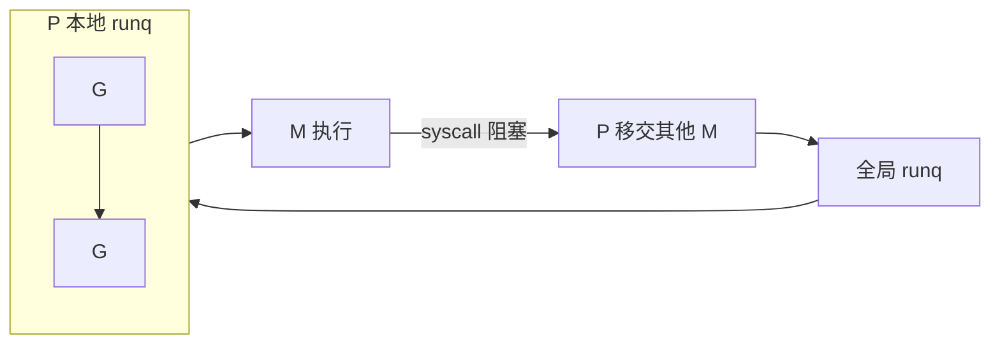

# GMP 模型与 1.14 以来抢占式调度

## 30 秒版（开场）

> Go 用 **G（goroutine）+ M（OS 线程）+ P（逻辑处理器）** 做用户态调度；**1.14 起基于信号的异步抢占** 解决了长时间纯计算不 yield 导致其他 G 饿死的问题。生产关键词：**P 数量 = GOMAXPROCS**，调度公平性与 STW/GC 协同。

## 3 分钟版（一面深度）

1. **是什么**：GMP 是 Go runtime 的三层调度抽象。G 是协程任务，M 是真正跑在 CPU 上的内核线程，P 是本地运行队列与调度上下文，持有可运行的 G 列表。
2. **为什么**：M:N 模型在少量内核线程上 multiplex 海量 goroutine，避免每协程一线程的栈与切换成本；P 减少全局锁竞争。
3. **怎么做**：work stealing 平衡负载；阻塞 syscall 时 M 与 P 解绑，P 可交给其他 M；1.14 前仅靠函数调用边界协作式让出，1.14+ 在 safe-point 用 `SIGURG` 标记抢占，1.21+ 进一步收紧循环与栈增长场景的抢占。

## 10 分钟版（原理 + 图示）

**数据结构要点**

| 实体 | 职责 |
|------|------|
| G | 栈、PC/SP、状态（`_Grunnable/_Grunning/_Gwaiting` 等） |
| M | 绑定 P 后执行 G；无 P 时阻塞或自旋找活 |
| P | `runq`（本地队列，通常 256）、`mcache`、调度 tick |

**调度触发**：G 主动 `gosched`、channel/select 阻塞、syscall、GC、抢占 tick、`GOMAXPROCS` 变化。



**1.14 抢占**：runtime 向目标 M 发信号，在栈扫描安全点插入抢占逻辑，使长时间 CPU 密集循环也能被切走。注意：**unsafe/汇编 边界、cgo、部分 runtime 锁持有** 仍可能延迟抢占。

**与 GC**：`STW mark assist`、写屏障期间调度仍运行，但 P 可能参与 GC 辅助标记；高分配 + 高 GOMAXPROCS 会放大 assist 压力。

## 生产场景

- **CPU 密集型微服务**：某热点接口纯计算，P99 正常但同 Pod 其他路由延迟飙升 → 怀疑单 G 占满 P 过久（1.14 前更常见）。
- **容器 CPU limit**：cgroup 限核后实际可用 P 与 `GOMAXPROCS` 不一致，调度与 GC 行为异常。
- **可观测**：`sched latency`（trace）、`runtime.NumGoroutine()`、每核 `runqueue` 深度（需 trace/pprof）。

## 排查与工具

| 工具 | 用途 |
|------|------|
| `go tool trace` | 查看 G 调度、网络阻塞、STW |
| `pprof` CPU | 热点函数是否长时间不调用 safe-point |
| `GODEBUG=schedtrace=1000` | 周期性打印调度器统计（调试环境） |

路径：延迟毛刺 → trace 看是否单 G 长期 `_Grunning` → CPU profile 定位热点 → 拆任务/yield/调 GOMAXPROCS。

## 架构取舍

| 方案 | 适用 | 不适用 |
|------|------|--------|
| 多 goroutine 默认调度 | IO 密集、大量短任务 | 需严格 FIFO 的硬实时 |
| 手动 worker + 有界队列 | 背压、限并发 | 简单 CRUD 过度设计 |
| cgo/阻塞库 | 无法改依赖时 | 默认首选（占 M 线程） |

## 追问链

1. **G 和线程区别？** → G 栈初始 ~2KB 可扩，切换用户态；M 是 OS 线程，切换成本高。
2. **为什么需要 P？** → 本地队列 + mcache 降低全局锁；无 P 的 M 只能偷取或 park。
3. **1.14 前后抢占差异？** → 协作式仅在调用/通道/锁等点让出；异步抢占覆盖长时间循环。
4. **syscall 时发生什么？** → M 阻塞，P 剥离给其他 M，避免占满 P 导致饿死。
5. **GOMAXPROCS=1 会怎样？** → 单 P，并行度为 1，但 goroutine 仍可并发交替（IO 时）。

## 反模式与事故

- 在热点循环里既不 `select` 也不分段，且依赖「别的请求能插进来」——在极端 CPU 占满时仍可能饥饿。
- 把 `GOMAXPROCS` 设为容器 CPU limit 的 2 倍「提速」，导致 throttle 与上下文切换恶化。
- 用 `runtime.LockOSThread` 滥用，耗尽 M 池。

## 代码示例

```go
// 协作式让出：将长计算切片，便于调度与抢占
func heavyWork(ctx context.Context, n int) error {
    for i := 0; i < n; i++ {
        if i%1000 == 0 {
            if err := ctx.Err(); err != nil {
                return err
            }
            runtime.Gosched() // 非必须，但利于公平性调试
        }
        _ = expensive(i)
    }
    return nil
}
```

可运行示例见 [`basis/goroutine/main.go`](../../../basis/goroutine/main.go)（任务调度与 WaitGroup）。

## 延伸阅读

- [Go 调度器设计文档（proposal）](https://github.com/golang/proposal/blob/master/design/24543-non-cooperative-preemption.md)
- [Effective Go: Goroutines](https://go.dev/doc/effective_go#goroutines)
- [掘金：深入理解 Go 调度器 GMP](https://juejin.cn/post/6844904079988232205)
- [Go 1.14 Release Notes - Preemption](https://go.dev/doc/go1.14)
