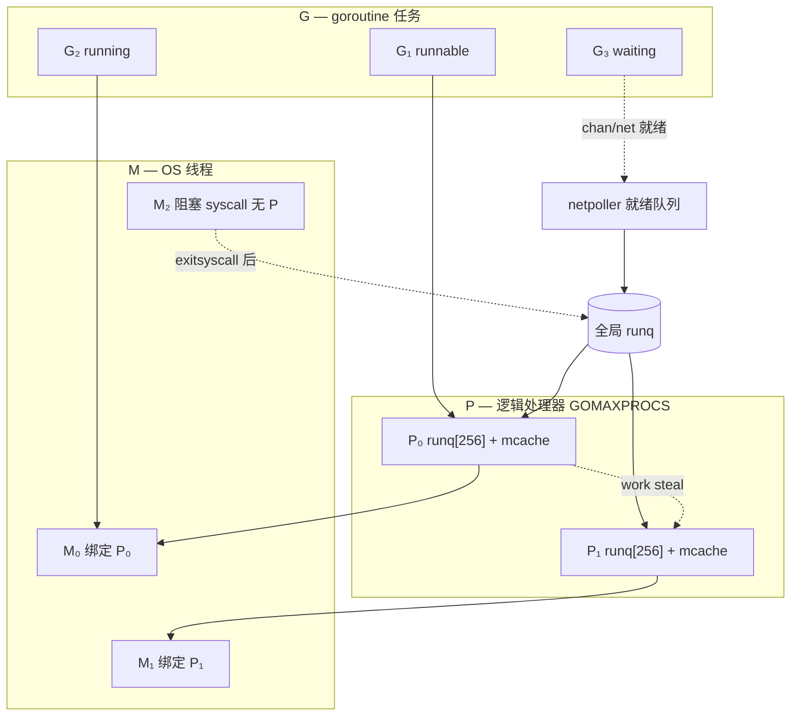
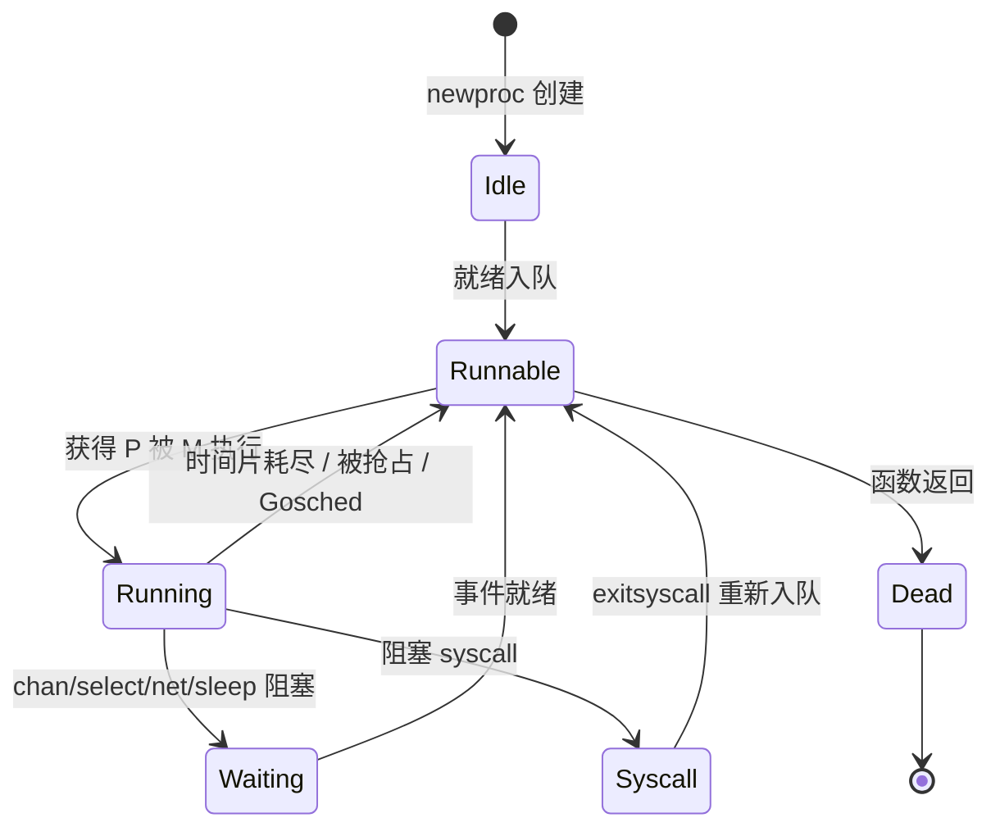
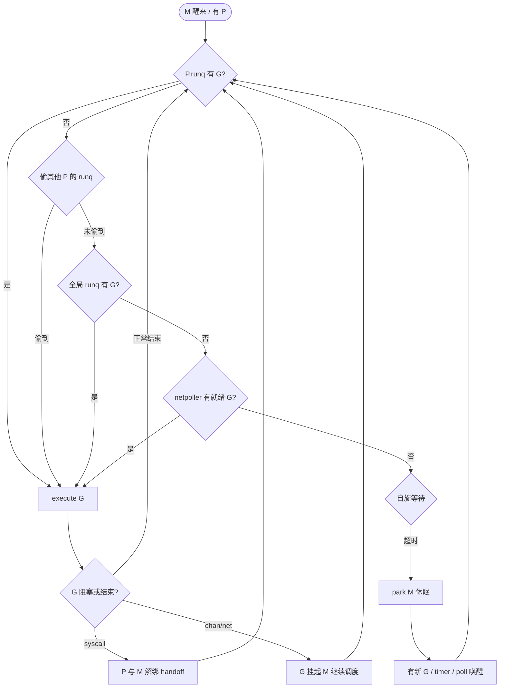
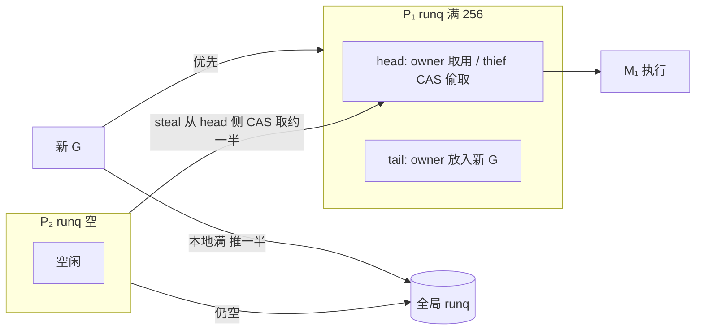
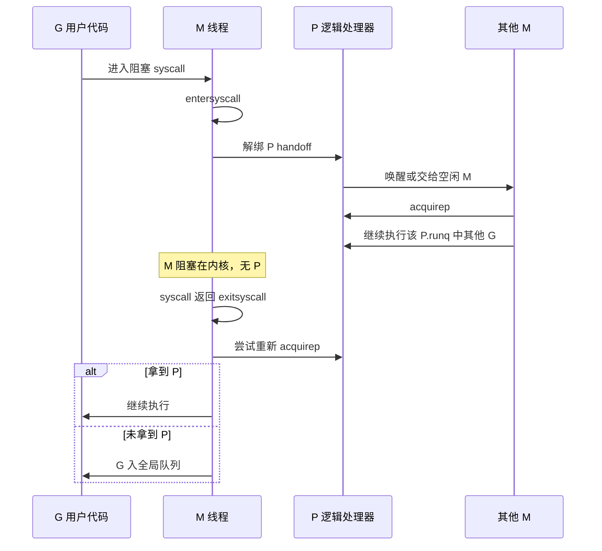
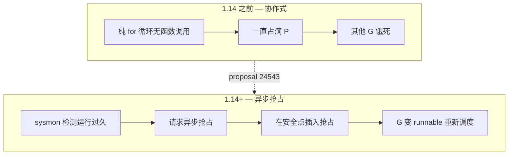
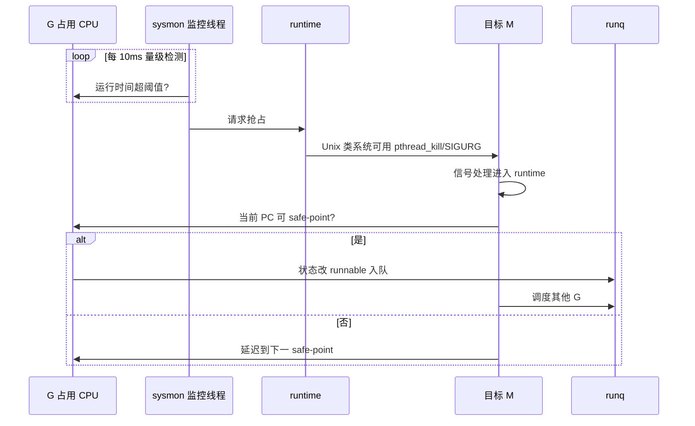
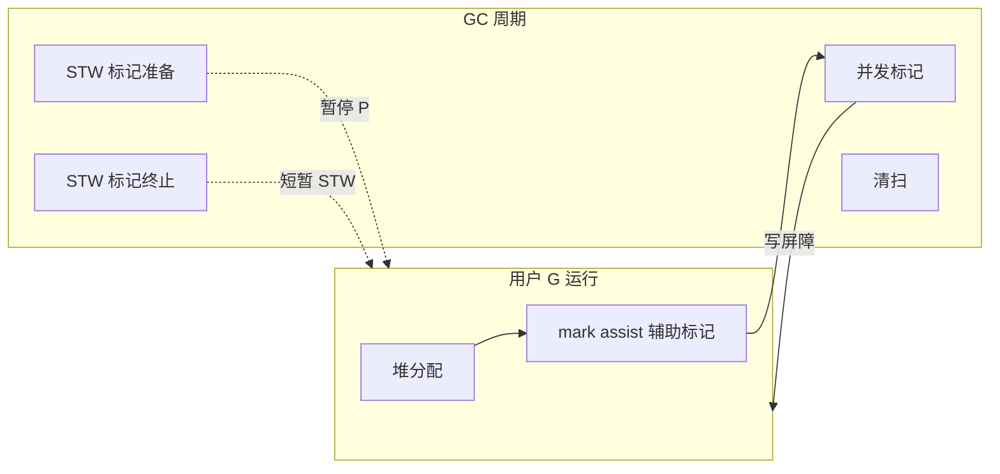

# GMP 模型与 1.14 以来抢占式调度

## 30 秒版（开场）

> Go 调度器 = **G（goroutine 任务）+ M（OS 线程）+ P（逻辑处理器 / 本地 runq）** 的 M:N 模型：海量 G 复用一组 M，真正执行 Go 代码的并行上限由 **`GOMAXPROCS` = 活跃 P 数**决定。Go 1.14+ 引入异步抢占，改善无函数调用的 CPU 热循环长期占用 P；Unix 类系统常用信号实现，但这是平台相关的 runtime 细节。

## 3 分钟版（一面深度）

1. **是什么**：GMP 是 Go runtime 的三层调度抽象。G 是用户态协程（~2KB 起栈，见 [S-CONC-03](./S-CONC-03-goroutine-stack.md)）；M 对应 OS 线程；P 是「工牌」——持有本地运行队列 `runq`（当前实现容量 256）、`mcache` 等资源，**无 P 的 M 不能执行 Go 用户代码**。
2. **为什么**：线程切换走内核、栈 MB 级，无法承载百万连接；P 的本地队列 + work stealing 降低全局锁竞争，比单纯 G-M 模型更易扩展（详见 [S-CONC-02](./S-CONC-02-gmp-roles.md)）。
3. **怎么做**：调度循环从 P 的 `runq` 取 G 执行；本地空则偷其他 P 或全局队列；阻塞 syscall 时 M 与 P 解绑、P 移交；网络 IO 走 netpoller 不占 P 忙等（[S-CONC-19](./S-CONC-19-netpoller.md)）；GC 与抢占 tick 触发重新调度。

## 10 分钟版（原理 + 图示）

### G、M、P 关系总览


```mermaid
flowchart TB
  subgraph Goroutines[G — goroutine 任务]
    G1[G₁ runnable]
    G2[G₂ running]
    G3[G₃ waiting]
  end
  subgraph Processors[P — 逻辑处理器 GOMAXPROCS]
    P0["P₀ runq[256] + mcache"]
    P1["P₁ runq[256] + mcache"]
  end
  subgraph Machines[M — OS 线程]
    M0[M₀ 绑定 P₀]
    M1[M₁ 绑定 P₁]
    M2[M₂ 阻塞 syscall 无 P]
  end
  GlobalQ[(全局 runq)]
  Netpoll[netpoller 就绪队列]

  G1 --> P0
  G2 --> M0
  G3 -.->|chan/net 就绪| Netpoll
  Netpoll --> GlobalQ
  GlobalQ --> P0
  GlobalQ --> P1
  P0 --> M0
  P1 --> M1
  P0 -.->|work steal| P1
  M2 -.->|exitsyscall 后| GlobalQ
```

**面试一句话**：**G 是任务，M 是载体，P 是并行槽位**；同一时刻最多约 `GOMAXPROCS` 个 G 处于 `_Grunning`。

### 三实体职责（必背表）

| 实体 | 全称 | 核心字段 / 职责 | 数量级 |
|------|------|-----------------|--------|
| **G** | Goroutine | 栈、SP/PC、状态、所属 M | 10⁵～10⁶ 常见 |
| **M** | Machine | 对应 `pthread`；`g0` 栈用于调度 | ≥ P，阻塞 syscall 时可 ≫ P |
| **P** | Processor | 本地 `runq`、`mcache`、调度上下文 | **= GOMAXPROCS**（活跃 P） |

| 绑定规则 | 说明 |
|----------|------|
| M 执行 Go 代码 | 必须先 `acquirep` 绑定某个 P |
| G 运行 | 挂在某个 M 上，且该 M 已绑 P |
| P 与 M | 某一时刻一个 P 至多绑定一个 M，一个 M 也至多绑定一个 P；绑定关系会随调度变化 |
| M 与 G | 一对多（M 切换执行不同 G） |

### G 状态机（调度视角）


```mermaid
stateDiagram-v2
  [*] --> Idle: newproc 创建
  Idle --> Runnable: 就绪入队
  Runnable --> Running: 获得 P 被 M 执行
  Running --> Waiting: chan/select/net/sleep 阻塞
  Running --> Runnable: 时间片耗尽 / 被抢占 / Gosched
  Running --> Syscall: 阻塞 syscall
  Waiting --> Runnable: 事件就绪
  Syscall --> Runnable: exitsyscall 重新入队
  Runnable --> Dead: 函数返回
  Dead --> [*]
```

| 状态 | 常量（源码） | 含义 | 是否在 runq |
|------|--------------|------|-------------|
| 空闲/新建 | `_Gidle` | 刚创建 | 否 |
| 就绪 | `_Grunnable` | 等待 CPU | 是（本地或全局） |
| 运行 | `_Grunning` | 正在 M 上执行 | 否 |
| 等待 | `_Gwaiting` | channel、锁、net、timer | 否 |
| 系统调用 | `_Gsyscall` | M 阻塞在 syscall | 否 |
| 已结束 | `_Gdead` | 可被复用 | 否 |

### 调度器主循环（M 如何找活干）


```mermaid
flowchart TD
  Start([M 醒来 / 有 P]) --> LocalQ{P.runq 有 G?}
  LocalQ -->|是| Run[execute G]
  LocalQ -->|否| Steal{偷其他 P 的 runq}
  Steal -->|偷到| Run
  Steal -->|未偷到| Global{全局 runq 有 G?}
  Global -->|是| Run
  Global -->|否| Net{netpoller 有就绪 G?}
  Net -->|是| Run
  Net -->|否| Spin{自旋等待}
  Spin -->|超时| Park[park M 休眠]
  Park --> Wake[有新 G / timer / poll 唤醒]
  Wake --> LocalQ
  Run --> Blocked{G 阻塞或结束?}
  Blocked -->|syscall| Handoff[P 与 M 解绑 handoff]
  Blocked -->|chan/net| ParkG[G 挂起 M 继续调度]
  Blocked -->|正常结束| LocalQ
  Handoff --> LocalQ
  ParkG --> LocalQ
```

**调度触发点（何时重新选 G）**

| 触发 | 场景 | 结果 |
|------|------|------|
| `go func()` | 新建 G | 优先入当前 P 的 `runq`，满则推一半到全局 |
| `runtime.Gosched` | 主动让出 | 当前 G 变 runnable 重新入队 |
| channel / select | 阻塞或就绪 | G 在 waiting ↔ runnable 间切换 |
| 阻塞 syscall | 文件 IO、cgo 等 | `entersyscall`，P handoff（见下图） |
| netpoller | 网络 fd 就绪 | G 入队，不长期占 P |
| **抢占** | 运行过久 | 1.14+ 信号抢占，G 重新入队 |
| GC | mark assist / STW | 协助标记或暂停调度 |

### 本地队列与 Work Stealing


```mermaid
flowchart LR
  subgraph P1[P₁ runq 满 256]
    direction TB
    H1[head: owner 取用 / thief CAS 偷取]
    T1[tail: owner 放入新 G]
  end
  subgraph P2[P₂ runq 空]
    direction TB
    E2[空闲]
  end
  Global[(全局 runq)]
  NewG[新 G] -->|优先| P1
  NewG -->|本地满 推一半| Global
  P2 -->|steal 从 head 侧 CAS 取约一半| H1
  P2 -->|仍空| Global
  H1 --> M1[M₁ 执行]
```

| 策略 | 说明 |
|------|------|
| **本地优先** | 减少缓存失效；同 P 上连续执行相关 G |
| **全局兜底** | 本地满时批量转移，避免单 P 过载 |
| **偷取** | 当前实现从受害 P 的 **head 侧** CAS 取约一半；owner 也从 head 取，因此并非经典 Cilk 的双端 deque |
| **FIFO 本地** | 所有者从头部取；新 G 入尾部 |

### 阻塞 Syscall 时 P 移交（handoff）


```mermaid
sequenceDiagram
  participant G as G 用户代码
  participant M as M 线程
  participant P as P 逻辑处理器
  participant M2 as 其他 M

  G->>M: 进入阻塞 syscall
  M->>M: entersyscall
  M->>P: 解绑 P handoff
  P->>M2: 唤醒或交给空闲 M
  M2->>P: acquirep
  M2->>P: 继续执行该 P.runq 中其他 G
  Note over M: M 阻塞在内核，无 P
  M->>M: syscall 返回 exitsyscall
  M->>P: 尝试重新 acquirep
  alt 拿到 P
    M->>G: 继续执行
  else 未拿到 P
    M->>G: G 入全局队列
  end
```

**要点**：syscall 期间 **P 不会闲着**——这是 Go 能在少量核上维持高吞吐的关键。大量同步阻塞 IO 会导致 **M 数膨胀**（线程多）但 **并行 Go 代码仍 ≤ GOMAXPROCS**。

### 协作式 vs 抢占式（1.14 分水岭）


```mermaid
flowchart TB
  subgraph Before[1.14 之前 — 协作式]
    B1[纯 for 循环无函数调用]
    B1 --> B2[一直占满 P]
    B2 --> B3[其他 G 饿死]
  end
  subgraph After[1.14+ — 异步抢占]
    A1[sysmon 检测运行过久]
    A1 --> A2[请求异步抢占]
    A2 --> A3[在安全点插入抢占]
    A3 --> A4[G 变 runnable 重新调度]
  end
  Before -.->|proposal 24543| After
```

| 版本 | 抢占方式 | 让出点 | 典型问题 |
|------|----------|--------|----------|
| **< 1.14** | 协作式 | 函数调用、channel、锁、GC safe-point | 大循环饿死同 P 其他 G |
| **1.14+** | **异步抢占**（Unix 类系统常用信号） | 异步安全点 + 原协作点 | 外部 C 代码、部分汇编/runtime 临界区仍不能按普通 Go 代码抢占 |

**安全点（safe-point）**：GC 与抢占需要能安全扫描栈、切换 G 的代码位置；Go 1.14 的异步抢占显著缩小了纯计算循环的抢占盲区，但 Go 调度仍不是硬实时调度。

**不能完全抢占的情况（面试加分）**

- runtime 的 `nosplit`/关键临界区
- 正在执行的 **C/外部代码**；该 M 不受 Go 调度器直接抢占，但调用通常会释放 P 供其他 M 使用
- 缺少可用栈图或异步安全点的 **汇编代码**

`runtime.LockOSThread` 只固定 G 与 M 的绑定，本身并不等于“该 G 不可抢占”。

### 抢占时序（1.14+ 简化）


```mermaid
sequenceDiagram
  participant G as G 占用 CPU
  participant Sys as sysmon 监控线程
  participant RT as runtime
  participant M as 目标 M
  participant Q as runq

  loop 每 10ms 量级检测
    Sys->>G: 运行时间超阈值?
  end
  Sys->>RT: 请求抢占
  RT->>M: Unix 类系统可用 pthread_kill/SIGURG
  M->>M: 信号处理进入 runtime
  M->>G: 当前 PC 可 safe-point?
  alt 是
    G->>Q: 状态改 runnable 入队
    M->>Q: 调度其他 G
  else 否
    M->>G: 延迟到下一 safe-point
  end
```

### 与 GC 的协同


```mermaid
flowchart LR
  subgraph Mutator[用户 G 运行]
    Alloc[堆分配]
    Assist[mark assist 辅助标记]
  end
  subgraph GC[GC 周期]
    STW1[STW 标记准备]
    Concurrent[并发标记]
    STW2[STW 标记终止]
    Sweep[清扫]
  end
  Alloc --> Assist
  Assist --> Concurrent
  Concurrent -->|写屏障| Mutator
  STW1 -.->|暂停 P| Mutator
  STW2 -.->|短暂 STW| Mutator
```

| 概念 | 说明 |
|------|------|
| **mark assist** | 分配快的 G 需帮 GC 标记，**不是 STW 专属**；分配越多 assist 越多 |
| **写屏障** | 并发标记期间保证指针图正确 |
| **STW** | 极短停世界；调度器与 P 参与同步 |
| **调度与 GC** | 标记阶段 G 仍运行，但 assist 会占 CPU；高 `GOMAXPROCS` + 高分配放大压力 |

### GOMAXPROCS 与并行度

| 配置 | 效果 |
|------|------|
| `GOMAXPROCS=1` | 单 P，任意时刻 1 个 G 跑用户代码；IO 多时仍可交替 |
| `GOMAXPROCS=N` | N 个 P，**CPU 密集**理论 N 路并行 |
| 未设置 | 默认 = 逻辑 CPU 数（容器内见 [S-CONC-04](./S-CONC-04-gomaxprocs.md)） |
| \> 物理核 | 上下文切换增多，通常无益 |

```go
// 查看与设置
fmt.Println(runtime.GOMAXPROCS(0)) // 查询
runtime.GOMAXPROCS(8)              // 设置 P 数量上限
```

## 生产场景

| 场景 | 现象 | 排查 / 策略 |
|------|------|-------------|
| **CPU 密集热点** | 同 Pod 其他接口 P99 飙高 | trace 看单 G 长期 `_Grunning`；拆片、`Gosched`/分段、限并发 |
| **容器 CPU limit** | `GOMAXPROCS` 与 cgroup 不一致 | 用 `automaxprocs` 或手动对齐 quota |
| **大量阻塞 syscall** | `Threads` 很高、CPU 不高 | 改 netpoller 路径、线程池、隔离 cgo |
| **GC 毛刺** | 延迟与 GC assist 相关 | `GODEBUG=gctrace=1`、降分配、调 `GOGC` |
| **调度不公平** | 某些 G 长期得不到 P | 检查热点占 P、调 GOMAXPROCS、worker 池限流 |

## 排查与工具

| 工具 | 命令 / 用法 | 看什么 |
|------|-------------|--------|
| **调度 trace** | `go test -trace=sched.out` / `go tool trace` | G 生命周期、P 利用率、syscall、STW |
| **CPU profile** | `pprof` CPU | 热点是否无 safe-point 长循环 |
| **schedtrace** | `GODEBUG=schedtrace=1000` | 每 1s 打印 P/M/G 数量（仅调试） |
| **goroutine** | `pprof` goroutine | 阻塞在 chan、锁、net 的栈 |
| **线程数** | `/proc/pid/status` Threads | M 是否因 syscall 膨胀 |

**排查路径**：延迟毛刺 → `trace` 看是否单 G 占 P → CPU profile 定位函数 → 分段 / 限流 / 调 `GOMAXPROCS`。

## 架构取舍

| 方案 | 适用 | 不适用 |
|------|------|--------|
| 默认多 goroutine | IO 密集、大量短任务 | 硬实时 FIFO |
| 有界 worker 池 | CPU 密集需背压 | 简单 CRUD 过度设计 |
| `automaxprocs` | 容器部署 | 裸机通常默认即可 |
| 进程外隔离 CPU 密集 | 避免拖垮 API 延迟 | 运维成本更高 |

## 追问链

1. **G 和线程区别？** → G 栈 ~2KB 起、用户态切换；M 是 OS 线程，MB 栈、内核切换贵。
2. **为什么需要 P，不是只有 G-M？** → 本地 runq + mcache 降锁；明确并行度上限（[S-CONC-02](./S-CONC-02-gmp-roles.md)）。
3. **1.14 前后抢占差异？** → 协作式仅边界让出；异步抢占覆盖长循环。
4. **syscall 时发生什么？** → M 阻塞，P handoff，避免占槽（见 handoff 图）。
5. **GOMAXPROCS=1 还能并发吗？** → CPU 并行度为 1；IO 阻塞时其他 G 可上 P。
6. **work stealing 偷哪一端？** → 当前实现从受害 P 的 **head 侧** CAS 取约一半；所有者也从 head 取，细节以对应 Go 版本源码为准。
7. **sysmon 做什么？** → 监控抢占、netpoll、GC 触发、释放闲置 P 等。
8. **netpoller 与调度的关系？** → 网络 G 等待不占 P；就绪后入队等 P 执行（[S-CONC-19](./S-CONC-19-netpoller.md)）。
9. **mark assist 会停调度吗？** → 不停世界；在运行中插入标记工作，分配多 assist 重。
10. **Go 调度公平吗？** → 近似公平，非严格 FIFO；长任务可被抢占（1.14+）。

## 反模式与事故

| 反模式 | 后果 | 正确做法 |
|--------|------|----------|
| 无界 `go` + CPU 密集 | 全局队列堆积、延迟失控 | 有界池、分段、限流 |
| 热点循环不 yield（老版本） | 同 P G 饿死 | 升级 1.14+ 仍建议可中断设计 |
| `GOMAXPROCS` = 容器核数 ×2 | throttle、切换恶化 | 对齐 cgroup（[S-CONC-04](./S-CONC-04-gomaxprocs.md)） |
| 滥用 `LockOSThread` | M 池耗尽 | 仅必要时绑线程 |
| 假设 goroutine 多 ≠ 线程多 | 阻塞 syscall 线程暴涨 | 监控 Threads、改异步 IO |

## 代码示例

### 协作式让出 + 可取消长计算

```go
func heavyWork(ctx context.Context, n int) error {
    for i := 0; i < n; i++ {
        if i%1000 == 0 {
            if err := ctx.Err(); err != nil {
                return err
            }
            runtime.Gosched() // 调试公平性；1.14+ 抢占可减轻依赖
        }
        _ = expensive(i)
    }
    return nil
}
```

### 观察 GOMAXPROCS 与并行度

```go
func main() {
    fmt.Println("GOMAXPROCS:", runtime.GOMAXPROCS(0))
    fmt.Println("NumCPU:", runtime.NumCPU())
    var wg sync.WaitGroup
    for i := 0; i < 8; i++ {
        wg.Add(1)
        go func(id int) {
            defer wg.Done()
            fmt.Printf("G-%d on %d\n", id, runtime.GOMAXPROCS(0))
        }(i)
    }
    wg.Wait()
}
```

### 制造可 trace 的调度事件（测试用）

```go
func TestSchedTrace(t *testing.T) {
    f, _ := os.Create("sched.out")
    defer f.Close()
    trace.Start(f)
    defer trace.Stop()

    done := make(chan struct{})
    go func() {
        time.Sleep(10 * time.Millisecond)
        close(done)
    }()
    <-done
}
```

可运行 goroutine 与 WaitGroup 示例见 [`basis/goroutine/main.go`](https://github.com/twodog-tt/Golang-development-manual/blob/master/basis/goroutine/main.go)。

## 延伸阅读

- [S-CONC-02 G/M/P 角色与 P 移除](./S-CONC-02-gmp-roles.md) — handoff、work stealing 细节
- [S-CONC-03 Goroutine 栈增长](./S-CONC-03-goroutine-stack.md) — 栈与 safe-point
- [S-CONC-04 GOMAXPROCS 与容器](./S-CONC-04-gomaxprocs.md) — CPU quota 对齐
- [S-CONC-19 Netpoller](./S-CONC-19-netpoller.md) — 网络 IO 不占 P
- [proposal 24543 非协作抢占](https://github.com/golang/proposal/blob/master/design/24543-non-cooperative-preemption.md)
- [Go 1.14 Release Notes - Preemption](https://go.dev/doc/go1.14)
- [Effective Go: Goroutines](https://go.dev/doc/effective_go#goroutines)
- [runtime/proc.go（源码）](https://go.dev/src/runtime/proc.go)
- [Draveness：GMP 调度器](https://draveness.me/golang/docs/part3-runtime/ch06-concurrency/golang-gmp/)
