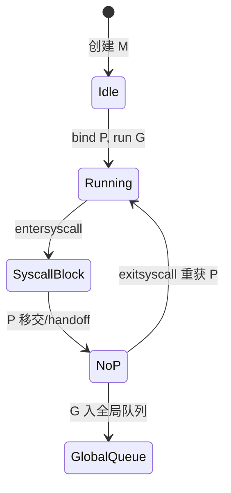

# G、M、P 角色与 P 被移除时会发生什么

## 30 秒版（开场）

> **G 干活，M 跑腿，P 发工牌**：只有绑了 P 的 M 才能执行 Go 代码。**P 被摘掉**（syscall、GC、GOMAXPROCS 调小）时，该 M 上的 G 回全局队列或让出，P 转给别的 M 继续跑队列。生产关键词：**P 是并行度上限**。

## 3 分钟版（一面深度）

1. **是什么**
   - **G**：goroutine，含栈、调度上下文、状态机。
   - **M**：machine，对应一个 OS 线程，数量可大于 P（阻塞 syscall 时常见）。
   - **P**：processor，逻辑 CPU 槽位，`len(P) ≈ GOMAXPROCS`，持有本地 runq 和 `mcache`。
2. **为什么**：P 将「并行执行」与「线程数量」解耦；多 M 可存在，但同时 `_Grunning` 的 G 不超过 P 个（近似）。
3. **怎么做**：M 必须 `acquirep` 才能 `execute` G；`entersyscall` 时 P 与 M 解绑；`exitsyscall` 尝试拿回 P 或把 G 放回全局队列。

## 10 分钟版（原理 + 图示）



**G 状态迁移（简化）**：`_Grunnable` → `_Grunning`（需 P）→ `_Gwaiting`（chan/net）→ `_Grunnable`。

**P 被移除的典型场景**

| 场景 | 行为 |
|------|------|
| 阻塞 syscall | M 进入 `_Gsyscall`，P 给 `handoff` 给其他 M |
| `GOMAXPROCS` 减小 | 多余 P 上 G 迁移，P 销毁 |
| GC STW 某些阶段 | P 参与标记，调度暂停 |
| M 无工作 | spin 后 park，不占用 P |

**Work stealing**：本地 runq 空时，从其他 P 队列尾偷一半 G，或从全局队列取。

**若无 P**：M 仍可存在（等 syscall 返回），但不能执行 Go 用户代码，只能尝试 `wakep` 获取 P 或把 G 交给有 P 的 M。

## 生产场景

- **文件/ DNS 同步阻塞**：大量 goroutine 同时 `Read` 阻塞，M 数上升，P 被 handoff，**线程数飙高**但 CPU 不高。
- **调小 GOMAXPROCS**：滚动发布改 env，瞬时全局队列堆积，延迟尖刺。
- **指标**：`process_threads`、goroutine 数、runqueue 延迟；线程 >> GOMAXPROCS 且持续，查阻塞 syscall/cgo。

## 排查与工具

- `pprof` → goroutine / threadcreate
- `go tool trace` → Syscall 行、Proc 利用率
- `/proc/<pid>/status` 的 `Threads` 与容器 thread limit

## 架构取舍

- **减少 P 占用时间**：IO 用 netpoller（非阻塞 epoll/kqueue），避免每连接一线程式阻塞。
- **cgo/阻塞 SDK**：接受 M 膨胀，或隔离到 sidecar/进程池。
- **不宜**：假设「goroutine 多 ≠ 线程多」在重度阻塞库下仍成立。

## 追问链

1. **M 的数量上限？** → 默认无硬顶（曾 1 万），阻塞多时增长；可 `debug.SetMaxThreads`。
2. **P 和 GOMAXPROCS 关系？** → 活跃 P 数由 GOMAXPROCS 决定，是并行执行 Go 代码的上限。
3. **G 在 M 上执行一半 P 没了？** → 抢占/安全点保存状态，G 重新入队。
4. **全局队列 vs 本地队列？** → 新 G 优先本地；满则一半推全局；偷取平衡负载。
5. **netpoller 与 P 关系？** → 网络就绪后 G 变 runnable 入队，仍需 P 执行。

## 反模式与事故

- 在默认线程池外大量 `LockOSThread`，M 与 P 绑定异常，**线程泄漏**。
- 容器 `threads` ulimit 过低，高并发阻塞后 `runtime: program exceeds thread limit`。
- 误以为调大 goroutine 即可提高并行，未调 GOMAXPROCS/CPU quota。

## 代码示例

```go
// 观察：阻塞 syscall 会增加 M，但不增加并行 Go 执行槽
func blockSyscall() {
    for i := 0; i < 1000; i++ {
        go func() {
            var b [1]byte
            _, _ = syscall.Read(syscall.Stdin, b[:]) // 阻塞
        }()
    }
}
```

调度与并发任务见 [`basis/goroutine/main.go`](https://github.com/twodog-tt/Golang-development-manual/blob/master/basis/goroutine/main.go)。

## 延伸阅读

- [runtime/proc.go（源码）](https://go.dev/src/runtime/proc.go)
- [Design: GOMAXPROCS vs CPU cores](https://github.com/golang/proposal/blob/master/design/12416-cpu-cores.md)
- [掘金：GMP 模型详解](https://juejin.cn/post/6844904079988232205)
