# G、M、P 角色与 P 被移除时会发生什么

## 30 秒版（开场）

> **G 干活，M 跑腿，P 发工牌**：G 是 goroutine 任务；M 是 OS 线程；P 是逻辑执行槽位，活跃数量等于 `GOMAXPROCS`，持有本地 runq 与 mcache。已知会阻塞的 syscall 路径可主动 handoff P；普通 syscall 先把 P 标成 syscall 状态，持续阻塞时再由 sysmon 尝试 retake。STW 是停止 P 上的 mutator 工作，不是把所有 P “移除”。

## 3 分钟版（一面深度）

1. **是什么**
   - **G（Goroutine）**：用户态协程，含栈（~2KB 起，见 [S-CONC-03](./S-CONC-03-goroutine-stack.md)）、SP/PC、状态、sched 链接；是调度器的**任务单元**。
   - **M（Machine）**：对应一个 OS 线程（`pthread`），含 `g0` 系统栈用于 runtime 调度；**数量可远大于 P**（阻塞 syscall、cgo 时常见）。
   - **P（Processor）**：逻辑处理器，**活跃 P 数 = GOMAXPROCS**；持有 **本地 runq**（256 容量）、**mcache**（小对象分配缓存）、defer 池等；是 **并行执行 Go 代码的槽位**。
2. **为什么需要 P**：纯 G-M 模型全局 runq 锁竞争严重；P 的本地队列 + work stealing 降低锁争用，并把 **并行度** 与 **线程数** 解耦——100 个阻塞 M 也不等于 100 路 CPU 并行。
3. **怎么做**：M 执行普通 Go 代码前必须绑定 P。`entersyscallblock` 这类已知阻塞路径会先 handoff P；普通 `entersyscall` 则让 P 进入 syscall 状态，若调用持续阻塞且有调度需要，sysmon 才尝试 retake。`exitsyscall` 走快速恢复或重新获得 P，失败时再把 G 变为 runnable。该过程不是“每次系统调用一进入就立即创建新 M”。

## 10 分钟版（原理 + 图示）

### G、M、P 绑定关系（核心图）

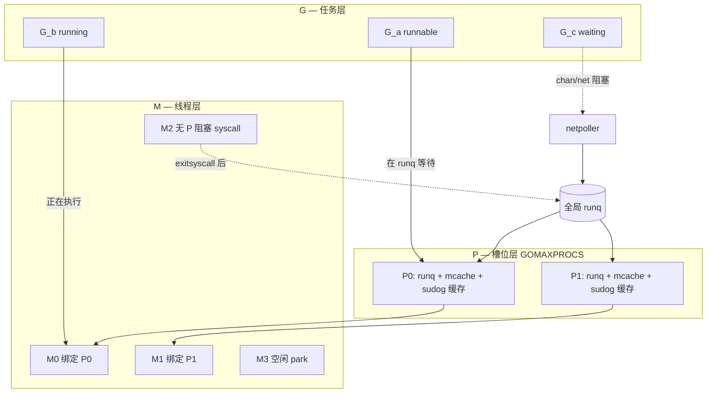
```mermaid
flowchart TB
  subgraph G_layer[G — 任务层]
    G_a[G_a runnable]
    G_b[G_b running]
    G_c[G_c waiting]
  end
  subgraph P_layer[P — 槽位层 GOMAXPROCS]
    P0["P0: runq + mcache + sudog 缓存"]
    P1["P1: runq + mcache + sudog 缓存"]
  end
  subgraph M_layer[M — 线程层]
    M0[M0 绑定 P0]
    M1[M1 绑定 P1]
    M2[M2 无 P 阻塞 syscall]
    M3[M3 空闲 park]
  end

  G_b -->|正在执行| M0
  G_a -->|在 runq 等待| P0
  G_c -.->|chan/net 阻塞| Netpoll[netpoller]
  P0 --> M0
  P1 --> M1
  M2 -.->|exitsyscall 后| GlobalQ[(全局 runq)]
  Netpoll --> GlobalQ
  GlobalQ --> P0
  GlobalQ --> P1
```

**一句话结论**：G 是任务，M 是载体，P 是工牌——**同一时刻最多约 GOMAXPROCS 个 G 处于 `_Grunning`**；M 可以很多，但无 P 的 M 跑不了 Go 用户代码。

### 三实体职责与核心字段

| 实体 | 全称 | 核心字段 / 资源 | 谁创建 / 复用 | 数量级 |
|------|------|-----------------|---------------|--------|
| **G** | Goroutine | 用户栈、SP/PC、`gobuf`、状态、`m` 指针 | `go` 关键字 → `newproc`；G 对象池复用 | 10⁵～10⁶ |
| **M** | Machine | `g0` 栈、`curg`、绑定的 `p`、TLS | 按需创建 OS 线程；阻塞多时可膨胀 | ≥ P，阻塞时 ≫ P |
| **P** | Processor | `runq[256]`、`mcache`、`sudog` 缓存、调度统计 | `procresize(GOMAXPROCS)` | **= GOMAXPROCS** |

| 绑定规则 | 说明 |
|----------|------|
| M 执行 Go 用户代码 | **必须先 `acquirep` 绑定 P** |
| G 处于 `_Grunning` | 挂在某 M 上，且该 M 已绑 P |
| P 与 M | 某时刻是 **至多一对一绑定**；随时间可重新配对 |
| M 与 G | 某时刻 **一个 M 最多跑一个 G**（除 g0） |
| P 与 G | G 在 P 的 runq 等待，或被 M 执行 |

### 各实体「拥有什么」（资源归属图）

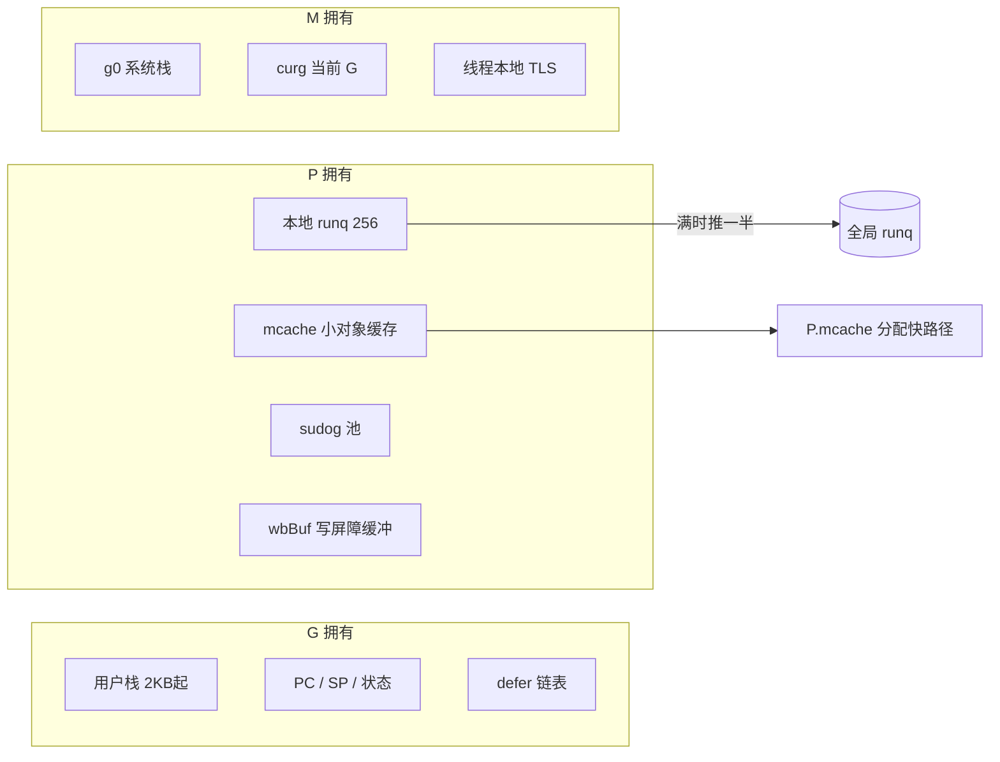
```mermaid
flowchart LR
  subgraph G_res[G 拥有]
    G1[用户栈 2KB起]
    G2[PC / SP / 状态]
    G3[defer 链表]
  end
  subgraph P_res[P 拥有]
    P1[本地 runq 256]
    P2[mcache 小对象缓存]
    P3[sudog 池]
    P4[wbBuf 写屏障缓冲]
  end
  subgraph M_res[M 拥有]
    M1[g0 系统栈]
    M2[curg 当前 G]
    M3[线程本地 TLS]
  end
  P2 --> Fast[P.mcache 分配快路径]
  P1 -->|满时推一半| GlobalQ[(全局 runq)]
```

| 资源 | 归属 | 无 P 时影响 |
|------|------|-------------|
| 小对象堆分配 | P.mcache | M 无 P 时不能运行普通 Go 用户代码，也就不存在“用户分配自动降级到 mcentral” |
| 就绪 G 队列 | P.runq + 全局 runq | G 仍可入全局队列，等有 P 的 M 来取 |
| 网络 IO 等待 | netpoller（全局） | 不占 P；就绪后 G 入队 |
| 线程栈 | M | M 仍存在，但只能等 syscall 返回或 park |

### 为什么需要 P：G-M 两层的瓶颈

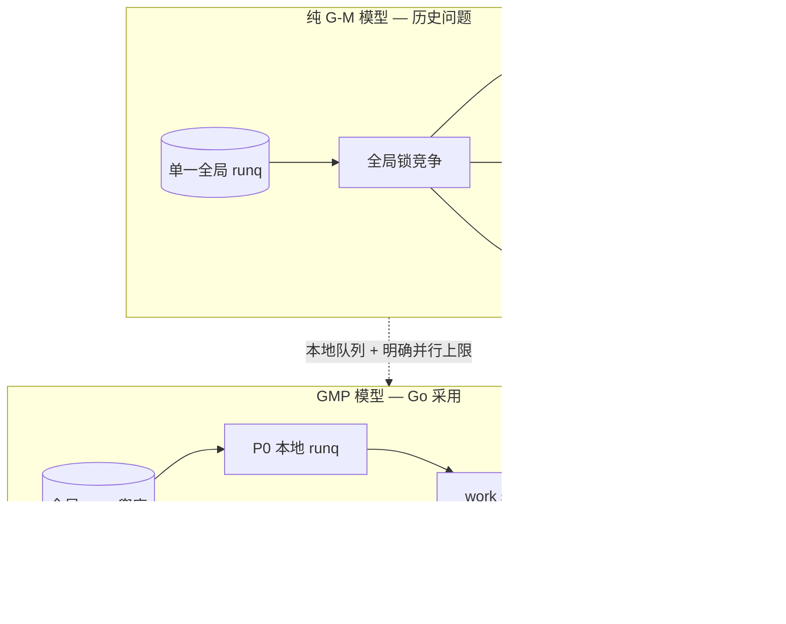
```mermaid
flowchart TB
  subgraph GM_only[纯 G-M 模型 — 历史问题]
    GQ[(单一全局 runq)]
    Lock[全局锁竞争]
    GQ --> Lock
    Lock --> M1[M1]
    Lock --> M2[M2]
    Lock --> M3[M3]
  end
  subgraph GMP[GMP 模型 — Go 采用]
    P0q[P0 本地 runq]
    P1q[P1 本地 runq]
    Steal[work stealing]
    P0q --> Steal
    P1q --> Steal
    Steal --> M_a[M_a]
    Steal --> M_b[M_b]
    GQ2[(全局 runq 兜底)]
    GQ2 --> P0q
    GQ2 --> P1q
  end
  GM_only -.->|本地队列 + 明确并行上限| GMP
```

| 对比项 | 纯 G-M | GMP（Go） |
|--------|--------|-----------|
| 就绪队列 | 全局一把锁 | P 本地 + 全局兜底 |
| 并行度控制 | 不清晰 | **GOMAXPROCS = P 数** |
| 小对象分配 | 全局 cache 锁 | **P.mcache 无锁路径** |
| 线程与并行 | 易混淆 | M 多 ≠ 并行多 |

### M 的生命周期与 P 绑定状态机

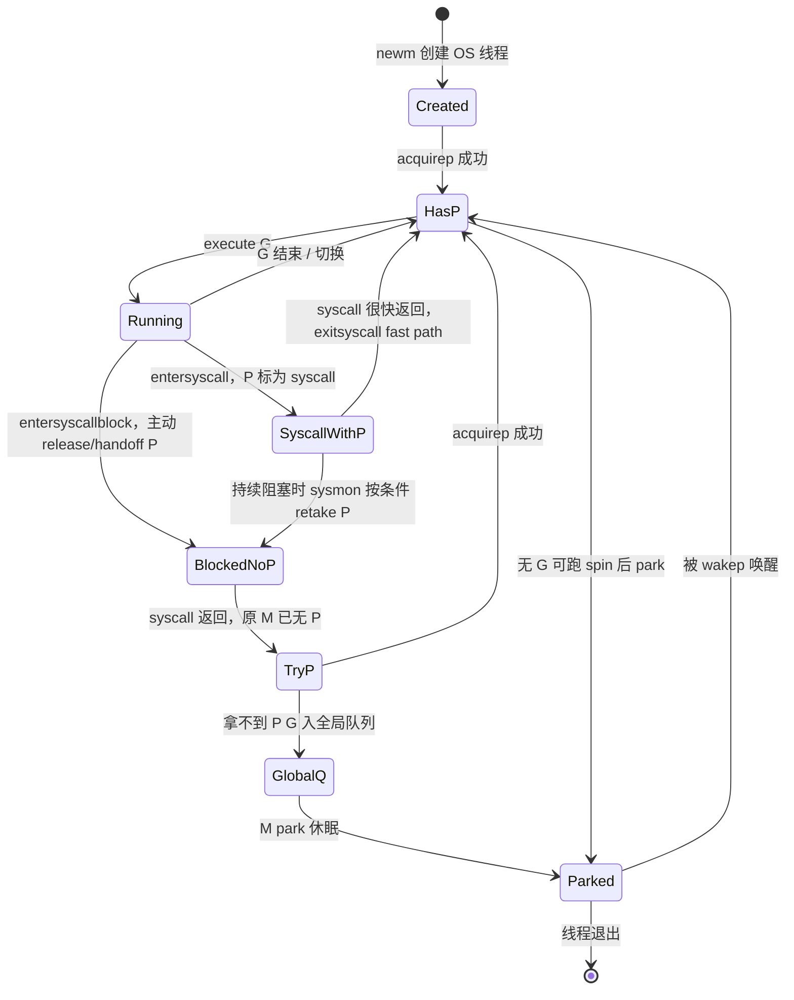
```mermaid
stateDiagram-v2
  [*] --> Created: newm 创建 OS 线程
  Created --> HasP: acquirep 成功
  HasP --> Running: execute G
  Running --> HasP: G 结束 / 切换
  Running --> SyscallWithP: entersyscall，P 标为 syscall
  Running --> BlockedNoP: entersyscallblock，主动 release/handoff P
  SyscallWithP --> HasP: syscall 很快返回，exitsyscall fast path
  SyscallWithP --> BlockedNoP: 持续阻塞时 sysmon 按条件 retake P
  BlockedNoP --> TryP: syscall 返回，原 M 已无 P
  TryP --> HasP: acquirep 成功
  TryP --> GlobalQ: 拿不到 P G 入全局队列
  GlobalQ --> Parked: M park 休眠
  HasP --> Parked: 无 G 可跑 spin 后 park
  Parked --> HasP: 被 wakep 唤醒
  Parked --> [*]: 线程退出
```

| M 状态 | 能否执行 Go 用户代码 | 典型场景 |
|--------|---------------------|----------|
| 绑定 P | **能** | 正常调度 |
| 无 P（syscall 中） | **不能** | 文件 IO、DNS、cgo 阻塞 |
| 无 P（exitsyscall 后） | **暂不能**，尝试 acquirep | 竞争 P 或 G 入全局队列 |
| Parked | **不能** | 无 G、spin 超时后休眠 |

### P 与 M 解绑、P 停止或数量调整的场景（决策树）

下面几种动作不能都叫“移除 P”：syscall 主要改变 P/M 绑定，STW 改变 P 的运行状态，
`GOMAXPROCS` 缩小才会停用多余 P；`Gosched`/抢占通常只重新调度 G。

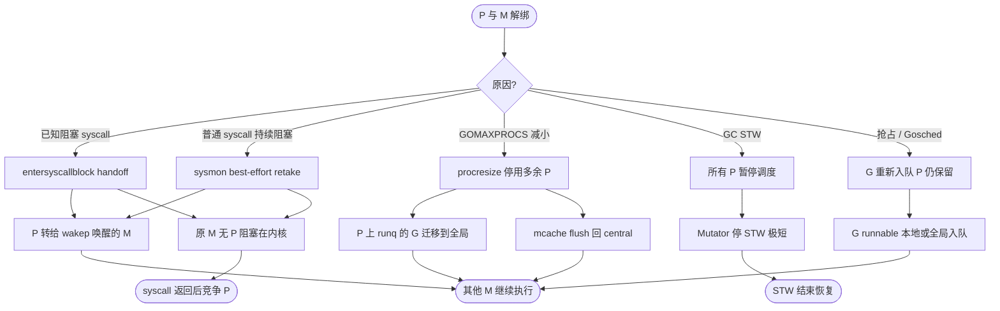
```mermaid
flowchart TD
  Start([P 与 M 解绑]) --> Reason{原因?}
  Reason -->|已知阻塞 syscall| S1[entersyscallblock handoff]
  Reason -->|普通 syscall 持续阻塞| S1b[sysmon best-effort retake]
  Reason -->|GOMAXPROCS 减小| S2[procresize 停用多余 P]
  Reason -->|GC STW| S3[所有 P 暂停调度]
  Reason -->|抢占 / Gosched| S4[G 重新入队 P 仍保留]

  S1 --> A1[P 转给 wakep 唤醒的 M]
  S1 --> A2[原 M 无 P 阻塞在内核]
  S1b --> A1
  S1b --> A2
  S2 --> B1[P 上 runq 的 G 迁移到全局]
  S2 --> B2[mcache  flush 回 central]
  S3 --> C1[Mutator 停 STW 极短]
  S4 --> D1[G runnable 本地或全局入队]

  A1 --> End([其他 M 继续执行])
  A2 --> End2([syscall 返回后竞争 P])
  B1 --> End
  B2 --> End
  C1 --> End3([STW 结束恢复])
  D1 --> End
```

| 场景 | 触发函数 / 条件 | P 去向 | G 去向 | M 去向 |
|------|-----------------|--------|--------|--------|
| **已知阻塞 syscall** | `entersyscallblock` | 先 release/handoff；有工作时启动 M | 随 M 进 `_Gsyscall` | 阻塞在内核，**无 P** |
| **普通 syscall** | `entersyscall` | 先处于 syscall 状态；持续阻塞时 sysmon 按条件 retake | 随 M 进 `_Gsyscall` | P 被 retake 后才成为无 P |
| **GOMAXPROCS↓** | `runtime.GOMAXPROCS(n)` n 更小 | 多余 P 停用并清理资源 | runq 中 G → 全局队列 | 多余 M 可能 park |
| **GC STW** | mark termination 等 | 全部 P 参与同步 | 暂停 | 暂停 |
| **主动让出** | `Gosched`、抢占 | P **保留** | G 重新入队 | M 继续调度 |

### 已知阻塞 Syscall 的 P 移交时序

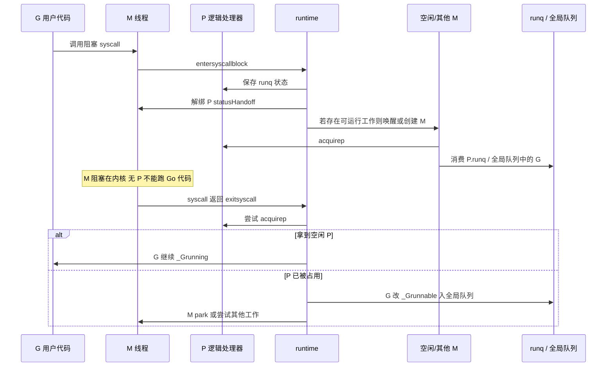
```mermaid
sequenceDiagram
  participant G as G 用户代码
  participant M as M 线程
  participant P as P 逻辑处理器
  participant RT as runtime
  participant M2 as 空闲/其他 M
  participant Q as runq / 全局队列

  G->>M: 调用阻塞 syscall
  M->>RT: entersyscallblock
  RT->>P: 保存 runq 状态
  RT->>M: 解绑 P statusHandoff
  RT->>M2: 若存在可运行工作则唤醒或创建 M
  M2->>P: acquirep
  M2->>Q: 消费 P.runq / 全局队列中的 G
  Note over M: M 阻塞在内核 无 P 不能跑 Go 代码
  M->>RT: syscall 返回 exitsyscall
  RT->>P: 尝试 acquirep
  alt 拿到空闲 P
    RT->>G: G 继续 _Grunning
  else P 已被占用
    RT->>Q: G 改 _Grunnable 入全局队列
    RT->>M: M park 或尝试其他工作
  end
```

**要点**：

- 已知阻塞路径会主动 handoff；普通 syscall 的 P 可能短暂保留在 syscall 状态，sysmon
  在持续阻塞且满足条件时才 retake，不能承诺“syscall 期间 P 一定不闲”。
- **M 数膨胀**（线程多）≠ **并行 Go 代码多**；并行仍 ≤ GOMAXPROCS。
- 网络 IO 走 netpoller，**不占 P 忙等**（[S-CONC-19](./S-CONC-19-netpoller.md)）。

### 无 P 时 M 能做什么 / 不能做什么

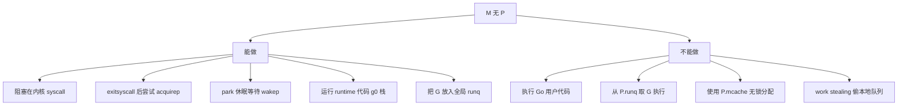
```mermaid
flowchart TB
  NoP[M 无 P]
  NoP --> Can[能做]
  NoP --> Cannot[不能做]

  Can --> C1[阻塞在内核 syscall]
  Can --> C2[exitsyscall 后尝试 acquirep]
  Can --> C3[park 休眠等待 wakep]
  Can --> C4[运行 runtime 代码 g0 栈]
  Can --> C5[把 G 放入全局 runq]

  Cannot --> X1[执行 Go 用户代码]
  Cannot --> X2[从 P.runq 取 G 执行]
  Cannot --> X3[使用 P.mcache 无锁分配]
  Cannot --> X4[work stealing 偷本地队列]
```

| 操作 | 有 P | 无 P |
|------|------|------|
| 执行 `go func()` 用户逻辑 | ✅ | ❌ |
| 小对象 `new`/`make` 走 mcache | ✅ | ❌（无 P 不能执行这段 Go 用户代码） |
| 阻塞在 `Read`/cgo | ✅（但会 handoff P） | ✅（本身就在阻塞） |
| 把 G 放入全局队列 | ✅ | ✅（exitsyscall 路径） |

### 本地 runq 结构（环形队列）

P 的 `runq` 是 **长度 256 的环形数组**，用 `runqhead` / `runqtail` 维护：

| 字段 | 含义 |
|------|------|
| `runqhead` | **队头** — 所有者 M 下次 `runqget` 取 G 的位置（FIFO 出队侧） |
| `runqtail` | **队尾** — `runqput` 新 G 入队的位置 |
| `runq[256]` | 固定容量；`t - h == 256` 时表示本地队列已满 |

**所有者操作**：`runqput` 在 **tail** 入队；`runqget` 从 **head** 出队（另有高优先级 `runnext` 槽位，见 [S-CONC-01](./S-CONC-01-gmp-overview.md)）。

### 本地 runq 满时：`runqputslow` 推一半到全局（源码级）

当 `runqput` 发现 `t - h == 256` 无法再入队时，调用 **`runqputslow`**（`runtime/proc.go`）。这是「slow」的原因：需要 **`sched.lock` 全局锁**，批量转移而非逐个入全局队列。

**结论（以 Go 1.22+ `runtime/proc.go` 为准）**：

1. **移出的是从 `runqhead` 开始的前半段**（共 128 个 G），**不是**从 tail 开始的后半段。
2. **留在本地的是靠近 tail 的后半段**（128 个 G），加上随后新 G 可继续入 tail。
3. 触发溢出的 **新 G** 也一并进入本次 batch（共 **129** 个 G 进全局）。
4. **顺序打乱**：仅当 **`randomizeScheduler`** 为真时执行（当前实现中 **`randomizeScheduler = raceenabled`**，即 **`-race` 检测构建** 才会 Fisher-Yates 洗牌）；**普通生产构建通常不打乱**。

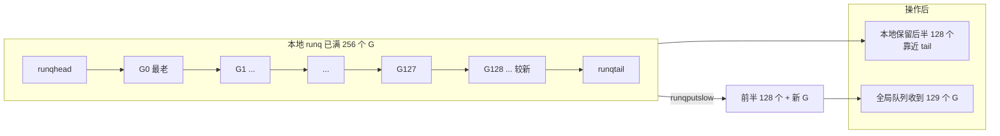
```mermaid
flowchart LR
  subgraph Before[本地 runq 已满 256 个 G]
    direction LR
    H[runqhead] --> F1[G0 最老]
    F1 --> F2[G1 ...]
    F2 --> Mid[...]
    Mid --> B1[G127]
    B1 --> B2[G128 ... 较新]
    B2 --> T[runqtail]
  end
  Moved["前半 128 个 + 新 G"]
  subgraph After[操作后]
    LocalKeep["本地保留后半 128 个<br/>靠近 tail"]
    GlobalBatch["全局队列收到 129 个 G"]
  end
  Before -->|runqputslow| Moved
  Moved --> GlobalBatch
  Before --> LocalKeep
```

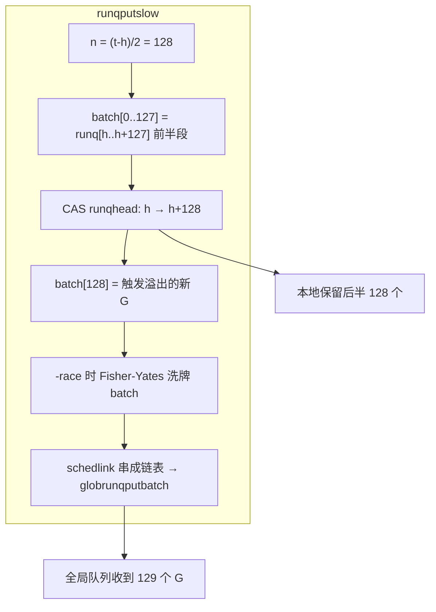
```mermaid
flowchart TB
  subgraph Action[runqputslow]
    A1["n = (t-h)/2 = 128"]
    A2["batch[0..127] = runq[h..h+127] 前半段"]
    A3["CAS runqhead: h → h+128"]
    A4["batch[128] = 触发溢出的新 G"]
    A5["-race 时 Fisher-Yates 洗牌 batch"]
    A6["schedlink 串成链表 → globrunqputbatch"]
    A1 --> A2 --> A3 --> A4 --> A5 --> A6
  end
  A3 --> LocalKeep["本地保留后半 128 个"]
  A6 --> GlobalBatch["全局队列收到 129 个 G"]
```

**源码伪逻辑**（对应 `runqputslow`）：

```go
// runtime/proc.go — 仅 owner P 执行
func runqputslow(pp *p, gp *g, h, t uint32) bool {
    n := (t - h) / 2                    // 满队列时 n == 128
    for i := uint32(0); i < n; i++ {
        batch[i] = pp.runq[(h+i) % 256] // 从 head 起取前半段
    }
    atomic.CasRel(&pp.runqhead, h, h+n) // head 前移，后半段留本地
    batch[n] = gp                       // 当前要入队的新 G

    if randomizeScheduler {             // 仅 raceenabled 时为 true
        for i := uint32(1); i <= n; i++ {
            j := cheaprandn(i + 1)
            batch[i], batch[j] = batch[j], batch[i] // Fisher-Yates
        }
    }
    // batch[0]..batch[n] 用 schedlink 串链，globrunqputbatch 挂到全局 runq
}
```

| 步骤 | 行为 | 易错点 |
|------|------|------------|
| 取哪一半 | **`runq[(h+i)]`，i=0..127** — **head 侧前半** | ❌ 常见误答「推 tail 后半段」 |
| 本地剩什么 | **head 推进 128**，tail 不动 → **tail 侧后半留本地** | 与「推后半」说法相反 |
| 新 G | 进入 `batch[n]`，随 batch 进全局 | 不是单独再入本地 |
| 全局入队 | `schedlink` 链成 `gQueue`，`globrunqputbatch` 批量挂全局 | 需 `sched.lock`，故 slow |
| 洗牌 | `-race` 下 Fisher-Yates 打乱 batch 顺序 | 生产默认可视为**保持 batch 内相对顺序** |

**与经典 Cilk 双端队列对比**：Cilk 是 owner 一端 pop、thief 从**对端** steal；Go 的本地 runq 是 **FIFO 环形队列**，overflow 与 steal 都从 **head 侧取一半**（实现更简单，见 [Go: Under the Hood §9.2](https://golang.design/under-the-hood/en/part3concurrency/ch09sched/steal/)）。

### Work Stealing 与全局兜底

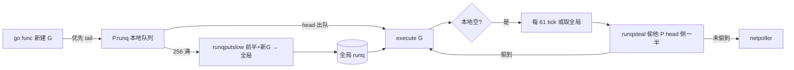
```mermaid
flowchart LR
  NewG[go func 新建 G] -->|优先 tail| Local[P.runq 本地队列]
  Local -->|256 满| Slow[runqputslow 前半+新G → 全局]
  Slow --> Global[(全局 runq)]
  Local -->|head 出队| Exec[execute G]
  Empty{本地空?} -->|是| GlobalFirst[每 61 tick 或取全局]
  GlobalFirst --> Steal[runqsteal 偷他 P head 侧一半]
  Steal -->|偷到| Exec
  Steal -->|未偷到| Net[netpoller]
  Global --> Exec
  Exec --> Empty
```

**Work stealing**（`runqsteal` → `runqgrab`）：从受害者 P 的 **`runqhead` 侧取约一半**（同样 `n = (t-h) - (t-h)/2`），CAS 推进受害者 head；偷来的 G 挂到**窃取者本地 tail**，立即执行其中一个。这与 overflow 一样取的是 **head 前半**，不是 Cilk 式「从 tail 偷」。

| 策略 | 细节 | 源码函数 |
|------|------|----------|
| **本地优先** | 新 G `runqput` 入 **tail** | `runqput` |
| **满则分流** | **head 前半 128 + 新 G** → 全局 batch | `runqputslow` |
| **所有者取头** | `runqget` 从 **head** FIFO 出队 | `runqget` |
| **Work stealing** | 偷受害者 **head 侧一半**，写入自己 **tail** | `runqsteal` / `runqgrab` |
| **全局公平** | 每 **61** 次调度 tick 优先看全局队列 | `findRunnable` |
| **全局兜底** | 本地空且偷失败 → `globrunqget` | `findRunnable` |

### GOMAXPROCS 调小时 P 缩减流程


```mermaid
sequenceDiagram
  participant App as 应用 / runtime.GOMAXPROCS
  participant RT as runtime procresize
  participant P_old as 多余 P
  participant Global as 全局 runq
  participant M as 各 M

  App->>RT: GOMAXPROCS 8 → 4
  RT->>P_old: 停用 P4..P7
  RT->>P_old: 将 runq 中 G 批量迁入 Global
  RT->>P_old: mcache flush 到 central cache
  RT->>P_old: 清理/释放多余 P 资源
  Note over M: 现有 M 继续绑定 P0..P3
  M->>Global: 从全局队列取被迁移的 G
```

| 影响 | 说明 | 生产建议 |
|------|------|----------|
| 瞬时全局队列堆积 | 多余 P 上 G 一次性迁入 | 避免滚动发布时大幅跳变 GOMAXPROCS |
| mcache flush | 小对象缓存归还 central | 可能短暂增加分配延迟 |
| 并行度立即下降 | 同时 running G 上限变为新值 | 配合 [S-CONC-04](./S-CONC-04-gomaxprocs.md) 对齐容器 CPU |

### mcache 与 P 的绑定

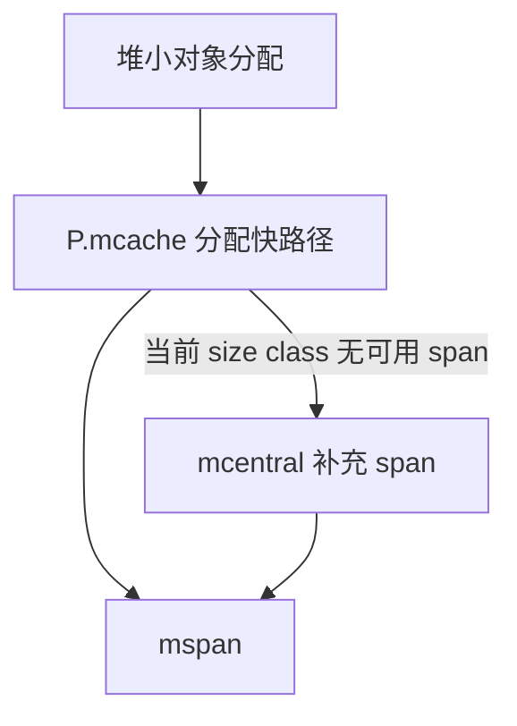
```mermaid
flowchart TB
  Alloc[堆小对象分配]
  Alloc --> MC[P.mcache 分配快路径]
  MC -->|当前 size class 无可用 span| CC[mcentral 补充 span]
  MC --> Span[mspan]
  CC --> Span
```

| 级别 | 路径 | 锁竞争 |
|------|------|--------|
| P.mcache | 当前 runtime 归类为 small object 的分配 | **无锁快路径**（Per-P；大小边界是实现细节） |
| mcentral | mcache 不足时补 span | 按 size class 分锁 |
| mheap | 大对象 / mcentral 不足 | 全局锁 |

**加分项**：大量阻塞 syscall 会让 M 数量膨胀，但只要 P 能及时 handoff，Go 代码并行上限仍由 `GOMAXPROCS` 决定。不能回答成“无 P 的 M 会继续执行用户代码，只是分配退化到全局锁”。

### G 状态与 P 的关系

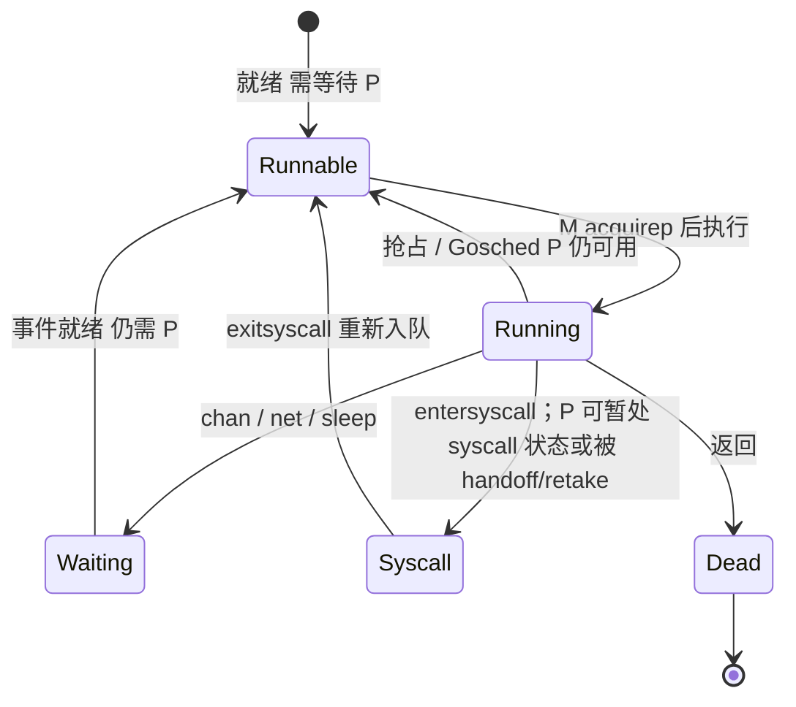
```mermaid
stateDiagram-v2
  [*] --> Runnable: 就绪 需等待 P
  Runnable --> Running: M acquirep 后执行
  Running --> Runnable: 抢占 / Gosched P 仍可用
  Running --> Waiting: chan / net / sleep
  Running --> Syscall: entersyscall；P 可暂处 syscall 状态或被 handoff/retake
  Waiting --> Runnable: 事件就绪 仍需 P
  Syscall --> Runnable: exitsyscall 重新入队
  Running --> Dead: 返回
  Dead --> [*]
```

| G 状态 | 是否需要 P 才能继续 | 说明 |
|--------|---------------------|------|
| `_Grunnable` | **需要** P 才能变 Running | 在 runq 等待 |
| `_Grunning` | 已占用 P | 通过绑 P 的 M 执行 |
| `_Gwaiting` | 不需要（不占 P） | netpoller / chan 阻塞 |
| `_Gsyscall` | 不执行普通 Go 用户代码；P 可能暂处 `_Psyscall`，也可能已被主动 handoff 或由 sysmon retake | G 随 syscall M，返回后走 `exitsyscall` |

## 生产场景

| 场景 | 现象 | 根因 | 排查 / 策略 |
|------|------|------|-------------|
| 同步文件 IO 风暴 | `Threads` 飙高、CPU 低 | 每个阻塞 G 占一 M；P 可被主动 handoff 或由 sysmon 后续 retake | 评估异步/可轮询 IO 路径并限制并发 |
| DNS 解析线程膨胀 | 毛刺 + 线程多 | 选中了 cgo resolver 或底层解析调用阻塞；纯 Go resolver 通常走网络 poller | 先用 `GODEBUG=netdns`/trace 确认路径，再决定强制 Go resolver、缓存或隔离 |
| cgo 阻塞 SDK | M ≫ GOMAXPROCS | cgo 占 M 不进 netpoller | sidecar 隔离、进程池 |
| 滚动改 GOMAXPROCS | P99 尖刺 | 全局队列瞬时堆积 | 小步调整、预热、HPA 对齐 quota |
| 容器 thread limit | `exceeds thread limit` | M 膨胀触顶 | 升 ulimit 或减少阻塞源 |
| 误判并行度 | goroutine 10 万但 CPU 8 核打满 | GOMAXPROCS 与 quota 不一致 | [automaxprocs](https://github.com/uber-go/automaxprocs)、[S-CONC-04](./S-CONC-04-gomaxprocs.md) |

## 排查与工具

| 工具 | 命令 / 用法 | 看什么 |
|------|-------------|--------|
| 线程数 | `/proc/pid/status` → `Threads` | M 是否因 syscall 膨胀 |
| schedtrace | `GODEBUG=schedtrace=1000` | P/M/G 数量变化（仅调试） |
| trace | `go test -trace` / `go tool trace` | Syscall、Proc 利用率、P handoff |
| goroutine | `pprof` goroutine | G 阻塞在 syscall / chan |
| threadcreate | `pprof` profile | 线程创建热点 |
| 运行时指标 | Prometheus `go_threads` | 与 GOMAXPROCS 对比 |

**排查路径**：`Threads` >> `GOMAXPROCS` 且持续 → trace 看 Syscall 行 → 定位阻塞 API → 改 netpoller 路径或限流。

## 架构取舍

| 方案 | 适用 | 不适用 |
|------|------|--------|
| 默认 netpoller 路径 | Go `net` 包管理的 pollable TCP/UDP FD | 普通文件、cgo 或绕过 poller 的阻塞调用 |
| 有界 worker + 阻塞 IO 池 | 必须同步阻塞 | 简单 CRUD 过度设计 |
| 进程外 cgo / 阻塞库 | 隔离 M 膨胀 | 运维简单优先 |
| `automaxprocs` | 旧工具链或明确希望库在启动时固定设置 P 数 | Go 1.25+ 已启用 runtime 容器感知且希望保留动态更新时；库会显式设置 `GOMAXPROCS` |
| 调大 GOMAXPROCS | CPU 密集、核数明确 | 已超过 cgroup quota |

## 深挖问答

1. **G、M、P 一句话各是什么？** → G 任务，M 线程，P 并行槽位 + 本地 runq/mcache。
2. **为什么需要 P，不是 G-M 两层？** → 降全局锁、明确并行上限、mcache 无锁分配。
3. **M 的数量上限？** → 默认很高（历史 1 万）；`debug.SetMaxThreads`；容器 thread ulimit。
4. **P 和 GOMAXPROCS 关系？** → 活跃 P 数 = GOMAXPROCS，是 `_Grunning` G 的上限。
5. **去掉 P 后 M 能跑 Go 代码吗？** → **不能**执行用户代码；只能 runtime / 等 acquirep。
6. **syscall 时 G 去哪了？** → G 状态 `_Gsyscall`，M 无 P 阻塞；P 给其他 M。
7. **exitsyscall 后拿不到 P 呢？** → G 改 `_Grunnable` 入全局队列，M park 或继续找活。
8. **work stealing 偷哪一端？** → 偷受害者 **head 侧约一半**（`runqgrab`）；所有者从 **head** 取；偷来的 G 挂到窃取者 **tail**（非 Cilk 双端 deque）。
9. **本地 runq 满推哪一半到全局？** → **`runqputslow` 推 head 前半 128 个 + 新 G**；**tail 后半留本地**；`-race` 下 batch Fisher-Yates 洗牌。
10. **GOMAXPROCS 从 8 改 4 会怎样？** → runtime 通过 STW 调整活跃 P；多余 P 的 runq 迁移、缓存清理，多余 M 可能 park。
11. **netpoller 与 P 关系？** → 网络 G 等待不占 P；就绪后入队仍需 P 执行（[S-CONC-19](./S-CONC-19-netpoller.md)）。

## 反模式与事故

| 反模式 | 后果 | 正确做法 |
|--------|------|----------|
| 假设 goroutine 多 = 并行多 | CPU 打满但吞吐低 | 看 GOMAXPROCS 与 P 利用率 |
| 大量同步 `Read`/cgo | M 膨胀、thread limit | 异步 IO、隔离、限并发 |
| 滥用 `LockOSThread` | M 与 P 绑定异常 | 仅 CGO/GUI 等必要场景 |
| 发布时 GOMAXPROCS 腰斩 | 全局队列延迟尖刺 | 小步变更、监控 runqueue |
| 忽视 mcache 与 P 绑定 | 阻塞多 + 分配慢 | 减少无 P 路径、降分配 |

## 代码示例

### 观察 GOMAXPROCS 与并行槽位

```go
package main

import (
	"fmt"
	"runtime"
	"sync"
)

func main() {
	fmt.Println("GOMAXPROCS:", runtime.GOMAXPROCS(0))
	fmt.Println("NumCPU:", runtime.NumCPU())

	var wg sync.WaitGroup
	for i := 0; i < 16; i++ {
		wg.Add(1)
		go func(id int) {
			defer wg.Done()
			// 纯 CPU 循环：同一时刻约 GOMAXPROCS 个在跑
			sum := 0
			for j := 0; j < 1e8; j++ {
				sum += j
			}
			fmt.Printf("worker %d done sum=%d\n", id, sum)
		}(i)
	}
	wg.Wait()
}
```

### 对比：阻塞 syscall 导致 M 膨胀（勿在生产 stdin 上跑）

```go
// 演示：阻塞 syscall 增加 M，但不增加并行 Go 执行槽
func blockSyscallDemo() {
	for i := 0; i < 1000; i++ {
		go func() {
			var b [1]byte
			_, _ = syscall.Read(syscall.Stdin, b[:]) // 每个阻塞 G 占一 M；P 可被主动 handoff 或后续 retake
		}()
	}
	// 此时 runtime 中 M 数可远大于 GOMAXPROCS
}
```

### 动态调整 GOMAXPROCS（观察全局队列影响）

```go
func retuneGOMAXPROCS() {
	old := runtime.GOMAXPROCS(0)
	fmt.Printf("before: GOMAXPROCS=%d\n", old)

	// 生产慎用：缩小会在 STW 中停用多余 P、迁移 runq。
	next := old / 2
	if next < 1 {
		next = 1
	}
	runtime.GOMAXPROCS(next)
	fmt.Printf("after: GOMAXPROCS=%d\n", runtime.GOMAXPROCS(0))
}
```

可运行 goroutine 与 WaitGroup 示例见 [`basis/goroutine/main.go`](https://github.com/twodog-tt/Golang-development-manual/blob/master/basis/goroutine/main.go)。

## 延伸阅读

- [S-CONC-01 GMP 总览与抢占](./S-CONC-01-gmp-overview.md) — 调度主循环、1.14 抢占
- [S-CONC-03 Goroutine 栈](./S-CONC-03-goroutine-stack.md) — G 的栈与 safe-point
- [S-CONC-04 GOMAXPROCS 与容器](./S-CONC-04-gomaxprocs.md) — cgroup CPU 对齐
- [S-CONC-19 Netpoller](./S-CONC-19-netpoller.md) — 网络 IO 不占 P
- [runtime/proc.go（源码）](https://go.dev/src/runtime/proc.go)
- [Go Issue #12416：GOMAXPROCS](https://github.com/golang/go/issues/12416)
- [Draveness：GMP 调度器](https://draveness.me/golang/docs/part3-runtime/ch06-concurrency/golang-gmp/)
