# G、M、P 角色与 P 被移除时会发生什么

## 30 秒版（开场）

> **G 干活，M 跑腿，P 发工牌**：G 是 goroutine 任务；M 是 OS 线程（可多于 P）；P 是逻辑 CPU 槽位（`≈ GOMAXPROCS`），持有 **本地 runq** 与 **mcache**。**无 P 的 M 不能执行 Go 用户代码**。P 被摘掉时（syscall、GOMAXPROCS 调小、STW），G 回全局队列或让出，P 转给其他 M 继续跑本地队列。生产关键词：**P = 并行度上限、handoff、work stealing、M 膨胀 ≠ 并行提升**。

## 3 分钟版（一面深度）

1. **是什么**
   - **G（Goroutine）**：用户态协程，含栈（~2KB 起，见 [S-CONC-03](./S-CONC-03-goroutine-stack.md)）、SP/PC、状态、sched 链接；是调度器的**任务单元**。
   - **M（Machine）**：对应一个 OS 线程（`pthread`），含 `g0` 系统栈用于 runtime 调度；**数量可远大于 P**（阻塞 syscall、cgo 时常见）。
   - **P（Processor）**：逻辑处理器，**活跃 P 数 = GOMAXPROCS**；持有 **本地 runq**（256 容量）、**mcache**（小对象分配缓存）、defer 池等；是 **并行执行 Go 代码的槽位**。
2. **为什么需要 P**：纯 G-M 模型全局 runq 锁竞争严重；P 的本地队列 + work stealing 降低锁争用，并把 **并行度** 与 **线程数** 解耦——100 个阻塞 M 也不等于 100 路 CPU 并行。
3. **怎么做**：M 执行 Go 代码前必须 `acquirep(P)`；`entersyscall` 时 M 与 P **解绑 handoff**；`exitsyscall` 尝试 `acquirep` 或把 G 入全局队列；本地 runq 空则偷其他 P 或取全局队列（详见 [S-CONC-01](./S-CONC-01-gmp-overview.md) 总览）。

## 10 分钟版（原理 + 图示）

### G、M、P 绑定关系（核心图）

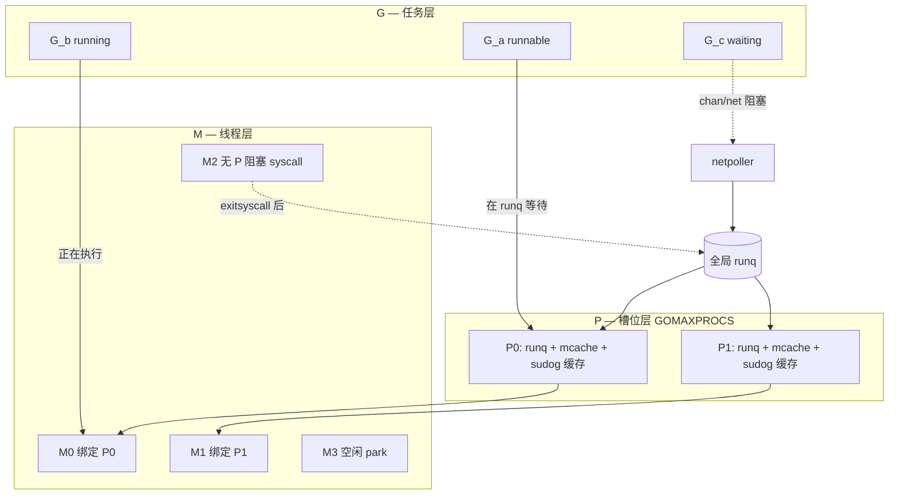
```mermaid
flowchart TB
  subgraph G_layer[G — 任务层]
    G_a[G_a runnable]
    G_b[G_b running]
    G_c[G_c waiting]
  end
  subgraph P_layer[P — 槽位层 GOMAXPROCS]
    P0["P0: runq + mcache + sudog 缓存"]
    P1["P1: runq + mcache + sudog 缓存"]
  end
  subgraph M_layer[M — 线程层]
    M0[M0 绑定 P0]
    M1[M1 绑定 P1]
    M2[M2 无 P 阻塞 syscall]
    M3[M3 空闲 park]
  end

  G_b -->|正在执行| M0
  G_a -->|在 runq 等待| P0
  G_c -.->|chan/net 阻塞| Netpoll[netpoller]
  P0 --> M0
  P1 --> M1
  M2 -.->|exitsyscall 后| GlobalQ[(全局 runq)]
  Netpoll --> GlobalQ
  GlobalQ --> P0
  GlobalQ --> P1
```

**面试一句话**：G 是任务，M 是载体，P 是工牌——**同一时刻最多约 GOMAXPROCS 个 G 处于 `_Grunning`**；M 可以很多，但无 P 的 M 跑不了 Go 用户代码。

### 三实体职责与核心字段

| 实体 | 全称 | 核心字段 / 资源 | 谁创建 / 复用 | 数量级 |
|------|------|-----------------|---------------|--------|
| **G** | Goroutine | 用户栈、SP/PC、`gobuf`、状态、`m` 指针 | `go` 关键字 → `newproc`；G 对象池复用 | 10⁵～10⁶ |
| **M** | Machine | `g0` 栈、`curg`、绑定的 `p`、TLS | 按需创建 OS 线程；阻塞多时可膨胀 | ≥ P，阻塞时 ≫ P |
| **P** | Processor | `runq[256]`、`mcache`、`sudog` 缓存、调度统计 | `procresize(GOMAXPROCS)` | **= GOMAXPROCS** |

| 绑定规则 | 说明 |
|----------|------|
| M 执行 Go 用户代码 | **必须先 `acquirep` 绑定 P** |
| G 处于 `_Grunning` | 挂在某 M 上，且该 M 已绑 P |
| P 与 M | 某时刻 **一个 P 最多绑一个 M**（多对一） |
| M 与 G | 某时刻 **一个 M 最多跑一个 G**（除 g0） |
| P 与 G | G 在 P 的 runq 等待，或被 M 执行 |

### 各实体「拥有什么」（资源归属图）

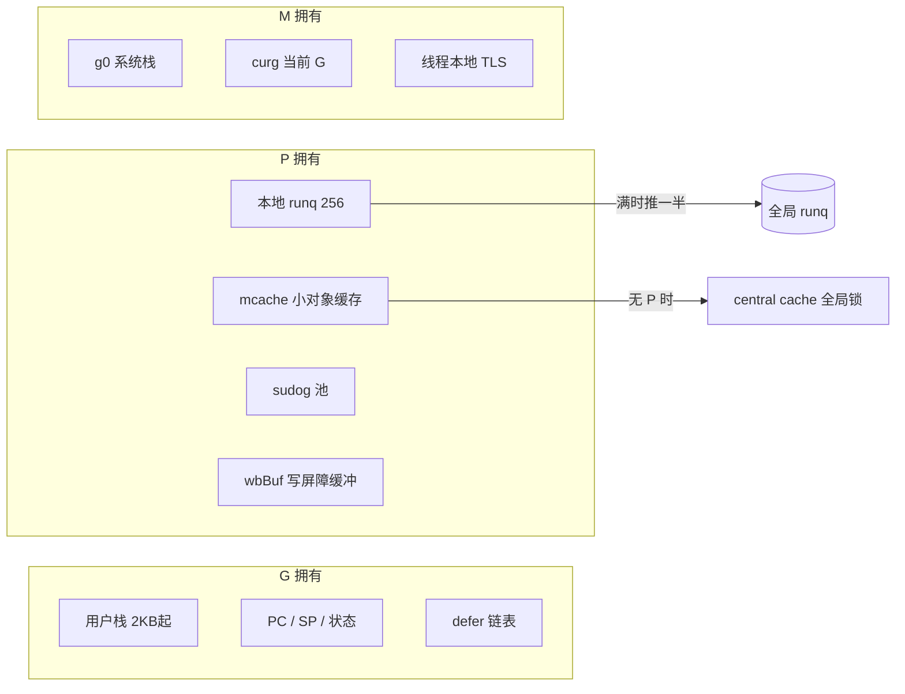
```mermaid
flowchart LR
  subgraph G_res[G 拥有]
    G1[用户栈 2KB起]
    G2[PC / SP / 状态]
    G3[defer 链表]
  end
  subgraph P_res[P 拥有]
    P1[本地 runq 256]
    P2[mcache 小对象缓存]
    P3[sudog 池]
    P4[wbBuf 写屏障缓冲]
  end
  subgraph M_res[M 拥有]
    M1[g0 系统栈]
    M2[curg 当前 G]
    M3[线程本地 TLS]
  end
  P2 -->|无 P 时| Slow[central cache 全局锁]
  P1 -->|满时推一半| GlobalQ[(全局 runq)]
```

| 资源 | 归属 | 无 P 时影响 |
|------|------|-------------|
| 小对象堆分配 | P.mcache | 走 central cache，**分配变慢、锁竞争** |
| 就绪 G 队列 | P.runq + 全局 runq | G 仍可入全局队列，等有 P 的 M 来取 |
| 网络 IO 等待 | netpoller（全局） | 不占 P；就绪后 G 入队 |
| 线程栈 | M | M 仍存在，但只能等 syscall 返回或 park |

### 为什么需要 P：G-M 两层的瓶颈

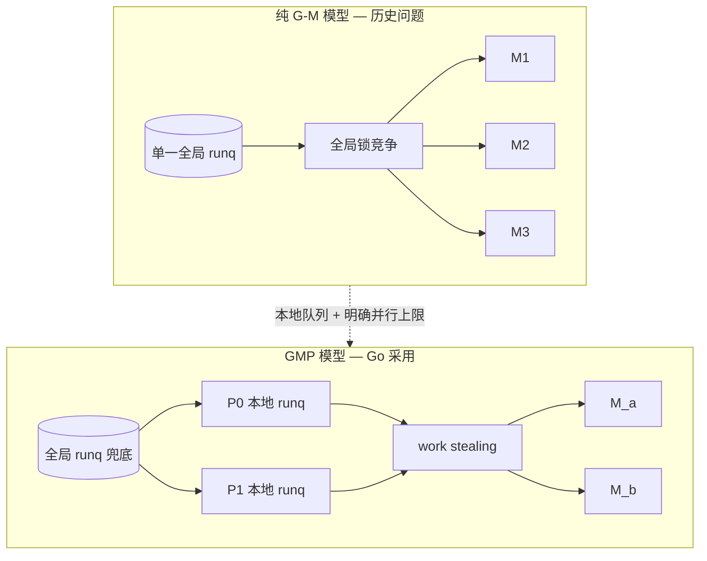
```mermaid
flowchart TB
  subgraph GM_only[纯 G-M 模型 — 历史问题]
    GQ[(单一全局 runq)]
    Lock[全局锁竞争]
    GQ --> Lock
    Lock --> M1[M1]
    Lock --> M2[M2]
    Lock --> M3[M3]
  end
  subgraph GMP[GMP 模型 — Go 采用]
    P0q[P0 本地 runq]
    P1q[P1 本地 runq]
    Steal[work stealing]
    P0q --> Steal
    P1q --> Steal
    Steal --> M_a[M_a]
    Steal --> M_b[M_b]
    GQ2[(全局 runq 兜底)]
    GQ2 --> P0q
    GQ2 --> P1q
  end
  GM_only -.->|本地队列 + 明确并行上限| GMP
```

| 对比项 | 纯 G-M | GMP（Go） |
|--------|--------|-----------|
| 就绪队列 | 全局一把锁 | P 本地 + 全局兜底 |
| 并行度控制 | 不清晰 | **GOMAXPROCS = P 数** |
| 小对象分配 | 全局 cache 锁 | **P.mcache 无锁路径** |
| 线程与并行 | 易混淆 | M 多 ≠ 并行多 |

### M 的生命周期与 P 绑定状态机

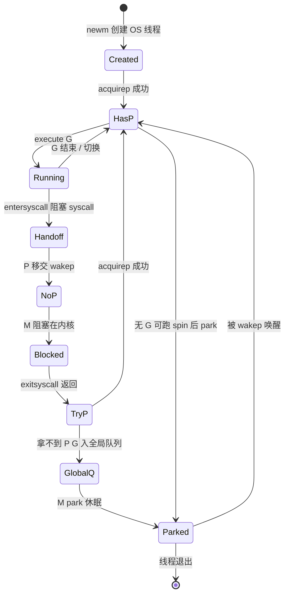
```mermaid
stateDiagram-v2
  [*] --> Created: newm 创建 OS 线程
  Created --> HasP: acquirep 成功
  HasP --> Running: execute G
  Running --> HasP: G 结束 / 切换
  Running --> Handoff: entersyscall 阻塞 syscall
  Handoff --> NoP: P 移交 wakep
  NoP --> Blocked: M 阻塞在内核
  Blocked --> TryP: exitsyscall 返回
  TryP --> HasP: acquirep 成功
  TryP --> GlobalQ: 拿不到 P G 入全局队列
  GlobalQ --> Parked: M park 休眠
  HasP --> Parked: 无 G 可跑 spin 后 park
  Parked --> HasP: 被 wakep 唤醒
  Parked --> [*]: 线程退出
```

| M 状态 | 能否执行 Go 用户代码 | 典型场景 |
|--------|---------------------|----------|
| 绑定 P | **能** | 正常调度 |
| 无 P（syscall 中） | **不能** | 文件 IO、DNS、cgo 阻塞 |
| 无 P（exitsyscall 后） | **暂不能**，尝试 acquirep | 竞争 P 或 G 入全局队列 |
| Parked | **不能** | 无 G、spin 超时后休眠 |

### P 被移除的四大场景（决策树）

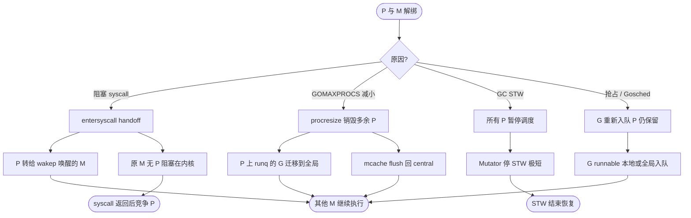
```mermaid
flowchart TD
  Start([P 与 M 解绑]) --> Reason{原因?}
  Reason -->|阻塞 syscall| S1[entersyscall handoff]
  Reason -->|GOMAXPROCS 减小| S2[procresize 销毁多余 P]
  Reason -->|GC STW| S3[所有 P 暂停调度]
  Reason -->|抢占 / Gosched| S4[G 重新入队 P 仍保留]

  S1 --> A1[P 转给 wakep 唤醒的 M]
  S1 --> A2[原 M 无 P 阻塞在内核]
  S2 --> B1[P 上 runq 的 G 迁移到全局]
  S2 --> B2[mcache  flush 回 central]
  S3 --> C1[Mutator 停 STW 极短]
  S4 --> D1[G runnable 本地或全局入队]

  A1 --> End([其他 M 继续执行])
  A2 --> End2([syscall 返回后竞争 P])
  B1 --> End
  B2 --> End
  C1 --> End3([STW 结束恢复])
  D1 --> End
```

| 场景 | 触发函数 / 条件 | P 去向 | G 去向 | M 去向 |
|------|-----------------|--------|--------|--------|
| **阻塞 syscall** | `entersyscall` / `entersyscallblock` | handoff 给其他 M | 随 M 进 `_Gsyscall` | 阻塞在内核，**无 P** |
| **GOMAXPROCS↓** | `runtime.GOMAXPROCS(n)` n 更小 | 多余 P 销毁 | runq 中 G → 全局队列 | 不受影响 |
| **GC STW** | mark termination 等 | 全部 P 参与同步 | 暂停 | 暂停 |
| **主动让出** | `Gosched`、抢占 | P **保留** | G 重新入队 | M 继续调度 |

### 阻塞 Syscall 时 P 移交（handoff 时序）

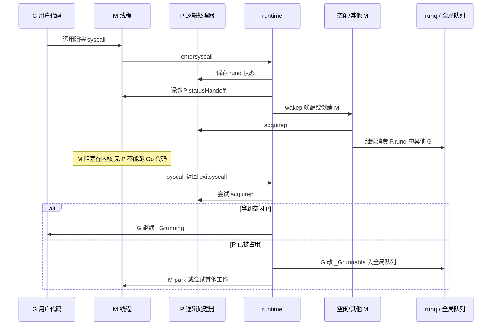
```mermaid
sequenceDiagram
  participant G as G 用户代码
  participant M as M 线程
  participant P as P 逻辑处理器
  participant RT as runtime
  participant M2 as 空闲/其他 M
  participant Q as runq / 全局队列

  G->>M: 调用阻塞 syscall
  M->>RT: entersyscall
  RT->>P: 保存 runq 状态
  RT->>M: 解绑 P statusHandoff
  RT->>M2: wakep 唤醒或创建 M
  M2->>P: acquirep
  M2->>Q: 继续消费 P.runq 中其他 G
  Note over M: M 阻塞在内核 无 P 不能跑 Go 代码
  M->>RT: syscall 返回 exitsyscall
  RT->>P: 尝试 acquirep
  alt 拿到空闲 P
    RT->>G: G 继续 _Grunning
  else P 已被占用
    RT->>Q: G 改 _Grunnable 入全局队列
    RT->>M: M park 或尝试其他工作
  end
```

**要点**：

- syscall 期间 **P 不会闲着**——这是 Go 高吞吐的关键。
- **M 数膨胀**（线程多）≠ **并行 Go 代码多**；并行仍 ≤ GOMAXPROCS。
- 网络 IO 走 netpoller，**不占 P 忙等**（[S-CONC-19](./S-CONC-19-netpoller.md)）。

### 无 P 时 M 能做什么 / 不能做什么

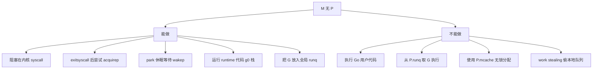
```mermaid
flowchart TB
  NoP[M 无 P]
  NoP --> Can[能做]
  NoP --> Cannot[不能做]

  Can --> C1[阻塞在内核 syscall]
  Can --> C2[exitsyscall 后尝试 acquirep]
  Can --> C3[park 休眠等待 wakep]
  Can --> C4[运行 runtime 代码 g0 栈]
  Can --> C5[把 G 放入全局 runq]

  Cannot --> X1[执行 Go 用户代码]
  Cannot --> X2[从 P.runq 取 G 执行]
  Cannot --> X3[使用 P.mcache 无锁分配]
  Cannot --> X4[work stealing 偷本地队列]
```

| 操作 | 有 P | 无 P |
|------|------|------|
| 执行 `go func()` 用户逻辑 | ✅ | ❌ |
| 小对象 `new`/`make` 走 mcache | ✅ | ❌（需 central cache） |
| 阻塞在 `Read`/cgo | ✅（但会 handoff P） | ✅（本身就在阻塞） |
| 把 G 放入全局队列 | ✅ | ✅（exitsyscall 路径） |

### 本地 runq、全局 runq 与 Work Stealing

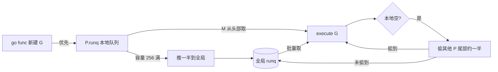
```mermaid
flowchart LR
  NewG[go func 新建 G] -->|优先| Local[P.runq 本地队列]
  Local -->|容量 256 满| PushHalf[推一半到全局]
  PushHalf --> Global[(全局 runq)]
  Local -->|M 从头部取| Exec[execute G]
  Empty{本地空?} -->|是| Steal[偷其他 P 尾部约一半]
  Steal -->|偷到| Exec
  Steal -->|未偷到| Global
  Global -->|批量取| Exec
  Exec --> Empty
```

| 策略 | 细节 | 面试考点 |
|------|------|----------|
| **本地优先** | 新 G 入当前 P 的 runq 尾部 | 减少跨 P 迁移，缓存友好 |
| **满则分流** | 本地满（256）时推一半到全局 | 避免单 P 过载 |
| **所有者取头** | M 从本地队列**头部**取 G | FIFO 本地 |
| **偷取取尾** | 空闲 P 从其他 P **尾部**偷约一半 | 降低与所有者的争用 |
| **全局兜底** | 偷失败则取全局 runq | 新 P 创建、GOMAXPROCS 变化后 G 的归宿 |

### GOMAXPROCS 调小时 P 销毁流程

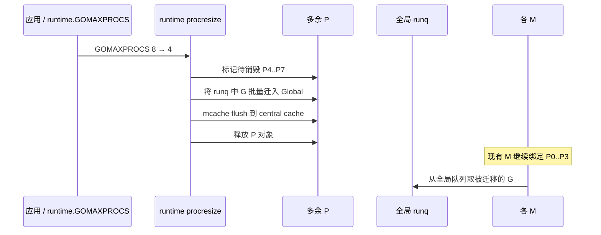
```mermaid
sequenceDiagram
  participant App as 应用 / runtime.GOMAXPROCS
  participant RT as runtime procresize
  participant P_old as 多余 P
  participant Global as 全局 runq
  participant M as 各 M

  App->>RT: GOMAXPROCS 8 → 4
  RT->>P_old: 标记待销毁 P4..P7
  RT->>P_old: 将 runq 中 G 批量迁入 Global
  RT->>P_old: mcache flush 到 central cache
  RT->>P_old: 释放 P 对象
  Note over M: 现有 M 继续绑定 P0..P3
  M->>Global: 从全局队列取被迁移的 G
```

| 影响 | 说明 | 生产建议 |
|------|------|----------|
| 瞬时全局队列堆积 | 多余 P 上 G 一次性迁入 | 避免滚动发布时大幅跳变 GOMAXPROCS |
| mcache flush | 小对象缓存归还 central | 可能短暂增加分配延迟 |
| 并行度立即下降 | 同时 running G 上限变为新值 | 配合 [S-CONC-04](./S-CONC-04-gomaxprocs.md) 对齐容器 CPU |

### mcache 与 P 的绑定（去掉 P 的隐性代价）

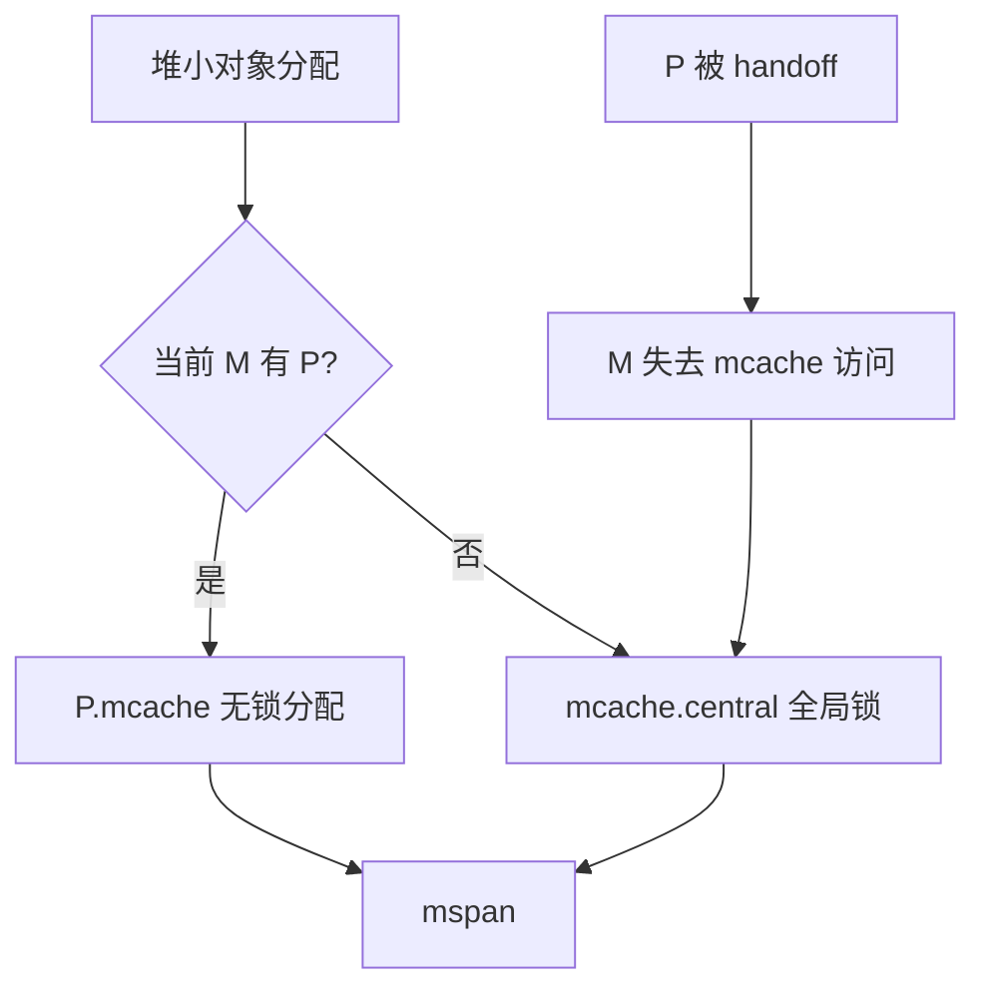
```mermaid
flowchart TB
  Alloc[堆小对象分配]
  Alloc --> HasP{当前 M 有 P?}
  HasP -->|是| MC[P.mcache 无锁分配]
  HasP -->|否| CC[mcache.central 全局锁]
  MC --> Span[mspan]
  CC --> Span
  P_removed[P 被 handoff] --> NoMC[M 失去 mcache 访问]
  NoMC --> CC
```

| 级别 | 路径 | 锁竞争 |
|------|------|--------|
| P.mcache | 32KB 以下小对象 | **无锁**（Per-P） |
| mcentral | mcache 不足时补 span | 按 size class 分锁 |
| mheap | 大对象 / mcentral 不足 | 全局锁 |

**面试加分**：大量阻塞 syscall 导致 M 频繁无 P，不仅 **并行度下降**，还可能 **拖慢堆分配**——这与「M 多线程但 CPU 不高」现象一致。

### G 状态与 P 的关系

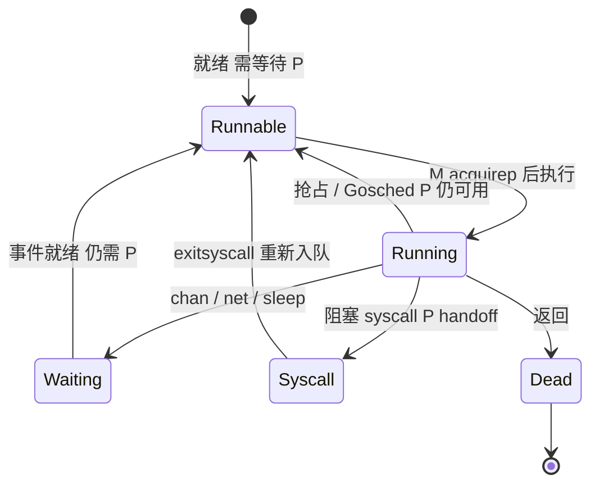
```mermaid
stateDiagram-v2
  [*] --> Runnable: 就绪 需等待 P
  Runnable --> Running: M acquirep 后执行
  Running --> Runnable: 抢占 / Gosched P 仍可用
  Running --> Waiting: chan / net / sleep
  Running --> Syscall: 阻塞 syscall P handoff
  Waiting --> Runnable: 事件就绪 仍需 P
  Syscall --> Runnable: exitsyscall 重新入队
  Running --> Dead: 返回
  Dead --> [*]
```

| G 状态 | 是否需要 P 才能继续 | 说明 |
|--------|---------------------|------|
| `_Grunnable` | **需要** P 才能变 Running | 在 runq 等待 |
| `_Grunning` | 已占用 P | 通过绑 P 的 M 执行 |
| `_Gwaiting` | 不需要（不占 P） | netpoller / chan 阻塞 |
| `_Gsyscall` | **P 已 handoff** | M 阻塞，G 随 M |

## 生产场景

| 场景 | 现象 | 根因 | 排查 / 策略 |
|------|------|------|-------------|
| 同步文件 IO 风暴 | `Threads` 飙高、CPU 低 | 每阻塞 G 占一 M，P 被 handoff | 改异步 IO、io_uring、限并发 |
| DNS 同步解析 | 毛刺 + 线程多 | `net.Resolver` 阻塞 syscall | 自定义 Resolver、缓存、Pure Go 解析 |
| cgo 阻塞 SDK | M ≫ GOMAXPROCS | cgo 占 M 不进 netpoller | sidecar 隔离、进程池 |
| 滚动改 GOMAXPROCS | P99 尖刺 | 全局队列瞬时堆积 | 小步调整、预热、HPA 对齐 quota |
| 容器 thread limit | `exceeds thread limit` | M 膨胀触顶 | 升 ulimit 或减少阻塞源 |
| 误判并行度 | goroutine 10 万但 CPU 8 核打满 | GOMAXPROCS 与 quota 不一致 | [automaxprocs](https://github.com/uber-go/automaxprocs)、[S-CONC-04](./S-CONC-04-gomaxprocs.md) |

## 排查与工具

| 工具 | 命令 / 用法 | 看什么 |
|------|-------------|--------|
| 线程数 | `/proc/pid/status` → `Threads` | M 是否因 syscall 膨胀 |
| schedtrace | `GODEBUG=schedtrace=1000` | P/M/G 数量变化（仅调试） |
| trace | `go test -trace` / `go tool trace` | Syscall、Proc 利用率、P handoff |
| goroutine | `pprof` goroutine | G 阻塞在 syscall / chan |
| threadcreate | `pprof` profile | 线程创建热点 |
| 运行时指标 | Prometheus `go_threads` | 与 GOMAXPROCS 对比 |

**排查路径**：`Threads` >> `GOMAXPROCS` 且持续 → trace 看 Syscall 行 → 定位阻塞 API → 改 netpoller 路径或限流。

## 架构取舍

| 方案 | 适用 | 不适用 |
|------|------|--------|
| 默认 netpoller 路径 | TCP/UDP 高并发 | 已走 blocking fd 的 legacy |
| 有界 worker + 阻塞 IO 池 | 必须同步阻塞 | 简单 CRUD 过度设计 |
| 进程外 cgo / 阻塞库 | 隔离 M 膨胀 | 运维简单优先 |
| `automaxprocs` | K8s 容器 | 裸机通常默认即可 |
| 调大 GOMAXPROCS | CPU 密集、核数明确 | 已超过 cgroup quota |

## 追问链

1. **G、M、P 一句话各是什么？** → G 任务，M 线程，P 并行槽位 + 本地 runq/mcache。
2. **为什么需要 P，不是 G-M 两层？** → 降全局锁、明确并行上限、mcache 无锁分配。
3. **M 的数量上限？** → 默认很高（历史 1 万）；`debug.SetMaxThreads`；容器 thread ulimit。
4. **P 和 GOMAXPROCS 关系？** → 活跃 P 数 = GOMAXPROCS，是 `_Grunning` G 的上限。
5. **去掉 P 后 M 能跑 Go 代码吗？** → **不能**执行用户代码；只能 runtime / 等 acquirep。
6. **syscall 时 G 去哪了？** → G 状态 `_Gsyscall`，M 无 P 阻塞；P 给其他 M。
7. **exitsyscall 后拿不到 P 呢？** → G 改 `_Grunnable` 入全局队列，M park 或继续找活。
8. **work stealing 偷哪一端？** → 偷其他 P **尾部**约一半；所有者从**头部**取。
9. **GOMAXPROCS 从 8 改 4 会怎样？** → 销毁 P4–7，runq 中 G 迁全局，mcache flush。
10. **netpoller 与 P 关系？** → 网络 G 等待不占 P；就绪后入队仍需 P 执行（[S-CONC-19](./S-CONC-19-netpoller.md)）。

## 反模式与事故

| 反模式 | 后果 | 正确做法 |
|--------|------|----------|
| 假设 goroutine 多 = 并行多 | CPU 打满但吞吐低 | 看 GOMAXPROCS 与 P 利用率 |
| 大量同步 `Read`/cgo | M 膨胀、thread limit | 异步 IO、隔离、限并发 |
| 滥用 `LockOSThread` | M 与 P 绑定异常 | 仅 CGO/GUI 等必要场景 |
| 发布时 GOMAXPROCS 腰斩 | 全局队列延迟尖刺 | 小步变更、监控 runqueue |
| 忽视 mcache 与 P 绑定 | 阻塞多 + 分配慢 | 减少无 P 路径、降分配 |

## 代码示例

### 观察 GOMAXPROCS 与并行槽位

```go
package main

import (
	"fmt"
	"runtime"
	"sync"
)

func main() {
	fmt.Println("GOMAXPROCS:", runtime.GOMAXPROCS(0))
	fmt.Println("NumCPU:", runtime.NumCPU())

	var wg sync.WaitGroup
	for i := 0; i < 16; i++ {
		wg.Add(1)
		go func(id int) {
			defer wg.Done()
			// 纯 CPU 循环：同一时刻约 GOMAXPROCS 个在跑
			sum := 0
			for j := 0; j < 1e8; j++ {
				sum += j
			}
			fmt.Printf("worker %d done sum=%d\n", id, sum)
		}(i)
	}
	wg.Wait()
}
```

### 对比：阻塞 syscall 导致 M 膨胀（勿在生产 stdin 上跑）

```go
// 演示：阻塞 syscall 增加 M，但不增加并行 Go 执行槽
func blockSyscallDemo() {
	for i := 0; i < 1000; i++ {
		go func() {
			var b [1]byte
			_, _ = syscall.Read(syscall.Stdin, b[:]) // 每 G 占一 M，P 被 handoff
		}()
	}
	// 此时 runtime 中 M 数可远大于 GOMAXPROCS
}
```

### 动态调整 GOMAXPROCS（观察全局队列影响）

```go
func retuneGOMAXPROCS() {
	old := runtime.GOMAXPROCS(0)
	fmt.Printf("before: GOMAXPROCS=%d\n", old)

	// 生产慎用：减半可能导致 P 销毁、runq 迁移
	runtime.GOMAXPROCS(old / 2)
	fmt.Printf("after: GOMAXPROCS=%d\n", runtime.GOMAXPROCS(0))
}
```

可运行 goroutine 与 WaitGroup 示例见 [`basis/goroutine/main.go`](https://github.com/twodog-tt/Golang-development-manual/blob/master/basis/goroutine/main.go)。

## 延伸阅读

- [S-CONC-01 GMP 总览与抢占](./S-CONC-01-gmp-overview.md) — 调度主循环、1.14 抢占
- [S-CONC-03 Goroutine 栈](./S-CONC-03-goroutine-stack.md) — G 的栈与 safe-point
- [S-CONC-04 GOMAXPROCS 与容器](./S-CONC-04-gomaxprocs.md) — cgroup CPU 对齐
- [S-CONC-19 Netpoller](./S-CONC-19-netpoller.md) — 网络 IO 不占 P
- [runtime/proc.go（源码）](https://go.dev/src/runtime/proc.go)
- [Go Issue #12416：GOMAXPROCS](https://github.com/golang/go/issues/12416)
- [Draveness：GMP 调度器](https://draveness.me/golang/docs/part3-runtime/ch06-concurrency/golang-gmp/)
