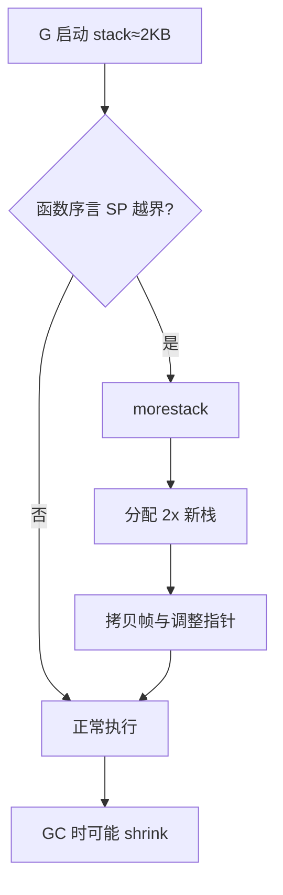

# Goroutine 栈增长与 OS 线程栈对比

## 30 秒版（开场）

> Goroutine **初始栈约 2KB**，按需 **分段复制扩容**（连续栈，copy stack）；线程栈通常 **MB 级固定预留**。百万 goroutine 可行主要靠小栈 + 动态增长。生产关键词：**深递归/大栈局部变量 → 栈扩容成本与 OOM**。

## 3 分钟版（一面深度）

1. **是什么**：每个 G 有独立栈；早期 2KB（版本略有调整），不够时 runtime 分配更大栈并 **拷贝** 旧栈内容，调整指针。
2. **为什么**：固定大栈浪费虚拟内存；过小栈需高效增长策略。Go 1.3+ 连续栈替代分段栈，简化 GC 扫描。
3. **怎么做**：函数序言比较 SP 与栈界，`morestack` 触发扩容；通常 **2 倍增长**；缩容在 GC 时检查（栈使用率过低则缩小）。

## 10 分钟版（原理 + 图示）



**与 OS 线程对比**

| 维度 | Goroutine | OS Thread |
|------|-----------|-----------|
| 初始大小 | ~2KB | 常见 1–8MB（pthread） |
| 增长 | 运行时 copy grow | 固定或 guard page |
| 数量级 | 10⁵–10⁶ 常见 | 通常 < 10⁴ |
| 切换成本 | 用户态，保存少量寄存器 | 内核态切换 |

**栈扫描与 GC**：栈上的指针参与根扫描；**逃逸到堆**的对象不在栈扩容问题里丢失，但指针需正确更新（连续栈拷贝时 runtime 处理）。

**1.21+ 相关**：基于寄存器的调用约定减少栈流量，间接影响栈压力（实现细节，面试可提一句）。

## 生产场景

- **深度递归**（JSON 嵌套、AST 遍历）：栈溢出 `stack overflow` 或频繁扩容导致 CPU 毛刺。
- **大数组在栈上**：`var buf [1<<20]byte` 在函数内可能触发扩容或栈过大。
- **百万连接网关**：每连接一 goroutine，若每栈平均 8KB，仅栈就 ~8GB 虚拟内存——需监控 RSS。

## 排查与工具

- `runtime/debug.SetMaxStack`（默认 1GB）限制单 G 栈
- pprof → `stack` sample 看栈深度热点
- panic `runtime: goroutine stack exceeds ...` → 改迭代/拆 goroutine

## 架构取舍

| 选择 | 何时 |
|------|------|
| 迭代替代递归 | 深度不确定的树/图 |
| 栈上大对象改堆分配或 sync.Pool | 避免扩容抖动 |
| 每任务独立 goroutine | IO 阻塞短、数量可控 |
| worker 池 | 栈总占用需硬上限 |

## 追问链

1. **分段栈为何被弃用？** → 热分割点、GC 复杂；连续栈拷贝更简单。
2. **栈会缩吗？** → 会，GC 阶段评估，避免长期占用。
3. **goroutine 和线程栈谁更安全？** → 线程栈溢出常 SIGSEGV；Go 有 `morestack` 检测，但仍有 `stack overflow`。
4. **cgo 调用栈？** → 仍在 G 栈上，深 cgo 嵌套同样耗栈。
5. **闭包捕获变量在哪？** → 逃逸分析决定堆或栈。

## 反模式与事故

- 无尾递归优化下写万层递归，生产数据略深即崩。
- 在 `defer` 链极长的 HTTP 中间件里叠加上下文，栈与延迟双高。
- 压测只测 QPS 不看 `VmRSS` per 100k goroutine。

## 代码示例

```go
// 反例：深度递归
func walk(n int) {
    if n == 0 { return }
    var scratch [256]byte // 每层占栈
    _ = scratch
    walk(n - 1)
}

// 正例：显式栈或 goroutine 分段
func walkIter(root *Node) {
    stack := []*Node{root}
    for len(stack) > 0 {
        n := stack[len(stack)-1]
        stack = stack[:len(stack)-1]
        // ...
    }
}
```

见 [`basis/goroutine/main.go`](https://github.com/twodog-tt/Golang-development-manual/blob/master/basis/goroutine/main.go)。

## 延伸阅读

- [runtime/stack.go](https://go.dev/src/runtime/stack.go)
- [Stack copying and goroutines（旧文仍有助于理解）](https://go.dev/blog/slices-intro)
- [Draveness：Goroutine 与栈](https://draveness.me/golang/docs/part3-runtime/ch06-concurrency/golang-goroutine/)
