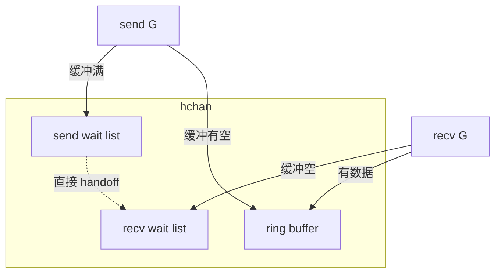

# Channel 内部实现与有缓冲/无缓冲选型

## 30 秒版（开场）

> Channel 底层是 **`hchan`**：环形队列 + `sendq/recvq` 等待链表 + 互斥锁；**无缓冲**是同步握手（直接 goroutine 交接），**有缓冲**解耦生产者与消费者。生产关键词：**关闭语义、nil channel 永久阻塞、背压容量**。

## 3 分钟版（一面深度）

1. **是什么**：类型安全的 CSP 原语；`make(chan T)` 无缓冲，`make(chan T, n)` 有 n 槽环形缓冲。
2. **为什么**：用通信共享内存；runtime 统一调度阻塞与唤醒，与 netpoller/select 集成。
3. **怎么做**：send/recv 先抢锁；若对端在等待队列则 **直接拷贝**（无缓冲不经队列）；否则入缓冲或入等待队列并 `gopark`；`close` 唤醒所有 recv，后续 send panic。

## 10 分钟版（原理 + 图示）



**关键字段（逻辑）**：`qcount/dataqsiz/buf/sendx/recvx`、等待 sudog 链表、`closed`。

**无缓冲**：send 与 recv **就绪配对**时，在栈上完成数据拷贝（`memmove`），双方 unpark。

**有缓冲**：send 仅当 `qcount==dataqsiz` 阻塞；recv 在 `qcount==0` 阻塞。

**内存**：元素存于 `buf` 连续数组；`T` 含指针时 GC 扫描 channel。

**select**：多 channel 伪随机顺序 + 单锁尝试，避免全局死锁（见 S-CONC-07）。

## 生产场景

- **任务队列**：有缓冲 = 削峰；满则阻塞或 `select default` 丢弃/降级。
- **事件总线**：多订阅者需 **fan-out**（每消费者独立 chan 或 broadcast 模式），单 chan 多 reader 竞争。
- **优雅关闭**：`close(done)` + range；注意 **只有发送方 close**。

## 排查与工具

- goroutine profile：`chan receive` / `chan send` 栈顶
- trace：G 阻塞在 channel
- 指标：队列深度需应用层暴露（channel len 非线程安全快照，仅调试）

## 架构取舍

| 选型 | 适用 |
|------|------|
| 无缓冲 | 强同步、流水线握手、确认对方已处理 |
| 小缓冲 | 平滑突发、固定背压 |
| 大缓冲 | 容忍短时消费慢，**掩盖慢消费者** |
| mutex+slice | 需 Peek、优先级、批量消费 |

**不宜用 channel**：跨进程、需持久化、复杂路由规则。

## 追问链

1. **关闭后 recv？** → 零值 + `ok=false`；send panic。
2. **nil channel？** → send/recv 永久阻塞（用于 select 禁用分支）。
3. **len/cap 含义？** → 当前元素数 / 缓冲容量。
4. **channel 线程安全吗？** → 单次 send/recv 安全；close 与 send 竞态需约定。
5. **能广播吗？** → 原生无；用 close+多个 reader 或 `sync.Cond`/消息总线。

## 反模式与事故

- 无缓冲 + 单 goroutine 自发自收 → **死锁**。
- 多生产者 close 同一 chan → panic。
- 超大 buffer 掩盖消费故障，OOM。

## 代码示例

```go
// 有缓冲背压
jobs := make(chan Job, 100)
go func() {
    for j := range jobs {
        process(j)
    }
}()
select {
case jobs <- j:
case <-ctx.Done():
    return ctx.Err()
}
```

可运行示例：[`basis/channel/main.go`](https://github.com/twodog-tt/Golang-development-manual/blob/master/basis/channel/main.go)（`firstChannel` / `secondChannel`）。

## 延伸阅读

- [Go spec: Channel types](https://go.dev/ref/spec#Channel_types)
- [runtime/chan.go](https://go.dev/src/runtime/chan.go)
- [A Tour of Go: Channels](https://go.dev/tour/concurrency/2)
- [掘金：图解 Go channel](https://juejin.cn/post/6844903840752300039)
