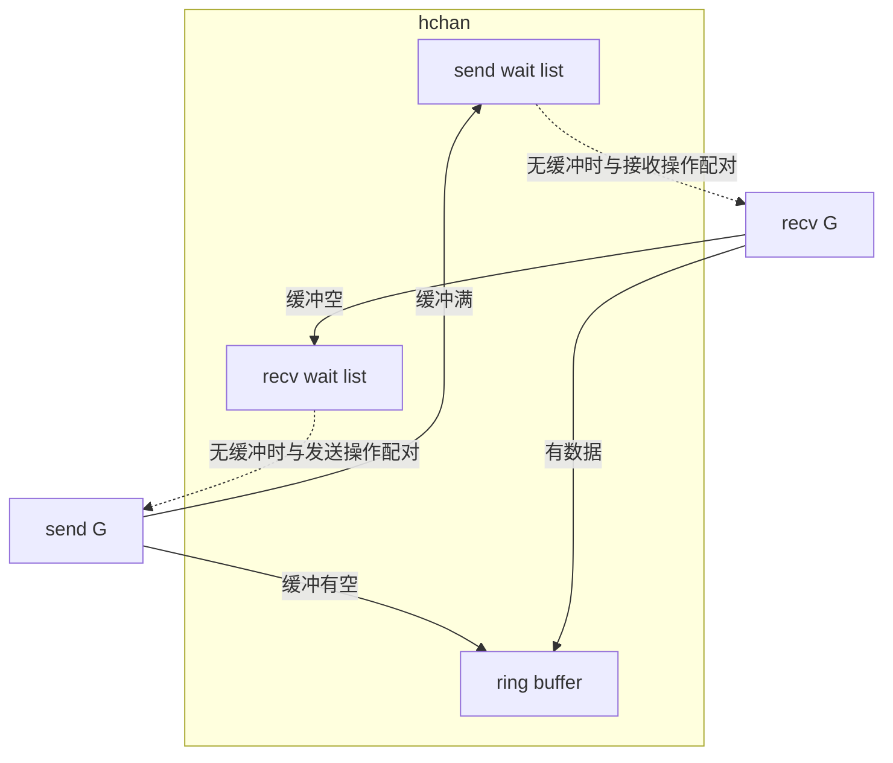

# Channel 内部实现与有缓冲/无缓冲选型

<a id="oral-card"></a>

## 要点卡

[返回高频核心锚点](../../high-frequency-roadmap.md)

!!! abstract "30 秒回答"

    Channel 是带同步语义的类型安全通信原语。当前 runtime 的 `hchan` 主要包含环形缓冲、
    `sendq/recvq` 和锁；无缓冲 channel 需要发送与接收配对，有缓冲 channel 允许生产者最多
    领先 `cap` 个元素。发送成功只证明值已完成交接或进入缓冲，不证明业务处理完成；需要处理
    确认时必须另建 ACK 协议。

**3 分钟展开**

1. 无缓冲适合同步交接；有缓冲适合吸收短时突发，但容量本身就是背压策略。
2. 缓冲满时 send 阻塞，缓冲空时 recv 阻塞；`select` 可以组合取消、超时和降级。
3. 只有明确的发送侧生命周期协调者关闭数据 channel；关闭后接收方可读完缓冲，再得到零值和
   `ok=false`，发送方继续发送会 panic。
4. `len(ch)` 只是瞬时观测，不能拿来做“先检查再发送”的正确性判断；单 channel 多消费者是
   竞争消费，不是消息广播。

| 记忆槽 | 内容 |
|--------|------|
| 三个不变量 | channel 交接不等于处理完成；关闭权必须由协议确定；buffer 不是持久化队列 |
| 手画图 | `producer → [buffer cap=N] → consumer`，满时标 `backpressure`，两侧补 `ctx.Done()` |
| 项目落点 | 链上事件进入有界 channel 后由 worker 落库/写 outbox；说明满队列时阻塞、拒绝还是降级 |
| 一个取舍 | 小缓冲能平滑突发；大缓冲降低短时阻塞，却会放大内存、排队时延并掩盖慢消费者 |

**错误表达**

- ❌ “无缓冲发送返回，说明接收方已经处理完成；关闭 channel 后所有接收都立即返回零值。”
- ✅ “发送返回只保证通信完成；关闭后仍要先消费已有缓冲，业务完成需要独立确认。”

**自测追问**：nil channel 有什么用途？为什么 `close(done)` 能广播结束，而普通业务消息不能自动广播？

## 10 分钟版（原理 + 图示）


```mermaid
flowchart TB
  subgraph hchan
    buf[ring buffer]
    sendq[send wait list]
    recvq[recv wait list]
  end
  S[send G] -->|缓冲满| sendq
  S -->|缓冲有空| buf
  R[recv G] -->|缓冲空| recvq
  R -->|有数据| buf
  sendq -.->|无缓冲时与接收操作配对| R
  recvq -.->|无缓冲时与发送操作配对| S
```

**关键字段（逻辑）**：`qcount/dataqsiz/buf/sendx/recvx`、等待 sudog 链表、`closed`。

**无缓冲**：send 与 recv **就绪配对**时，当前 runtime 可在两个 goroutine 的栈之间直接复制
元素并唤醒对端；这是实现细节。语言层保证相应的同步关系，不保证具体 `memmove` 路径。

**有缓冲**：send 在缓冲已满且没有可完成该操作的接收路径时阻塞；recv 在缓冲为空且没有
等待发送者时阻塞。缓冲满时若已有发送者排队，后续接收会先取缓冲头，再把等待发送者的值
补到缓冲尾，不能把所有情形都描述成 sendq 与 recvq 直接互拷。

**内存**：元素存于 `buf` 连续数组；`T` 含指针时 GC 扫描 channel。

**select**：规范保证多个可执行通信分支中做均匀伪随机选择。当前 runtime 还会建立独立的
poll/lock order，并按 channel 的排序键加锁以避免内部锁顺序死锁；排序和扫描方式属于实现
细节，不能当成业务公平性、优先级或长期无饥饿保证（见 S-CONC-07）。

## 生产场景

- **任务队列**：有缓冲 = 削峰；满则阻塞或 `select default` 丢弃/降级。
- **事件总线**：多订阅者需 **fan-out**（每消费者独立 chan 或 broadcast 模式），单 chan 多 reader 竞争。
- **优雅关闭**：`close(done)` 可广播停止信号；数据 channel 的关闭权应归属于明确的
  send-side 生命周期协调者。语言并没有“某个发送 goroutine 自动拥有 close 权”的规则，
  多生产者必须先协调完所有发送再关闭。

## 排查与工具

- goroutine profile：`chan receive` / `chan send` 栈顶
- trace：G 阻塞在 channel
- 指标：`len(ch)` 并发读取本身是安全的，但只是瞬时快照，不建立同步关系；可用于观测，不应用来做正确性判断

## 架构取舍

| 选型 | 适用 |
|------|------|
| 无缓冲 | 同步交接、限制生产者领先；若要确认“处理完成”还需单独 ACK |
| 小缓冲 | 平滑突发、固定背压 |
| 大缓冲 | 容忍短时消费慢，**掩盖慢消费者** |
| mutex+slice | 需 Peek、优先级、批量消费 |

**不宜用 channel**：跨进程、需持久化、复杂路由规则。

## 深挖问答

1. **关闭后 recv？** → 零值 + `ok=false`；send panic。
2. **nil channel？** → send/recv 永久阻塞（用于 select 禁用分支）。
3. **len/cap 含义？** → 当前元素数 / 缓冲容量。
4. **channel 并发安全吗？** → 多 goroutine send/recv 由 runtime 同步；但 close 与 send 必须由协议协调，否则可能 panic，不能靠 recover 当控制流。
5. **能广播吗？** → 单个值不会自动 fan-out；关闭 channel 可广播“一次性结束信号”，
   业务消息广播要为每个订阅者单独投递或使用 `sync.Cond`/消息总线。

## 反模式与事故

- 无缓冲 + 单 goroutine 自发自收 → **死锁**。
- 多生产者 close 同一 chan → panic。
- 超大 buffer 掩盖消费故障，OOM。

## 代码示例

```go
// 有缓冲背压
jobs := make(chan Job, 100)
go func() {
    for j := range jobs {
        process(j)
    }
}()
select {
case jobs <- j:
case <-ctx.Done():
    return ctx.Err()
}
```

可运行示例：[`basis/channel/main.go`](https://github.com/twodog-tt/Golang-development-manual/blob/master/basis/channel/main.go)（`firstChannel` / `secondChannel`）。

## 延伸阅读

- [Go spec: Channel types](https://go.dev/ref/spec#Channel_types)
- [runtime/chan.go](https://go.dev/src/runtime/chan.go)
- [A Tour of Go: Channels](https://go.dev/tour/concurrency/2)
- [Draveness：Go Channel 实现](https://draveness.me/golang/docs/part3-runtime/ch06-concurrency/golang-channel/)
