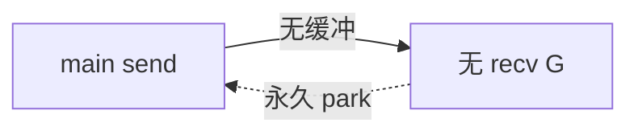

# Channel 死锁场景与排查

## 30 秒版（开场）

> Go **运行时只检测全局死锁**（所有 goroutine 阻塞），报 `fatal error: all goroutines are asleep - deadlock!`；**局部死锁**（部分 G 阻塞、部分空转）不会自动报。生产关键词：**无缓冲握手顺序、忘记 close、main 提前退出**。

## 3 分钟版（一面深度）

1. **是什么**：若干 G 在 channel 操作上互相等待，无进展。
2. **为什么**：CSP 同步语义要求配对；缓冲满/空、无接收者、无发送者都会 park。
3. **怎么做**：设计固定角色（生产者 close）、超时/ctx、buffer、多路 select；避免循环依赖等待链。

## 10 分钟版（原理 + 图示）

**经典模式**



| 场景 | 现象 |
|------|------|
| 单 G 无缓冲自收发 | 立即 fatal deadlock |
| 缓冲满且无消费者 | send 阻塞，若仅相关 G 全阻塞 → fatal |
| 只 send 不 close，range 永远等 | 消费者挂起（若还有其他 runnable G 不 fatal） |
| 环形等待 A→B→C→A | 部分系统表现为活锁或超时 |

**runtime 检测条件**：`checkdead` 发现所有 G 处于 `_Gwaiting` 且无 netpoll 事件、无 cgo 回调等。

**与 mutex 死锁区别**：channel 无死锁检测器；mutex 循环等待同样可能只表现为 hang。

## 生产场景

- **启动期**：`ch <- initDone` 在 main，worker 未启动 → 启动卡死。
- **批处理**：`wg.Wait()` 在消费者，生产者等 wg → 经典死锁环。
- **HTTP handler** 内同步等 channel，上游超时断开，下游永远等。

## 排查与工具

1. `SIGQUIT` / `kill -QUIT` → 打印所有 G 栈，搜 `chan receive`/`chan send`
2. `curl :6060/debug/pprof/goroutine?debug=2`
3. `go tool trace` 看无进展时间段
4. 单元测试加 `-timeout`

## 架构取舍

- **同步改异步**：用 errgroup + context 替代双向阻塞握手。
- **超时必备**：`select` + `time.After` 或 `context`（注意 After 泄漏，用 `NewTimer`）。
- **不宜**：用无缓冲 chan 做「函数返回值」替代 —— 用 future 模式也要防无人读。

## 追问链

1. **两个 G 互相无缓冲 send？** → 都阻塞，通常 fatal deadlock。
2. **有缓冲 size 1 会死锁吗？** → 可能，若双方都先 send 满或后 recv 空。
3. **close 能解开吗？** → recv 得零值；blocked send 仍可能 panic 若已 close。
4. **select 能防死锁吗？** → 仅当某分支可进 default 或超时。
5. **和 sync.Mutex 组合？** → 持锁等 chan 常见死锁，锁顺序要一致。

## 反模式与事故

- `go func(){ ch <- result }()` 但主流程已 return，无人 recv（泄漏非 always fatal）。
- 在 `init` 或单测里无缓冲握手忘记起 goroutine。
- 用 channel 实现信号量却 size=0 且无配对。

## 代码示例

```go
// 死锁：main 是唯一 G
func bad() {
    ch := make(chan int)
    ch <- 1 // fatal: all goroutines are asleep
}

// 修复：异步消费者或缓冲
func good() {
    ch := make(chan int, 1)
    go func() { fmt.Println(<-ch) }()
    ch <- 1
}
```

见 [`basis/channel/main.go`](https://github.com/twodog-tt/Golang-development-manual/blob/master/basis/channel/main.go)。

## 延伸阅读

- [Effective Go: Channels](https://go.dev/doc/effective_go#channels)
- [Go 内存模型与 channel](https://go.dev/ref/mem#chan)
- [掘金：Go 死锁排查](https://juejin.cn/post/6844903840752300039)
