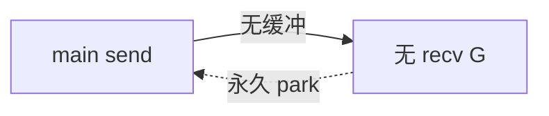

# Channel 死锁场景与排查

<a id="oral-card"></a>

## 口述卡（高频必背）

[返回 P0 知识图谱](../_meta/p0-knowledge-graph.md)

!!! abstract "30 秒回答"

    Go runtime 能报告的是进程已无可继续运行路径的一类**全局死锁**，典型报错为
    `fatal error: all goroutines are asleep - deadlock!`；**局部死锁**（部分 G 永久阻塞，
    但还有 G、timer、网络/cgo 等活动路径）不会自动报。`main` 返回会直接结束进程，不是死锁。
    生产关键词：**无缓冲握手顺序、忘记 close、循环等待、取消路径缺失**。

**3 分钟展开**

1. **是什么**：若干 G 在 channel 操作上互相等待，无进展。
2. **为什么**：CSP 同步语义要求配对；缓冲满/空、无接收者、无发送者都会 park。
3. **怎么做**：设计固定角色（生产者 close）、超时/ctx、buffer、多路 select；避免循环依赖等待链。

| 记忆槽 | 内容 |
|--------|------|
| 三个不变量 | channel 操作要有配对方或可用容量；runtime 只检测部分全局无进展状态；关闭权必须由协议指定 |
| 手画图 | `G1 send A → 等 G2`、`G2 send B → 等 G1` 画成环，再补 `ctx.Done()` 退出边 |
| 项目落点 | 用实际链事件流水线说明 producer、worker、collector 的关闭所有权和取消路径；只引用本人实际参与部分和可解释指标 |
| 一个取舍 | buffer 可吸收短时错峰但不能修复循环依赖；越大越可能把错误推迟到生产高峰 |

**错误表达**

- ❌ “只要发生 channel 死锁，runtime 一定立即报错；加大 buffer 就能解决。”
- ✅ “runtime 主要能发现进程级无进展；局部等待环可能只是 hang，必须靠协议、指标和 profile 排查。”

**自测追问**：为什么系统仍有 timer 或其他 runnable goroutine 时，局部死锁可能不触发 fatal？多 producer 由谁 close？

## 10 分钟版（原理 + 图示）

**经典模式**


```mermaid
flowchart LR
  A[main send] -->|无缓冲| B[无 recv G]
  B -.->|永久 park| A
```

| 场景 | 现象 |
|------|------|
| 单 G 无缓冲自收发 | 立即 fatal deadlock |
| 缓冲满且无消费者 | send 阻塞，若仅相关 G 全阻塞 → fatal |
| 只 send 不 close，range 永远等 | 消费者挂起（若还有其他 runnable G 不 fatal） |
| 环形等待 A→B→C→A | 相关 goroutine 永久挂起；若系统仍有其他活动，不一定触发 runtime 全局死锁 |

**runtime 检测边界**：`checkdead` 主要从是否还有 running M/G 出发，并继续考虑 timer、
netpoll、cgo callback、`c-shared/c-archive` 等特殊路径。它不是 channel 专用的等待图检测器，
也不能证明业务局部一定有进展。

**与 mutex 死锁区别**：channel 无死锁检测器；mutex 循环等待同样可能只表现为 hang。

## 生产场景

- **启动期**：`ch <- initDone` 在 main，worker 未启动 → 启动卡死。
- **批处理**：`wg.Wait()` 在消费者，生产者等 wg → 经典死锁环。
- **HTTP handler** 内同步等 channel，上游超时断开，下游永远等。

## 排查与工具

1. `SIGQUIT` / `kill -QUIT` → 打印所有 G 栈，搜 `chan receive`/`chan send`
2. `curl :6060/debug/pprof/goroutine?debug=2`
3. `go tool trace` 看无进展时间段
4. 单元测试加 `-timeout`

## 架构取舍

- **同步改异步**：用 errgroup + context 替代双向阻塞握手。
- **超时必备**：优先使用 `context`；也可用 `time.After`/`NewTimer`。Go 1.23+ 可回收不再被引用的未触发 timer，旧语言版本或高频循环仍应注意 timer 分配，并在需要复用/停止时用 `NewTimer`。
- **不宜**：用无缓冲 chan 做「函数返回值」替代 —— 用 future 模式也要防无人读。

## 追问链

1. **两个 G 互相无缓冲 send？** → 两者会形成局部死锁；只有整个 Go 程序也没有其他
   可运行或可唤醒路径时，runtime 才会报全局 deadlock。
2. **有缓冲 size 1 会死锁吗？** → 可能，若双方都先 send 满或后 recv 空。
3. **close 能解开吗？** → recv 得零值；blocked send 仍可能 panic 若已 close。
4. **select 能防死锁吗？** → 只有可执行的取消/超时/default 分支才能避免该次永久阻塞；
   `default` 还可能制造 busy loop，且不能自动消除系统中的循环等待。
5. **和 sync.Mutex 组合？** → 持锁等 chan 常见死锁，锁顺序要一致。

## 反模式与事故

- `go func(){ ch <- result }()` 但主流程已 return，无人 recv（泄漏非 always fatal）。
- 在 `init` 或单测里无缓冲握手忘记起 goroutine。
- 用 channel 实现信号量却 size=0 且无配对。

## 代码示例

```go
// 死锁：main 是唯一 G
func bad() {
    ch := make(chan int)
    ch <- 1 // fatal: all goroutines are asleep
}

// 修复：异步消费者或缓冲
func good() {
    ch := make(chan int, 1)
    go func() { fmt.Println(<-ch) }()
    ch <- 1
}
```

见 [`basis/channel/main.go`](https://github.com/twodog-tt/Golang-development-manual/blob/master/basis/channel/main.go)。

## 延伸阅读

- [Effective Go: Channels](https://go.dev/doc/effective_go#channels)
- [Go 内存模型与 channel](https://go.dev/ref/mem#chan)
- [Draveness：Go 死锁检测](https://draveness.me/golang/docs/part3-runtime/ch06-concurrency/golang-deadlock/)
