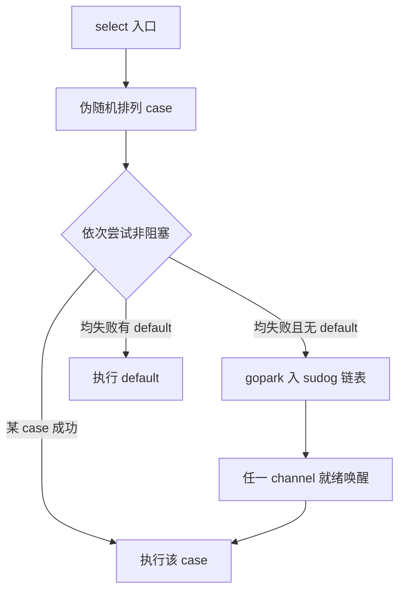

# select 语义、公平性与 default 陷阱

## 30 秒版（开场）

> **select** 在多个 channel 操作上择一执行；多路就绪时 **伪随机公平**（`fastrand` 打乱顺序）。**default** 使 select 非阻塞，易 **忙等 CPU** 或 **丢事件**。生产关键词：**超时分支、nil case 禁用、单 select 多 case 持锁范围**。

## 3 分钟版（一面深度）

1. **是什么**：语法级多路复用；每个 case 必须是 send/recv（含 `case <-ch`）。
2. **为什么**：避免层层嵌套阻塞；与 context、timer、done 信号统一模式。
3. **怎么做**：编译为 `selectgo`；按随机顺序尝试各 case；均不可行则阻塞或走 default。

## 10 分钟版（原理 + 图示）



**公平性**：长期运行各 case 概率近似均等，但 **不保证严格公平**；高负载下仍可能饥饿（极少见，面试知道即可）。

**nil channel**：对应 case 永不就绪，常用于动态关闭某分支。

**与 for-select 模式**：事件循环标准写法；注意 `break` 只跳出 select 不跳出 for。

**timer 陷阱**：`time.After` 在循环里每次新建 timer，**堆泄漏**；用 `time.NewTimer` + `Stop` + drain。

## 生产场景

- **RPC 超时**：`select { case res := <-ch: case <-ctx.Done(): }`
- **多源合并**：metrics/log 从多个 chan 写入 ES
- **非阻塞投递**：`select { case q <- x: default: drop/count }` 做降级

## 排查与工具

- CPU profile：`selectgo` 占比高 → 检查 default 忙等
- goroutine：大量卡在 `select` 正常；结合业务看是否缺超时

## 架构取舍

| 模式 | 适用 |
|------|------|
| blocking select | 长连接、事件驱动 |
| default + sleep | 简单轮询（慎用） |
| epoll/netpoller | 高并发网络（库内已用） |
| channel merge | 中等规模 fan-in |

**不宜**：用 `for { select { default: } }` 替代 condition variable 做精确等待。

## 追问链

1. **多个 case 同时就绪？** → 随机选一个执行，其余本轮不执行。
2. **select 与 priority？** → 语言无优先级，需多层 select 或独立 goroutine。
3. **空 select `select{}`？** → 永久阻塞，常用于 main 挂起。
4. **select 会复制接收值吗？** → recv 与单独 `<-ch` 一样，复制 `T`。
5. **context.Done 为何常用？** → 关闭后永远就绪，可作取消分支。

## 反模式与事故

- default 轮询导致 **一核 100%**，监控却显示「QPS 正常」。
- 循环 `time.After` 导致 **timer 堆积**，几分钟后 OOM。
- 在 select 里持锁做重逻辑，放大锁竞争。

## 代码示例

```go
timer := time.NewTimer(deadline)
defer timer.Stop()
select {
case v := <-result:
    return v, nil
case <-ctx.Done():
    return zero, ctx.Err()
case <-timer.C:
    return zero, ErrTimeout
}
```

Channel 基础见 [`basis/channel/main.go`](../../../basis/channel/main.go)。

## 延伸阅读

- [Spec: Select statements](https://go.dev/ref/spec#Select_statements)
- [runtime/select.go](https://go.dev/src/runtime/select.go)
- [Go blog: Context](https://go.dev/blog/context)
