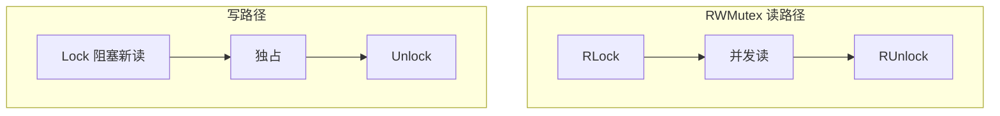

# Mutex、RWMutex 与 atomic 选型

## 30 秒版（开场）

> **Mutex** 互斥写与复杂不变量；**RWMutex** 读多写少但写饥饿风险；**atomic** 适合简单计数/标志/fence，无锁但语义窄。生产关键词：**defer Unlock、RWMutex 写放大、atomic 与 race 无关误用**。

## 3 分钟版（一面深度）

1. **是什么**：Mutex 二元锁；RWMutex 多读单写；atomic 硬件 CAS 保证单变量原子性。
2. **为什么**：保护共享结构；读多场景减少竞争；热点计数避免锁。
3. **怎么做**：Mutex 不可重入；RWMutex 写优先策略因版本略有差异；Go 1.19+ atomic 类型 `atomic.Int64` 等；仍须遵守 happens-before。

## 10 分钟版（原理 + 图示）



**Mutex 内部（简述）**：正常模式自旋 → 饥饿模式队列（1.9+），防写者饿死。

**RWMutex**：`readerCount` + 写锁等待；**不适合写频繁**或读临界区很重（锁持有时间长）。

**atomic**：`Add/Swap/CompareAndSwap/Load/Store`；**不保护多字段不变量**；`atomic.Value` 适合配置快照替换。

**与 channel 对比**：锁适合保护内存结构；channel 适合任务流与所有权转移。

## 生产场景

- **配置热更新**：`atomic.Value` 存不可变配置快照，读无锁。
- **限流计数**：`atomic.Int64` 秒级 QPS。
- **缓存 map**：`RWMutex` + map，或 `sync.Map`（见 S-CONC-09）。
- **事故**：RWMutex 读锁内调 RPC，写锁 30s 拿不到 → 全站读挂。

## 排查与工具

- `mutex` profile：`runtime/trace` Mutex 阻塞
- `-race` 检测锁顺序问题
- `pprof` block profile

## 架构取舍

| 原语 | 适用 |
|------|------|
| Mutex | 复合状态、map+slice 修改 |
| RWMutex | 读 >> 写、读临界区极短 |
| atomic | 单变量、flag、引用替换 |
| channel | 串行化访问、pipeline |

**不宜 atomic**：链表插入、check-then-act 多步无 CAS 循环。

## 追问链

1. **Mutex 可重入吗？** → 不可，二次 Lock 死锁。
2. **RWMutex 写饥饿？** → 连续写或 Go 实现策略可能导致读等待；监控锁等待。
3. **atomic 还要 mutex 吗？** → 多字段一致性要。
4. **defer Unlock 性能？** → 极小，换安全值得。
5. **sync.Map 替代 RWMutex+map？** → 看访问模式，非万能。

## 反模式与事故

- 读锁升级写锁（不支持）→ 死锁。
- `Unlock` 非配对 goroutine（Mutex 虽允许但不推荐，易逻辑错）。
- 用 atomic 做 `if atomic.Load(); atomic.Store()` 复合逻辑无 CAS 循环。

## 代码示例

```go
type Counter struct{ n atomic.Int64 }

func (c *Counter) Inc() { c.n.Add(1) }
func (c *Counter) Val() int64 { return c.n.Load() }

// Mutex 保护 map
type SafeMap struct {
    mu sync.RWMutex
    m  map[string]int
}
```

可运行：[`basis/sync/main.go`](https://github.com/twodog-tt/Golang-development-manual/blob/master/basis/sync/main.go)（`counter` / `counter2`）。

## 延伸阅读

- [sync 包文档](https://pkg.go.dev/sync)
- [atomic 包文档](https://pkg.go.dev/sync/atomic)
- [Go 内存模型](https://go.dev/ref/mem)
