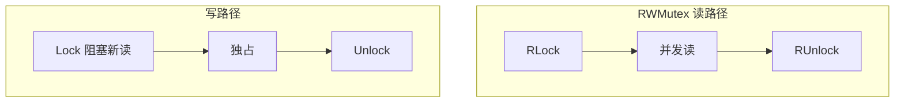

# Mutex、RWMutex 与 atomic 选型

## 30 秒版（开场）

> **Mutex** 保护复合不变量；**RWMutex** 只在读占绝大多数且临界区短时可能获益。Go 的 RWMutex 在 writer 等待时会阻塞新的 reader，避免 writer 被持续新读者饿死，但会形成读延迟尖峰。`sync/atomic` 适合单变量状态，不能自动保护多字段不变量。

## 3 分钟版（一面深度）

1. **是什么**：Mutex 二元锁；RWMutex 多读单写；atomic 包提供顺序一致的原子 Load/Store/Add/Swap/CAS 等操作，底层不都等同于 CAS。
2. **为什么**：保护共享结构；读多场景减少竞争；热点计数避免锁。
3. **怎么做**：Mutex/RWMutex 不可升级、不可重入；Go 1.19+ 可用 `atomic.Int64`、`atomic.Pointer[T]` 等类型；任何选型都要用 benchmark 和 mutex/block profile 验证。

## 10 分钟版（原理 + 图示）


```mermaid
flowchart TB
  subgraph readers[RWMutex 读路径]
    R1[RLock] --> R2[并发读]
    R2 --> R3[RUnlock]
  end
  subgraph writer[写路径]
    W1[Lock 阻塞新读] --> W2[独占]
    W2 --> W3[Unlock]
  end
```

**Mutex 内部（简述）**：当前 runtime 的 `sync.Mutex` 有正常/饥饿模式、短时自旋和等待队列；
切换阈值与唤醒策略是实现细节，不属于 `sync.Mutex` API 的公平性承诺。

**RWMutex**：`readerCount` + 写锁等待；**不适合写频繁**或读临界区很重（锁持有时间长）。

**atomic**：`Add/Swap/CompareAndSwap/Load/Store`；Go 的 atomic 操作具有顺序一致语义，但
**不保护多字段不变量**。`atomic.Value` 适合配置快照替换；首次 Store 后必须始终存相同具体
类型，Store `nil` 或不同具体类型会 panic，并且 Value/typed atomic 首次使用后不可复制。

**与 channel 对比**：锁适合保护内存结构；channel 适合任务流与所有权转移。

## 生产场景

- **配置热更新**：`atomic.Value` 存不可变配置快照，读无锁。
- **限流计数**：`atomic.Int64` 秒级 QPS。
- **缓存 map**：`RWMutex` + map，或 `sync.Map`（见 S-CONC-09）。
- **事故**：RWMutex 读锁内调 RPC，写锁 30s 拿不到 → 全站读挂。

## 排查与工具

- mutex profile / block profile：看竞争栈与等待时间
- `-race` 检测未同步的内存访问，**不检测锁顺序死锁**
- `pprof` block profile

## 架构取舍

| 原语 | 适用 |
|------|------|
| Mutex | 复合状态、map+slice 修改 |
| RWMutex | 读 >> 写、读临界区极短 |
| atomic | 单变量、flag、引用替换 |
| channel | 串行化访问、pipeline |

**不宜 atomic**：链表插入、check-then-act 多步无 CAS 循环。

## 追问链

1. **Mutex 可重入吗？** → 不可，二次 Lock 死锁。
2. **RWMutex 会让 writer 永久饿死吗？** → Go 实现会在 writer 等待时阻塞新 reader，使 writer 最终有机会获得锁；代价是后续 reader 也排队，长读临界区仍会让 writer 等很久。
3. **atomic 还要 mutex 吗？** → 多字段一致性要。
4. **defer Unlock 性能？** → 不背固定开销；编译器和代码形态会影响结果。先保证所有返回
   路径正确解锁，只有 profile/benchmark 证明临界热路径受影响时再改成显式 Unlock。
5. **sync.Map 替代 RWMutex+map？** → 看访问模式，非万能。

## 反模式与事故

- 读锁升级写锁（不支持）→ 死锁。
- 把“锁属于 goroutine”当规范：Go 明确允许另一个 goroutine Unlock，但跨 goroutine
  交接会增加所有权推理难度，必须有清晰协议。
- 用 atomic 做 `if atomic.Load(); atomic.Store()` 复合逻辑无 CAS 循环。

## 代码示例

```go
type Counter struct{ n atomic.Int64 }

func (c *Counter) Inc() { c.n.Add(1) }
func (c *Counter) Val() int64 { return c.n.Load() }

// Mutex 保护 map
type SafeMap struct {
    mu sync.RWMutex
    m  map[string]int
}
```

可运行：[`basis/sync/main.go`](https://github.com/twodog-tt/Golang-development-manual/blob/master/basis/sync/main.go)（`counter` / `counter2`）。

## 延伸阅读

- [sync 包文档](https://pkg.go.dev/sync)
- [atomic 包文档](https://pkg.go.dev/sync/atomic)
- [Go 内存模型](https://go.dev/ref/mem)
