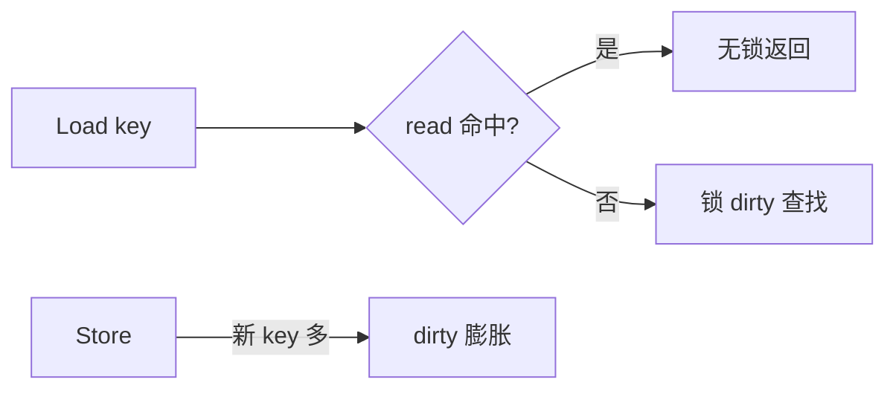

# sync.Map 适用场景与误用

## 30 秒版（开场）

> **sync.Map** 为 **读多写少、key 相对稳定** 的并发 map 优化：只读 `read` 原子快照 + `dirty` 增量。不适合 **频繁写、计数器、强一致遍历**。生产关键词：**session 缓存、类型断言开销、不如分片 map**。

## 3 分钟版（一面深度）

1. **是什么**：并发安全的 `map[any]any`；API：`Load/Store/LoadOrStore/Delete/Range`。
2. **为什么**：普通 map+Mutex 读也互斥；sync.Map 无锁读路径（命中 read-only）。
3. **怎么做**：miss 时加锁晋升 dirty；删除用 tombstone；Range 快照不一致迭代。

## 10 分钟版（原理 + 图示）



**适合**

- 配置/元数据缓存，写入一次读多次
- 每个 key 只写一次（如连接表 `connID -> Conn`）

**不适合**

- 高频 `Store` 同一 key（如计数）
- 需要 `len`、强一致快照
- key 类型需自行约束（any + 断言）

**替代**：`map[K]V` + `RWMutex`；或 **分片 map**（`shard = hash(key)%N`）降低锁竞争。

## 生产场景

- **WebSocket 连接表**：连接建立 Store，断开 Delete，广播 Range（注意 Range 回调勿阻塞）。
- **误用**：QPS 统计每请求 Store → 性能劣于 Mutex+map 或 atomic。
- **可观测**：mutex profile 热点在 `sync.(*Map).Store`。

## 排查与工具

- benchmark 对比 `ShardedMap` vs `sync.Map`
- `-race` 若混用普通 map 仍会报

## 架构取舍

| 方案 | 条件 |
|------|------|
| sync.Map | 读极多、写少、key 集合稳定 |
| RWMutex+map | 需遍历一致性、中等竞争 |
| 分片锁 map | 高并发读写、key 均匀 |
| 外部缓存 Redis | 跨实例 |

## 追问链

1. **Range 能修改吗？** → 勿在 Range 内 Delete/Store 同 map（文档警告）。
2. **类型安全？** → 否，用泛型封装或 `xsync.MapOf`（第三方）。
3. **与 map+sync.RWMutex 性能？** → 因负载而异，必须 benchmark。
4. **nil value？** → 可存；Load 需区分不存在与零值（用 ok）。
5. **能 LoadOrStore 做单飞吗？** → 可以，注意闭包内初始化成本。

## 反模式与事故

- 把 sync.Map 当 **通用并发 map** 全局替换。
- Range 里做 RPC 导致 **全局遍历卡死**。
- value 存指针，外部无拷贝修改 → 数据竞态。

## 代码示例

```go
var sessions sync.Map // key: sessionID string, val: *Session

func GetSession(id string) (*Session, bool) {
    v, ok := sessions.Load(id)
    if !ok {
        return nil, false
    }
    return v.(*Session), true
}
```

并发原语基础见 [`basis/sync/main.go`](https://github.com/twodog-tt/Golang-development-manual/blob/master/basis/sync/main.go)。

## 延伸阅读

- [sync.Map 文档](https://pkg.go.dev/sync#Map)
- [Go maps in action](https://go.dev/blog/maps)
- [掘金：sync.Map 源码解析](https://juejin.cn/post/6844903840752300039)
