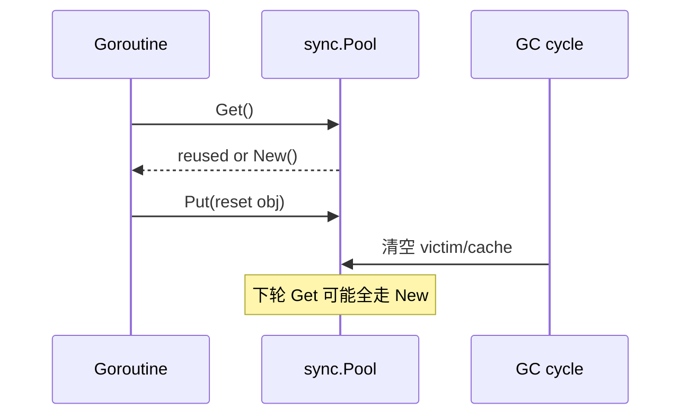

# sync.Pool 与 GC 交互

## 30 秒版（开场）

> **sync.Pool** 是 **按 P 缓存的临时对象池**，减轻分配压力；**GC 时会清空 Pool**（每轮 STW 关联清理），不保证 Get 能拿到。生产关键词：**Reset 复用对象、勿池化有状态连接、GC 后冷启动抖动**。

## 3 分钟版（一面深度）

1. **是什么**：`Get/Put` 复用 `any`；内部 `poolLocal` 数组按 P 分片。
2. **为什么**：高频短生命周期对象（buffer、临时 slice）降低 GC 负担。
3. **怎么做**：`New` 提供缺省构造；Put 前 **重置对象状态**；对象可能被 GC 随时回收。

## 10 分钟版（原理 + 图示）



**GC 关系（1.13+ victim 机制简化理解）**

- 两轮 GC 设计：当前池 + victim，减少每轮全丢；但 **仍不持久**。
- Pool 中对象 **不参与 GC 标记延长**（在池里仍可能被清）。

**适用对象**：`bytes.Buffer`、`[]byte`、解码临时结构。

**禁止**：数据库连接、带 goroutine 的对象、未 Reset 的请求上下文。

## 生产场景

- **JSON/Proto 序列化**：`buf := pool.Get().(*bytes.Buffer); buf.Reset()`
- **事故**：Pool 存 `*Request` 未清字段，下一请求读到上一用户 PII。
- **指标**：分配率下降、GC pause 缩短；GC 后首秒 alloc 飙升正常。

## 排查与工具

- `go test -bench` + `alloc_space`
- `GODEBUG=gctrace=1` 对比开 Pool 前后
- pprof alloc_objects

## 架构取舍

| 方案 | 适用 |
|------|------|
| sync.Pool | 临时对象、可 Reset、丢失可接受 |
| 固定 buffer 栈上/线程本地 | 小对象、生命周期清晰 |
| 连接池（sql.DB） | 长生命周期资源 |
| arena（实验） | 批量分配一次性释放 |

## 追问链

1. **Pool 线程安全吗？** → 是，但 Put/Get 的对象本身需无竞态。
2. **为什么 GC 清 Pool？** → 防内存泄漏、防隐式全局缓存。
3. **New 何时调用？** → Get 时本地与 victim 皆空。
4. **能统计池大小吗？** → 无公开 API。
5. **和 free list 区别？** → Pool 与 GC 协作、非确定性保留。

## 反模式与事故

- 用 Pool **缓存业务实体** 当 LRU。
- Put `[]byte` 仍被外部引用 → use-after-free 式 bug。
- 压测只测稳态，忽略 **GC 后延迟尖刺**。

## 代码示例

```go
var bufPool = sync.Pool{
    New: func() any { return new(bytes.Buffer) },
}

func Encode(v any) ([]byte, error) {
    b := bufPool.Get().(*bytes.Buffer)
    b.Reset()
    defer bufPool.Put(b)
    if err := json.NewEncoder(b).Encode(v); err != nil {
        return nil, err
    }
    return append([]byte(nil), b.Bytes()...), nil
}
```

## 延伸阅读

- [sync.Pool 文档](https://pkg.go.dev/sync#Pool)
- [Go 1.13 release notes - Pool](https://go.dev/doc/go1.13)
- [Draveness：sync.Pool 实现](https://draveness.me/golang/docs/part3-runtime/ch07-memory/golang-sync-pool/)
