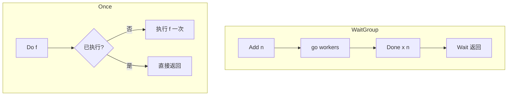

# WaitGroup、Once 与 Cond

## 30 秒版（开场）

> **WaitGroup** 等一组 goroutine 结束；**Once** 保证初始化单次；**Cond** 等条件成立（需配合锁）。生产关键词：**Add 先于 go、Wait 前勿 Add、Once 慢路径阻塞所有调用**。

## 3 分钟版（一面深度）

1. **是什么**：WG 计数器；Once `sync.Once`；Cond `sync.NewCond(Locker)`。
2. **为什么**：批任务汇合；单例 init；避免忙等（相比 spin）。
3. **怎么做**：WG `Add/Done/Wait`；Once `Do(func())`；Cond `Wait/Signal/Broadcast` 必须在循环检查谓词。

## 10 分钟版（原理 + 图示）



**WaitGroup 陷阱**

- `Add` 在 `Wait` 之后由子 goroutine 调用 → race（1.25 仍危险，应主 goroutine 先 Add）。
- `Done` 次数不匹配 → panic 或永久 Wait。
- 复用 WG：确保上一轮 Wait 完成后再 Add（常见面试点）。

**Once**：`Do` 内 panic 也算执行过与否视版本；**不要在 Do 内再调同一 Once 死锁**。

**Cond vs channel**

- Cond：线程（goroutine）等待 **共享内存条件**，唤醒精细（Signal 一个）。
- Channel：事件传递、所有权。

**Cond 模板**

```go
mu.Lock()
for !condition() {
    cond.Wait() // 释放 mu，醒来再抢
}
// 使用共享状态
mu.Unlock()
```

## 生产场景

- **并行 fan-out**：`errgroup` 底层类似 WG + error（扩展库）。
- **Once 初始化 DB/配置**：冷启动延迟集中在首次。
- **Cond**：连接池空闲连接通知（也可用 channel）；工作窃取自定义队列。

## 排查与工具

- `-race` 抓 WG Add/Wait 竞态
- goroutine dump：大量卡在 `WaitGroup.Wait`

## 架构取舍

| 原语 | 适用 |
|------|------|
| WaitGroup | 固定批次并行 |
| errgroup | 需首错取消 |
| Once | 懒加载单例 |
| Cond | 锁保护谓词等待 |
| context | 跨 API 取消 |

## 追问链

1. **WG 能 Add(0) 吗？** → 可以但不有意义。
2. **Once 并发 Do？** → 一个执行其余阻塞等待完成。
3. **Cond Wait 为何用 for 不用 if？** → 虚假唤醒、谓词多次变化。
4. **Signal vs Broadcast？** → 单消费者 vs 全唤醒。
5. **WG 与 channel done？** → channel 可传结果，WG 仅计数。

## 反模式与事故

- `go func(){ wg.Add(1) }()` 与 `go work` 竞态。
- Once 里初始化失败无重试，服务永久坏状态。
- Cond 不用循环，偶发逻辑错。

## 代码示例

```go
var wg sync.WaitGroup
for _, task := range tasks {
    wg.Add(1)
    go func(t Task) {
        defer wg.Done()
        run(t)
    }(task)
}
wg.Wait()
```

见 [`basis/goroutine/main.go`](https://github.com/twodog-tt/Golang-development-manual/blob/master/basis/goroutine/main.go)、[`basis/sync/main.go`](https://github.com/twodog-tt/Golang-development-manual/blob/master/basis/sync/main.go)。

## 延伸阅读

- [sync 包文档](https://pkg.go.dev/sync)
- [Go 1.25 WaitGroup 相关改进说明](https://go.dev/doc/go1.25)
- [errgroup 模式](https://pkg.go.dev/golang.org/x/sync/errgroup)
