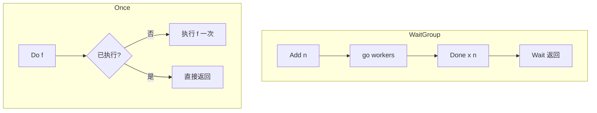

# WaitGroup、Once 与 Cond

## 30 秒版（开场）

> **WaitGroup** 等一组 goroutine 结束；**Once** 保证函数至多执行一次；**Cond** 等待锁保护的条件成立。Go 1.25+ 新代码可优先用 `WaitGroup.Go`；兼容旧版本时要在启动 goroutine **之前** `Add`。`Once.Do` 中函数即使 panic，也会被视为已经执行过。

## 3 分钟版（一面深度）

1. **是什么**：WG 计数器；Once `sync.Once`；Cond `sync.NewCond(Locker)`。
2. **为什么**：批任务汇合；单例 init；避免忙等（相比 spin）。
3. **怎么做**：Go 1.25+ 用 WG `Go/Wait`，旧版本用 `Add/Done/Wait`；Once 用 `Do(func())`；Cond 的 `Wait` 必须放在谓词循环中。

## 10 分钟版（原理 + 图示）


```mermaid
flowchart TB
  subgraph WaitGroup
    A[Add n] --> B[go workers]
    B --> C[Done x n]
    C --> D[Wait 返回]
  end
  subgraph Once
    O1[Do f] --> O2{已执行?}
    O2 -->|否| O3[执行 f 一次]
    O2 -->|是| O4[直接返回]
  end
```

**WaitGroup 陷阱**

- 使用 `Add/Done` 时，让子 goroutine 自己 `Add(1)` 可能使 `Wait` 提前返回；应先 `Add` 再启动 goroutine。
- 当计数器为 0 时，正数 `Add` 必须发生在对应 `Wait` 之前；上一轮 `Wait` 返回后才能开始下一轮复用。
- Go 1.25 的 `WaitGroup.Go(f)` 会完成“计数 + 启动 + Done”；按文档约束，传入的 `f` 不应 panic。
- `Done` 次数不匹配 → panic 或永久 Wait。

**Once**

- `Do(f)` 中 `f` 如果 panic，当前 `Once` 仍被视为已经执行过；后续 `Do` 不会重试 `f`。
- 一个 `Do` 尚未返回时，其他调用会等待；不要在 `f` 内再次调用同一个 `Once.Do`，否则会死锁。
- 初始化可能失败且需要重试时，不要直接用 `Once` 隐藏失败；应显式保存结果，或设计受控重试状态机。

**Cond vs channel**

- Cond：线程（goroutine）等待 **共享内存条件**，唤醒精细（Signal 一个）。
- Channel：事件传递、所有权。

**Cond 模板**

```go
mu.Lock()
for !condition() {
    cond.Wait() // 释放 mu，醒来再抢
}
// 使用共享状态
mu.Unlock()
```

## 生产场景

- **并行 fan-out**：`errgroup` 底层类似 WG + error（扩展库）。
- **Once 初始化 DB/配置**：冷启动延迟集中在首次。
- **Cond**：连接池空闲连接通知（也可用 channel）；工作窃取自定义队列。

## 排查与工具

- `-race` 抓 WG Add/Wait 竞态
- goroutine dump：大量卡在 `WaitGroup.Wait`

## 架构取舍

| 原语 | 适用 |
|------|------|
| WaitGroup | 固定批次并行 |
| errgroup | 需首错取消 |
| Once | 懒加载单例 |
| Cond | 锁保护谓词等待 |
| context | 跨 API 取消 |

## 追问链

1. **WG 能 Add(0) 吗？** → 可以但不有意义。
2. **Once 并发 Do？** → 一个执行其余阻塞等待完成。
3. **Cond Wait 为何用 for 不用 if？** → Go 的 `Wait` 只会在 `Signal/Broadcast` 后返回，但重新拿到锁时条件可能已被其他 goroutine 改变或消费，所以仍要重新检查谓词。
4. **Signal vs Broadcast？** → 单消费者 vs 全唤醒。
5. **WG 与 channel done？** → channel 可传结果，WG 仅计数。

## 反模式与事故

- `go func(){ wg.Add(1) }()` 与 `go work` 竞态。
- Once 里初始化失败无重试，服务永久坏状态。
- Cond 不用循环，偶发逻辑错。

## 代码示例

Go 1.25+：

```go
var wg sync.WaitGroup
for _, task := range tasks {
    task := task
    wg.Go(func() {
        run(task)
    })
}
wg.Wait()
```

兼容 Go 1.24 及更早版本：

```go
var wg sync.WaitGroup
for _, task := range tasks {
    task := task
    wg.Add(1)
    go func() {
        defer wg.Done()
        run(task)
    }()
}
wg.Wait()
```

见 [`basis/goroutine/main.go`](https://github.com/twodog-tt/Golang-development-manual/blob/master/basis/goroutine/main.go)、[`basis/sync/main.go`](https://github.com/twodog-tt/Golang-development-manual/blob/master/basis/sync/main.go)。

## 延伸阅读

- [WaitGroup.Go 文档](https://pkg.go.dev/sync#WaitGroup.Go)
- [Once.Do 的 panic 语义](https://pkg.go.dev/sync#Once.Do)
- [Go 1.25 WaitGroup 相关改进说明](https://go.dev/doc/go1.25)
- [errgroup 模式](https://pkg.go.dev/golang.org/x/sync/errgroup)
