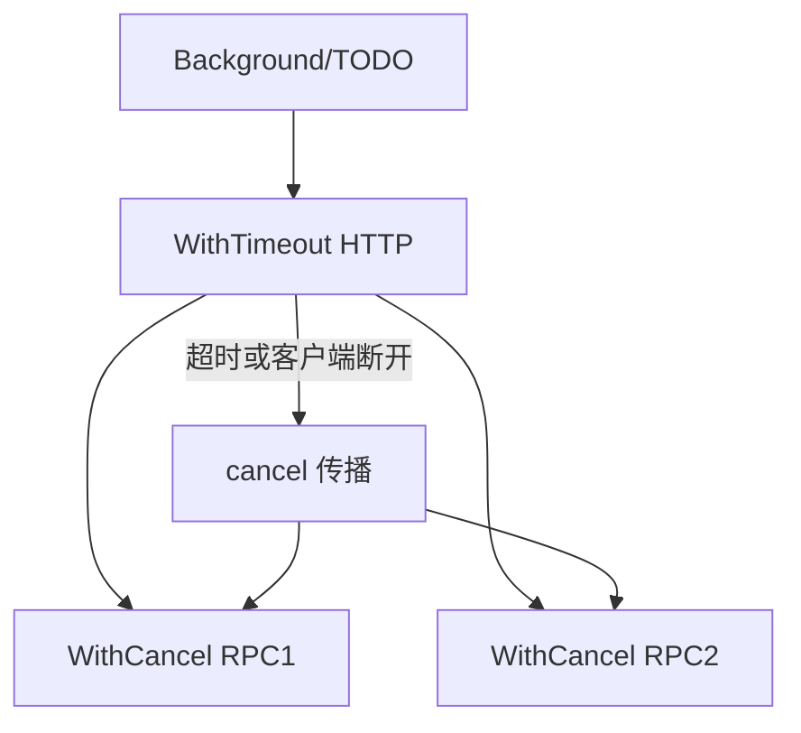

# Context 树、取消传播与泄漏

## 30 秒版（开场）

> **context** 在调用链传递 **取消、超时、请求域值**；子节点取消会向下传播，**父不能感知子取消**。生产关键词：**WithCancel 必须 cancel()、WithTimeout 防 goroutine 泄漏、不要把 Context 塞进结构体**。

## 3 分钟版（一面深度）

1. **是什么**：不可变树节点：`Context` 接口 `Done/Err/Deadline/Value`。
2. **为什么**：统一取消 HTTP/RPC/DB 子调用，避免孤儿 goroutine。
3. **怎么做**：请求入口 `context.Background()` 或框架提供；派生 `WithCancel/WithTimeout/WithDeadline/WithValue`；下游 `select ctx.Done()`。

## 10 分钟版（原理 + 图示）



**类型**

| 函数 | 行为 |
|------|------|
| WithCancel | 手动 cancel |
| WithTimeout/Deadline | 到时自动 cancel |
| WithValue | 传 requestID 等，**少用大对象** |

**传播规则**：仅向下；`cancel()` 关闭 `Done` channel，所有监听者收到。

**Value 约定**：仅 request scope；key 用未导出类型防冲突。

## 生产场景

- **网关超时 3s**：下游 DB 仍跑 30s → 未传 ctx 或未检查 `QueryContext`。
- **gRPC**：`metadata` + `IncomingContext` 派生子 ctx。
- **泄漏**：`WithCancel` 无 defer cancel，子树常驻。

## 排查与工具

- goroutine profile：栈含 `context.WithCancel` 创建点
- 日志对比 request 结束与后台任务存活时间
- `net/http` `BaseContext` / `Shutdown` 配合

## 架构取舍

| 做法 | 建议 |
|------|------|
| 函数第一参数 `ctx context.Context` | 强制 |
| ctx 入 struct 字段 | 反模式（除代码生成框架） |
| 业务参数放 ctx.Value | 避免，用显式参数 |
| errgroup + ctx | 并行子任务首错取消 |

## 追问链

1. **Background vs TODO？** → 语义区别，均不取消；TODO 表未完成迁移。
2. **Done 关闭后能读 Err 吗？** → `context.Canceled` 或 `DeadlineExceeded`。
3. **父 cancel 子会怎样？** → 子也取消。
4. **子 cancel 父？** → 不会。
5. **WithoutCancel（1.21+）？** → 派生去掉取消，保留 value。

## 反模式与事故

- 只用 `WithTimeout` 不设 DB `QueryContext`，超时仅 HTTP 返回。
- `ctx.Value` 存 logger/DB，测试与类型断言地狱。
- 每次循环 `WithTimeout` 不 `cancel()` → timer 与 goroutine 泄漏。

## 代码示例

```go
func Handler(w http.ResponseWriter, r *http.Request) {
    ctx, cancel := context.WithTimeout(r.Context(), 2*time.Second)
    defer cancel()
    if err := svc.Do(ctx); err != nil {
        http.Error(w, err.Error(), http.StatusGatewayTimeout)
        return
    }
}
```

## 延伸阅读

- [context 包](https://pkg.go.dev/context)
- [Go blog: Context](https://go.dev/blog/context)
- [context.Context and structs](https://go.dev/blog/context-and-structs)
