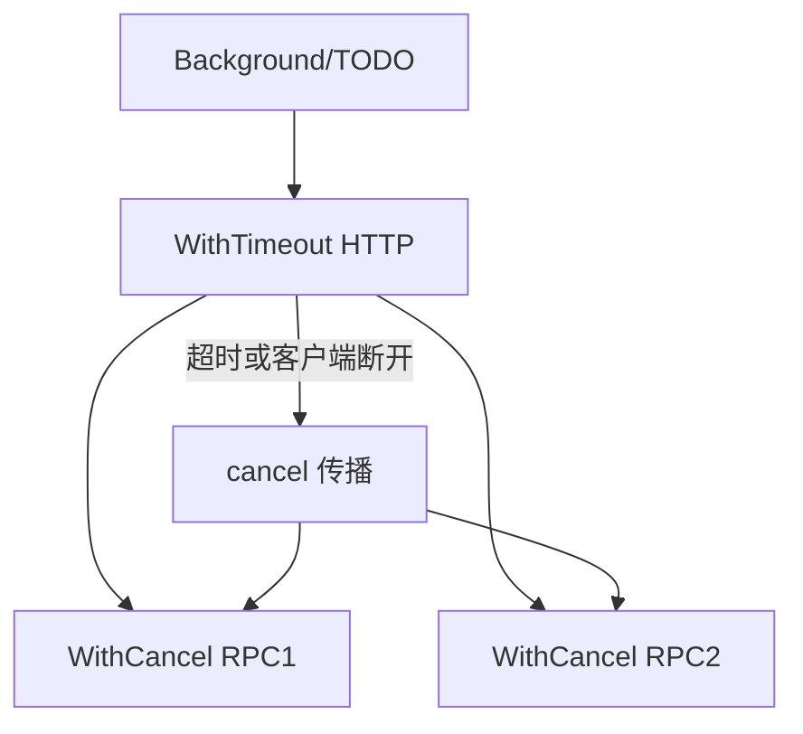

# Context 树、取消传播与泄漏

## 30 秒版（开场）

> **context** 在调用链传递取消、deadline 和请求域元数据；父取消向下传播，子取消不会反向取消父。`WithTimeout` 只有在下游实际监听 `Done` 或使用 `QueryContext/Do(req.WithContext)` 等 API 时才会停止工作。

## 3 分钟版（一面深度）

1. **是什么**：从父 Context 派生出的调用树；接口提供 `Done/Err/Deadline/Value`，并可被
   多个 goroutine 并发调用。不要把“派生后调用方不修改”误说成内部对象永远不可变。
2. **为什么**：统一取消 HTTP/RPC/DB 子调用，避免孤儿 goroutine。
3. **怎么做**：请求入口 `context.Background()` 或框架提供；派生 `WithCancel/WithTimeout/WithDeadline/WithValue`；下游 `select ctx.Done()`。

## 10 分钟版（原理 + 图示）


```mermaid
flowchart TB
  Root[Background/TODO] --> A[WithTimeout HTTP]
  A --> B[WithCancel RPC1]
  A --> C[WithCancel RPC2]
  A -->|超时或客户端断开| Cancel[cancel 传播]
  Cancel --> B
  Cancel --> C
```

**类型**

| 函数 | 行为 |
|------|------|
| WithCancel | 手动 cancel |
| WithTimeout/Deadline | 到时自动 cancel |
| WithValue | 传 requestID 等，**少用大对象** |

**传播规则**：仅向下；调用 `cancel()` 会安排派生 Context 的 `Done` 关闭并取消其子树，
但 `CancelFunc` 不等待下游工作退出，而且规范允许 `Done` 在 cancel 返回后异步关闭。

**Value 约定**：仅 request scope；key 用未导出类型防冲突。

## 生产场景

- **网关超时 3s**：下游 DB 仍跑 30s → 未传 ctx 或未检查 `QueryContext`。
- **gRPC**：`metadata` + `IncomingContext` 派生子 ctx。
- **资源泄漏**：不调用返回的 `CancelFunc`，父会继续引用子树，相关 timer/资源会保留到
  父取消；这不等同于“每次都额外泄漏一个 goroutine”。

## 排查与工具

- goroutine profile：定位未退出 goroutine 正阻塞在哪；Context 本身通常不会额外创建一个可直接看到的 goroutine
- 日志对比 request 结束与后台任务存活时间
- `net/http` `BaseContext` / `Shutdown` 配合

## 架构取舍

| 做法 | 建议 |
|------|------|
| 函数第一参数 `ctx context.Context` | 强制 |
| ctx 入 struct 字段 | 反模式（除代码生成框架） |
| 业务参数放 ctx.Value | 避免，用显式参数 |
| errgroup + ctx | 并行子任务首错取消 |

## 追问链

1. **Background vs TODO？** → 语义区别，均不取消；TODO 表未完成迁移。
2. **Done 关闭后能读 Err 吗？** → `context.Canceled` 或 `DeadlineExceeded`。
3. **父 cancel 子会怎样？** → 子也取消。
4. **子 cancel 父？** → 不会。
5. **WithoutCancel（1.21+）？** → 保留父 Value，但没有 Deadline、Done 为 nil、Err 永远为 nil；适合明确需要脱离父取消的任务，仍应另设自己的生命周期。
6. **CancelFunc 会等 goroutine 停止吗？** → 不会；它只发出取消信号并释放关联关系/计时器，
   调用方若需要等待退出还要使用 `WaitGroup`、`errgroup` 或结果 channel。

## 反模式与事故

- 只用 `WithTimeout` 不设 DB `QueryContext`，超时仅 HTTP 返回。
- 把 DB client 等依赖通过 `ctx.Value` 注入；Value 应限于请求域元数据，request-scoped logger 也要有清晰约定。
- 循环中创建 `WithTimeout` 后不及时 `cancel()` → 子节点与 timer 保留到超时。长循环内应每轮显式调用 `cancel()`，不要把大量 `defer cancel()` 堆到函数末尾。

## 代码示例

```go
func Handler(w http.ResponseWriter, r *http.Request) {
    ctx, cancel := context.WithTimeout(r.Context(), 2*time.Second)
    defer cancel()
    if err := svc.Do(ctx); err != nil {
        http.Error(w, err.Error(), http.StatusGatewayTimeout)
        return
    }
}
```

## 延伸阅读

- [context 包](https://pkg.go.dev/context)
- [Go blog: Context](https://go.dev/blog/context)
- [context.Context and structs](https://go.dev/blog/context-and-structs)
