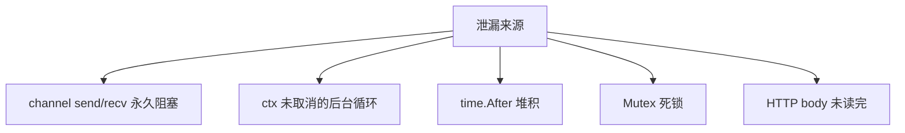

# Goroutine 泄漏成因与 pprof 排查

## 30 秒版（开场）

> **Goroutine 泄漏** = 数量单调涨、永不退出，占栈内存并拖慢调度。常见根因：**channel 无人读、缺 ctx 取消、WaitGroup/锁等待、定时器未 Stop**。生产关键词：**goroutine 指标、heap/goroutine profile、trace 看 stuck G**。

## 3 分钟版（一面深度）

1. **是什么**：本应在请求结束后退出的 G 仍阻塞或空转，进程级累积。
2. **为什么**：资源上限（内存、调度）、FD、下游连接池耗尽。
3. **怎么做**：生命周期绑定 ctx；避免无缓冲永久等；超时；压测后对比 `runtime.NumGoroutine()`。

## 10 分钟版（原理 + 图示）



**典型栈特征**

| 栈顶 | 含义 |
|------|------|
| `chan receive` | 等数据无人发 |
| `chan send` | 等接收者 |
| `select` | 多路皆不就绪 |
| `sync.(*Mutex).Lock` | 死锁或慢锁 |
| `time.Sleep` | 可能正常，结合业务 |

**与线程泄漏区别**：G 轻量但百万级仍 OOM；M 泄漏更致命（线程上限）。

## 生产场景

- **推送服务**：每连接 2 goroutine，断线未 cancel reader → 每晚 +50k G。
- **定时任务**：`for { select { case <-t.C: } }` 无退出。
- **可观测**：`go_goroutines` Prometheus；与 QPS 无关上涨即告警。

## 排查与工具

```bash
# 开启 pprof
import _ "net/http/pprof"
go tool pprof http://localhost:6060/debug/pprof/goroutine

# 对比两次快照
curl -o g1.prof ':6060/debug/pprof/goroutine'
# ... 压测 ...
curl -o g2.prof ':6060/debug/pprof/goroutine'
go tool pprof -base g1.prof g2.prof
```

- `go tool trace`：长时间无完成的 G
- 单元测试：`leaktest` 检测测试结束 G 数

## 架构取舍

| 防护 | 说明 |
|------|------|
| context 贯穿 | 请求结束即取消 |
| worker 池 | 上限固定 G |
| semaphore | 限制并发 fan-out |
| 连接超时 | TCP/HTTP idle |

## 追问链

1. **泄漏与高并发正常阻塞？** → 看是否随时间单调增且不回落。
2. **main 退出 G 呢？** → 进程结束全杀；泄漏指长跑服务。
3. **pprof 采样影响？** → 低开销，生产可短时开。
4. **如何定位创建点？** → debug=2 看全栈，搜业务包名。
5. **runtime.SetFinalizer 能救吗？** → 不能替代正确生命周期。

## 反模式与事故

- 每个任务 `go` 无界，仅靠「平均很快」。
- 子 goroutine 用 `context.Background()` 脱离请求。
- 只监控 CPU 不监控 `go_goroutines`。

## 代码示例

```go
func worker(ctx context.Context) {
    for {
        select {
        case <-ctx.Done():
            return
        case job := <-jobs:
            handle(job)
        }
    }
}
```

并发模式参考 [`basis/goroutine/main.go`](https://github.com/twodog-tt/Golang-development-manual/blob/master/basis/goroutine/main.go)。

## 延伸阅读

- [Profiling Go Programs](https://go.dev/blog/pprof)
- [net/http/pprof](https://pkg.go.dev/net/http/pprof)
- [掘金：Go goroutine 泄漏实战](https://juejin.cn/post/6844903840752300039)
