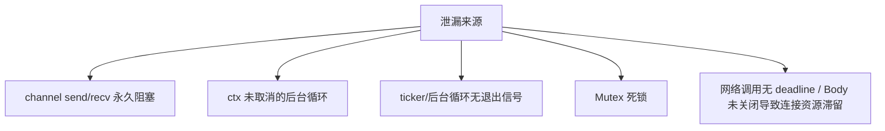

# Goroutine 泄漏成因与 pprof 排查

<a id="oral-card"></a>

## 要点卡

[返回高频核心锚点](../../high-frequency-roadmap.md)

!!! abstract "30 秒回答"

    Goroutine 泄漏是本应结束的 goroutine 因无对端 channel、缺少取消、永久锁等待、无 deadline
    网络调用或后台循环而长期存活。判断不能只看某一时刻的 goroutine 数，而要结合流量归一化
    趋势、两次 profile 的新增栈和业务生命周期。修复的核心是明确 owner、退出信号和等待协议，
    不是依赖 GC 或 `recover`。

**3 分钟展开**

1. 先看 `go_goroutines` 是否在相似负载下持续上升且不回落，再按版本/接口/租户关联变化。
2. 受保护地采集 goroutine profile，间隔一段压测或真实流量后对比，按 `chan send/receive`、
   `select`、`Mutex.Lock`、网络调用等栈聚类。
3. 回到创建点检查：谁启动、谁取消、谁 close、谁 wait、下游是否有 deadline。
4. 修复后做重复启停/压测和泄漏测试；Go 1.26 实验性 leak profile 只能补充识别一类可证明永久
   阻塞的 goroutine，不能替代普通 profile 和指标。

| 记忆槽 | 内容 |
|--------|------|
| 三个不变量 | 每个 goroutine 都要有 owner；每条阻塞路径都要有退出条件；profile 必须结合趋势和业务语义 |
| 手画图 | `start → work loop → ctx.Done/chan close → return → Wait`，把缺失的退出边画红叉 |
| 项目落点 | WebSocket/indexer 每连接或每订阅 goroutine：断线 cancel、关闭资源并等待退出；只讲真实排障证据 |
| 一个取舍 | 每连接 goroutine 简单清晰，但连接规模大时资源线性增长；事件循环/worker 池更省资源但实现更复杂 |

**错误表达**

- ❌ “goroutine 数多就是泄漏；pprof 开销很低，可以把调试端点直接暴露公网。”
- ✅ “泄漏由生命周期定义；profile 采集要鉴权、限频，并结合基线和流量判断。”

**自测追问**：正常的高并发阻塞与泄漏怎么区分？如何定位 goroutine 的创建点和无法退出的等待点？

## 10 分钟版（原理 + 图示）


```mermaid
flowchart TB
  Leak[泄漏来源] --> C1[channel send/recv 永久阻塞]
  Leak --> C2[ctx 未取消的后台循环]
  Leak --> C3[ticker/后台循环无退出信号]
  Leak --> C4[Mutex 死锁]
  Leak --> C5[网络调用无 deadline / Body 未关闭导致连接资源滞留]
```

**典型栈特征**

| 栈顶 | 含义 |
|------|------|
| `chan receive` | 等数据无人发 |
| `chan send` | 等接收者 |
| `select` | 多路皆不就绪 |
| `sync.(*Mutex).Lock` | 死锁或慢锁 |
| `time.Sleep` | 可能正常，结合业务 |

**与线程泄漏区别**：G 轻量但百万级仍 OOM；M 泄漏更致命（线程上限）。

## 生产场景

- **推送服务**：每连接 2 goroutine，断线未 cancel reader → 每晚 +50k G。
- **定时任务**：`for { select { case <-t.C: } }` 无退出。
- **可观测**：`go_goroutines` Prometheus；与 QPS 无关上涨即告警。

## 排查与工具

`net/http/pprof` 注册 handler，但仍需启动受保护的 HTTP listener；不要把调试端点直接暴露到公网：

```go
import (
    "log"
    "net/http"
    _ "net/http/pprof"
)

func startPprof() {
    go func() {
        log.Print(http.ListenAndServe("127.0.0.1:6060", nil))
    }()
}
```

```bash
go tool pprof http://127.0.0.1:6060/debug/pprof/goroutine

# 对比两次快照
curl -o g1.prof 'http://127.0.0.1:6060/debug/pprof/goroutine'
# ... 压测 ...
curl -o g2.prof 'http://127.0.0.1:6060/debug/pprof/goroutine'
go tool pprof -base g1.prof g2.prof
```

- `go tool trace`：长时间无完成的 G
- 单元测试：`leaktest` 检测测试结束 G 数

**Go 1.26 实验性泄漏画像**

```bash
# 构建时启用；不是运行时动态开关
GOEXPERIMENT=goroutineleakprofile go build ./...

# 使用 net/http/pprof 时会增加该端点
go tool pprof http://localhost:6060/debug/pprof/goroutineleak
```

runtime 借助 GC 可达性判断：若 goroutine 阻塞在某个并发原语上，且该原语不可能再被可运行 goroutine 触达或唤醒，就可报告为泄漏。它无法完备检测所有泄漏，例如阻塞对象仍被全局变量或可运行 goroutine 持有时可能漏报；CPU 空转、业务上“永不结束”但运行时仍可唤醒的 goroutine 也不能仅靠该 profile 定性。

## 架构取舍

| 防护 | 说明 |
|------|------|
| context 贯穿 | 请求结束即取消 |
| worker 池 | 上限固定 G |
| semaphore | 限制并发 fan-out |
| 连接超时 | TCP/HTTP idle |
| Go 1.26 `goroutineleak` profile | 补充发现可证明永久阻塞的泄漏；当前需实验开关 |

## 深挖问答

1. **泄漏与高并发正常阻塞？** → 看是否随时间单调增且不回落。
2. **main 退出 G 呢？** → 进程结束全杀；泄漏指长跑服务。
3. **pprof 采样影响？** → 不能承诺固定“低开销”；完整 goroutine 栈采集和文本输出会随
   goroutine 数、栈深和频率增长。生产应鉴权、限频，并先评估高峰期影响。
4. **如何定位创建点？** → debug=2 看全栈，搜业务包名。
5. **runtime.SetFinalizer 能救吗？** → 不能替代正确生命周期。
6. **Go 1.26 的 leak profile 能发现全部泄漏吗？** → 不能。它基于可达性证明一类永久阻塞，只是证据之一；还要结合 goroutine 数趋势、普通 profile、trace 与业务生命周期。

## 反模式与事故

- 每个任务 `go` 无界，仅靠「平均很快」。
- 子 goroutine 用 `context.Background()` 脱离请求。
- 只监控 CPU 不监控 `go_goroutines`。

## 代码示例

```go
func worker(ctx context.Context) {
    for {
        select {
        case <-ctx.Done():
            return
        case job, ok := <-jobs:
            if !ok {
                return
            }
            handle(job)
        }
    }
}
```

并发模式参考 [`basis/goroutine/main.go`](https://github.com/twodog-tt/Golang-development-manual/blob/master/basis/goroutine/main.go)。

## 延伸阅读

- [Profiling Go Programs](https://go.dev/blog/pprof)
- [net/http/pprof](https://pkg.go.dev/net/http/pprof)
- [Go 1.26 Release Notes - Experimental goroutine leak profile](https://go.dev/doc/go1.26)
- [Go 官方 Diagnostics 指南](https://go.dev/doc/diagnostics)
