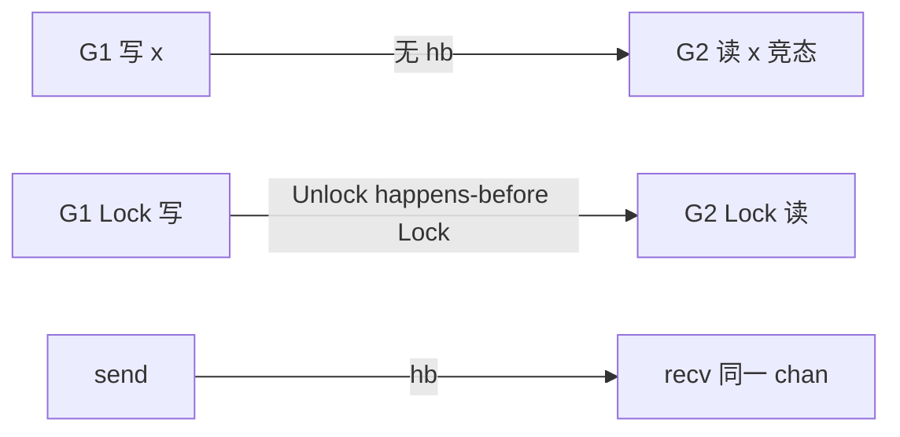

# Go 内存模型与 happens-before

## 30 秒版（开场）

> Go 内存模型定义：**若事件 A happens-before B，则 A 的写对 B 可见**。同步原语（mutex、channel、atomic、Once）建立 hb 边；**无同步的数据竞态 = 未定义行为**。生产关键词：**不要靠直觉排序、race 与 hb 互补**。

## 3 分钟版（一面深度）

1. **是什么**：规范 goroutine 间读写可见性与执行顺序保证。
2. **为什么**：编译器/CPU 重排序；无 hb 则读到的可能是陈旧值。
3. **怎么做**：用 channel 传递数据、mutex 保护、atomic 单变量、init 与 goroutine 启动有特殊规则。

## 10 分钟版（原理 + 图示）



**官方 hb 规则（节选）**

- `go` 语句 happens-before goroutine 开始执行
- channel：send hb recv（同一 channel）；close hb recv 返回零值
- `sync.Mutex`：Unlock hb 后续 Lock
- `sync/atomic`：同一变量原子操作有全序
- `sync.Once`：Do 返回 hb 后续 Do

**不保证**：普通变量无同步时的顺序；**不等于**时间先后。

**与 Java/C++ 差异**：无 volatile 关键字；用 atomic 类型。

## 生产场景

- **双重检查单例**无 Once：偶发 nil 指针。
- **标志位退出**：`done=true` 无 atomic/mutex，worker 看不见。
- **批处理**：主 goroutine 写 slice，子 goroutine 读，无 Wait/chan。

## 排查与工具

- `go test -race` / CI 必开
- 代码审查：共享 map、闭包捕获循环变量（1.22 前）

## 架构取舍

- **消息传递**（chan）优先于 **共享内存**（锁）—— Effective Go 精神，但高性能热点仍用锁/atomic。
- **不可变数据** 跨 goroutine：无 hb 也安全（只读发布）。

## 追问链

1. **chan 发送指针 hb 吗？** → send hb recv，指针指向内容对接收者可见（若之后无别的写）。
2. **RWMutex 读与读？** → RLock hb 后续 RLock 无写时可见。
3. **atomic 能替代 mutex 吗？** → 仅单变量操作有全序。
4. **happens-before 与 wall clock？** → 无关。
5. **init 函数 hb？** → package init hb main。

## 反模式与事故

- `sleep` 当同步手段。
- 以为 `int` 赋值原子（非 atomic 在 32 位可能撕裂）。
- 忽略 struct 字段重排可见性，只锁了部分字段访问。

## 代码示例

```go
var ready atomic.Bool
var data string

func producer() {
    data = "ok"
    ready.Store(true) // release
}

func consumer() {
    for !ready.Load() { // acquire
        runtime.Gosched()
    }
    _ = data // 安全可见
}
```

见 [`basis/sync/main.go`](../../../basis/sync/main.go)。

## 延伸阅读

- [The Go Memory Model](https://go.dev/ref/mem)
- [Introducing the Race Detector](https://go.dev/blog/race-detector)
