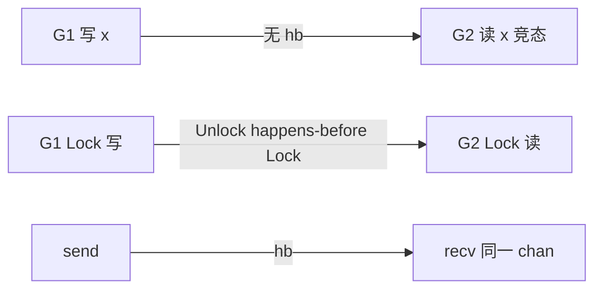

# Go 内存模型与 happens-before

<a id="oral-card"></a>

## 口述卡（高频必背）

[返回 P0 知识图谱](../_meta/p0-knowledge-graph.md)

!!! abstract "30 秒回答"

    Go 内存模型定义：若事件 A happens-before B，则 A 的写对 B 可见。同步原语建立 hb 边；含数据竞态的程序是错误程序，结果不可靠，但 Go 不应简单表述成 C/C++ 式“编译器可以任意做任何事”。无竞态程序享有 DRF-SC 保证。

**3 分钟展开**

1. **是什么**：规范 goroutine 间读写可见性与执行顺序保证。
2. **为什么**：编译器/CPU 重排序；无 hb 则读到的可能是陈旧值。
3. **怎么做**：用 channel 传递数据、mutex 保护、atomic 单变量、init 与 goroutine 启动有特殊规则。

| 记忆槽 | 内容 |
|--------|------|
| 三个不变量 | happens-before 不是墙上时间顺序；无数据竞态程序享有 DRF-SC；普通变量无同步就没有跨 G 可见性保证 |
| 手画图 | `write → Unlock/send/atomic → Lock/recv/atomic → read`，无同步分支标成 race |
| 项目落点 | 用实际配置热更新或状态快照说明如何用不可变对象加 `atomic.Pointer` 发布；只引用本人实际参与部分和可解释指标 |
| 一个取舍 | Mutex 易维护复合不变量；atomic 适合单变量/不可变快照，但组合状态更难证明 |

**错误表达**

- ❌ “先 sleep 一下写入就可见；race detector 没报就说明没有竞态。”
- ✅ “可见性来自内存模型定义的同步边；race detector 只覆盖本次执行到的路径。”

**自测追问**：为什么 `done=true` 之后另一个 goroutine 不一定安全看到配套数据？atomic 能否自动保护两个字段的不变量？

## 10 分钟版（原理 + 图示）


```mermaid
flowchart LR
  G1[G1 写 x] -->|无 hb| G2[G2 读 x 竞态]
  G1b[G1 Lock 写] -->|Unlock happens-before Lock| G2b[G2 Lock 读]
  S[send] -->|hb| R[recv 同一 chan]
```

**官方 hb 规则（节选）**

- `go` 语句 happens-before goroutine 开始执行
- channel：send hb recv（同一 channel）；close hb recv 返回零值
- `sync.Mutex`：Unlock hb 后续 Lock
- `sync/atomic`：原子操作表现为顺序一致的总序；当一个原子操作观察到另一个操作的效果时，二者建立同步关系
- `sync.Once`：由某次 `Do` 执行的函数 `f` 完成，synchronized-before 任意
  `once.Do(f)` 调用返回

**不保证**：普通变量无同步时的顺序；**不等于**时间先后。

**与 Java/C++ 差异**：无 volatile 关键字；用 atomic 类型。

## 生产场景

- **双重检查单例**无 Once：偶发 nil 指针。
- **标志位退出**：`done=true` 无 atomic/mutex，worker 看不见。
- **批处理**：子 goroutine 写 slice 结果，主 goroutine 未经 Wait/channel 就读取；或启动后双方继续并发读写底层数组。

## 排查与工具

- `go test -race` / CI 必开
- 代码审查：共享 map、闭包捕获循环变量（1.22 前）

## 架构取舍

- **消息传递**（chan）优先于 **共享内存**（锁）—— Effective Go 精神，但高性能热点仍用锁/atomic。
- **不可变数据** 跨 goroutine：构造完成后仍需安全发布，例如在 `go` 语句之前完成写入、通过 channel 发送、锁或 atomic pointer 发布；“发布后只读”不能替代发布时的 hb。

## 追问链

1. **chan 发送指针 hb 吗？** → send hb recv，指针指向内容对接收者可见（若之后无别的写）。
2. **两个 RLock 之间有 hb 吗？** → 没有一般性的 RLock→RLock 规则。RWMutex 的保证通过 writer 的 Unlock/Lock 以及 RUnlock→后续 Lock 建立；共享数据仍必须遵守完整加锁协议。
3. **atomic 能替代 mutex 吗？** → 仅单变量操作有全序。
4. **happens-before 与 wall clock？** → 无关。
5. **init 函数 hb？** → package init hb main。

## 反模式与事故

- `sleep` 当同步手段。
- 以为“机器字大小的普通读写不会撕裂”就等于并发安全。即使某次 `int` 读只能观察到实际
  写入过的值，无同步并发读写仍是 data race；大于机器字的 `int64`（在 32 位平台）以及
  slice/interface/string 等多字结构还可能被分步读写，产生不一致组合。
- 忽略 struct 字段重排可见性，只锁了部分字段访问。

## 代码示例

```go
var ready atomic.Bool
var data string

func producer() {
    data = "ok"
    ready.Store(true) // Go atomic 为顺序一致操作
}

func consumer() {
    for !ready.Load() {
        runtime.Gosched()
    }
    _ = data // 安全可见
}
```

见 [`basis/sync/main.go`](https://github.com/twodog-tt/Golang-development-manual/blob/master/basis/sync/main.go)。

## 延伸阅读

- [The Go Memory Model](https://go.dev/ref/mem)
- [Introducing the Race Detector](https://go.dev/blog/race-detector)
