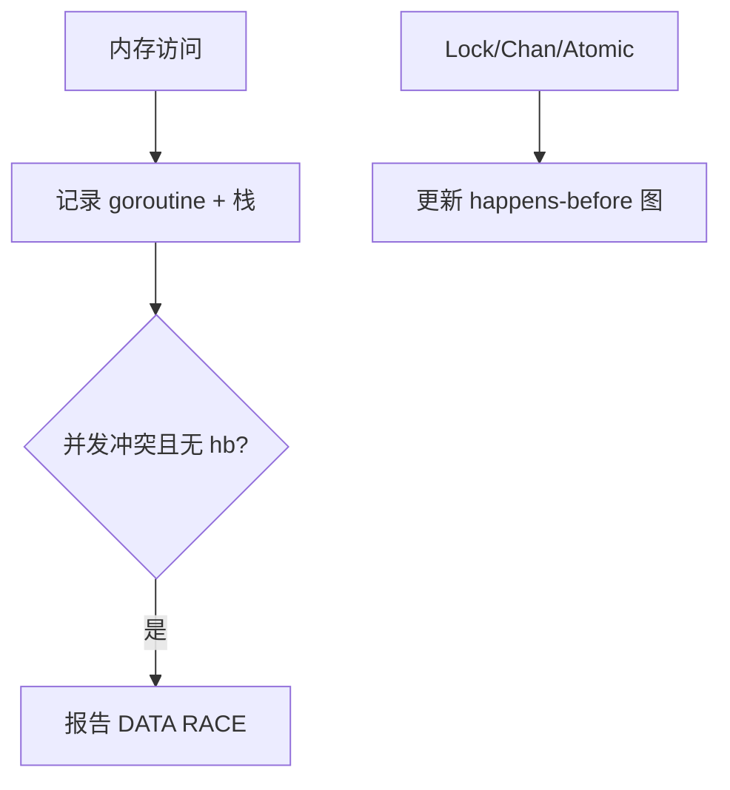

# Race Detector 原理与工程实践

## 30 秒版（开场）

> **Race Detector** 基于 **ThreadSanitizer**，在访问时插桩记录 **happens-before**，发现无 hb 的并发读写。**5–10× 内存、2–20× CPU** 开销，用于 **测试/预发**，非全量生产。生产关键词：**CI `-race`、竞态报告=真实 bug**。

## 3 分钟版（一面深度）

1. **是什么**：`-race` 编译插桩，运行时跟踪内存访问与同步事件。
2. **为什么**：数据竞态难复现，线上表现为偶发 panic/脏读。
3. **怎么做**：单测/集成测/压测带 `-race`；修复报告或加 mutex/chan/atomic；注意误报极少。

## 10 分钟版（原理 + 图示）



**检测类型**

- 读写竞态
- 写写竞态
- 涉及 `unsafe`、CGO 边界可能漏检

**不检测**：逻辑死锁、goroutine 泄漏、业务层竞态（如重复下单需应用幂等）。

**与 `-msan` 等**：Go 官方主推 race；内存未初始化另有工具链限制。

## 生产场景

- **CI 门禁**：race 失败禁止合并。
- **预发压测 30min**：偶发 map 并发写被揪出。
- **无法全量生产开**：采样 pod、或 nightly job。

## 排查与工具

```bash
go test -race ./...
go run -race .
go build -race -o app .
```

报告含 **双方栈**，定位到文件行；优先修写方加锁或改消息传递。

## 架构取舍

| 策略 | 说明 |
|------|------|
| 默认 CI race | 小中型服务 |
| 分模块 nightly | 超大仓库 |
| 生产关闭 | 性能与内存 |
| 设计避免共享 | 从根源减竞态 |

## 追问链

1. **race 一定崩溃吗？** → 否，未定义行为可能「看起来正常」。
2. **性能多少？** → 因访问模式而异，文档给数量级。
3. **map 并发写？** → 必 race，即使用单条 `delete`。
4. **闭包捕获循环变量？** → 1.22 前常见 race/逻辑错；`-race` 可辅助发现。
5. **race 与 mutex 误用？** → 锁未保护全部访问路径仍报。

## 反模式与事故

- 生产 `-race` 上线导致 OOM。
- 忽略 race 报告「仅测试环境」。
- 只用 race 不做负载测试，泄漏未发现。

## 代码示例

```go
// 触发 race（勿提交）
var x int
go func() { x++ }()
go func() { x++ }()
```

修复见 [`basis/sync/main.go`](https://github.com/twodog-tt/Golang-development-manual/blob/master/basis/sync/main.go) Mutex/atomic 计数器。

## 延伸阅读

- [Data Race Detector](https://go.dev/doc/articles/race_detector)
- [Introducing the Race Detector](https://go.dev/blog/race-detector)
