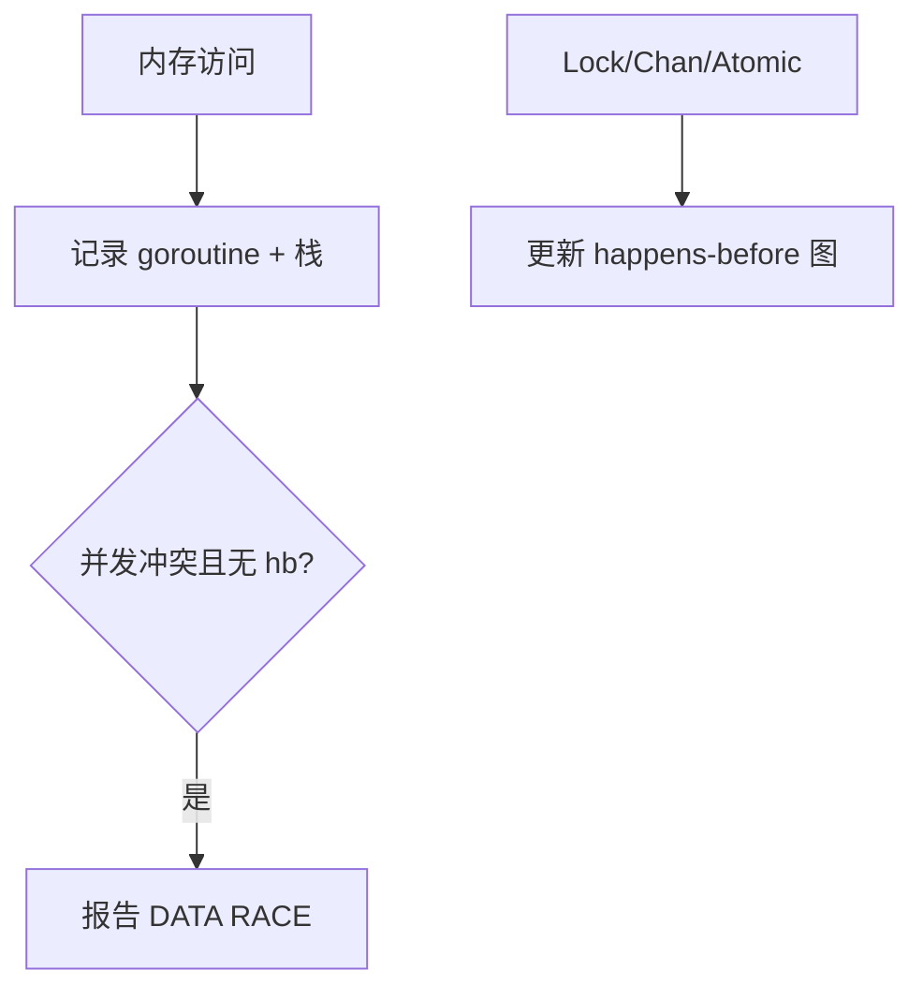

# Race Detector 原理与工程实践

## 30 秒版（开场）

> **Race Detector** 通过编译插桩与运行时 happens-before 分析发现实际执行到的数据竞态。开销与工作负载、平台有关，可能达到数倍甚至更高，因此通常用于测试、预发压测或少量 canary，而不是把固定倍率背成保证。

## 3 分钟版（一面深度）

1. **是什么**：`-race` 编译插桩，运行时跟踪内存访问与同步事件。
2. **为什么**：数据竞态难复现，线上表现为偶发 panic/脏读。
3. **怎么做**：让有代表性的单测、集成测和负载路径带 `-race`；报告意味着被观测执行中存在数据竞态，但未报告不代表没有，因为它只能检测跑到的路径。

## 10 分钟版（原理 + 图示）


```mermaid
flowchart TB
  Access[内存访问] --> Track[记录 goroutine + 栈]
  Sync[Lock/Chan/Atomic] --> HB[更新 happens-before 图]
  Track --> Check{并发冲突且无 hb?}
  Check -->|是| Report[报告 DATA RACE]
```

**检测类型**

- 读写竞态
- 写写竞态
- 涉及 `unsafe`、CGO 边界可能漏检

**不检测**：逻辑死锁、goroutine 泄漏、业务层竞态（如重复下单需应用幂等）。

**与 `-msan` 等**：Go 官方主推 race；内存未初始化另有工具链限制。

## 生产场景

- **CI 门禁**：race 失败禁止合并。
- **预发压测 30min**：偶发 map 并发写被揪出。
- **无法全量生产开**：采样 pod、或 nightly job。

## 排查与工具

```bash
go test -race ./...
go run -race .
go build -race -o app .
```

报告含 **双方栈**，定位到文件行；优先修写方加锁或改消息传递。

## 架构取舍

| 策略 | 说明 |
|------|------|
| 默认 CI race | 小中型服务 |
| 分模块 nightly | 超大仓库 |
| 生产关闭 | 性能与内存 |
| 设计避免共享 | 从根源减竞态 |

## 追问链

1. **race 一定崩溃吗？** → 否。数据竞态是程序错误且失去 DRF-SC 保证，但 Go 不应被
   表述成 C/C++ 式“编译器可以任意行为”的完全未定义语义；规范仍对单机器字读取等施加
   最低约束。无论表面是否正常都必须修复。
2. **性能多少？** → 因访问模式而异，文档给数量级。
3. **map 并发访问？** → 同一普通 map 被并发访问且至少一个操作是写入时，若无同步就是数据竞态；运行时有时会 fatal，但不能依赖它替代同步。
4. **闭包捕获循环变量？** → Go 1.22 的新 for 变量语义按模块语言版本生效，修复了很多经典捕获问题；旧语义代码和循环外复用变量仍需检查，`-race` 也只有在形成并发冲突时才会报告。
5. **race 与 mutex 误用？** → 锁未保护全部访问路径仍报。

## 反模式与事故

- 生产 `-race` 上线导致 OOM。
- 忽略 race 报告「仅测试环境」。
- 只用 race 不做负载测试，泄漏未发现。

## 代码示例

```go
// 触发 race（勿提交）
import "sync"

func raceExample() {
    var x int
    var wg sync.WaitGroup
    wg.Add(2)
    go func() {
        defer wg.Done()
        x++
    }()
    go func() {
        defer wg.Done()
        x++
    }()
    wg.Wait() // 确保两个访问都执行；WaitGroup 并未同步两次 x++ 之间的访问。
}
```

修复见 [`basis/sync/main.go`](https://github.com/twodog-tt/Golang-development-manual/blob/master/basis/sync/main.go) Mutex/atomic 计数器。

## 延伸阅读

- [Data Race Detector](https://go.dev/doc/articles/race_detector)
- [Introducing the Race Detector](https://go.dev/blog/race-detector)
