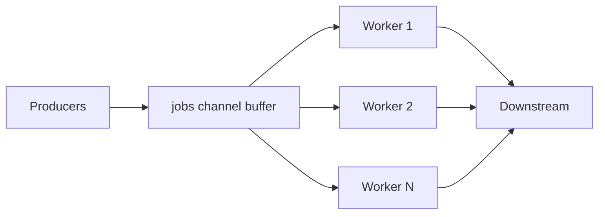

# Worker Pool 设计模式

## 30 秒版（开场）

> **Worker Pool** 用 **固定数量 goroutine** 消费任务队列，实现 **并发上限与背压**。Go 可用 **buffered channel + N worker** 或 **`semaphore.Weighted`**。生产关键词：**队列长度、拒绝策略、优雅关停**。

## 3 分钟版（一面深度）

1. **是什么**：生产者投递 Job，池内 worker 并发处理，池大小 = 最大并行度。
2. **为什么**：防 goroutine 爆炸、保护下游（DB/API）、平滑 CPU。
3. **怎么做**：`jobs chan Job` + `for i:=0;i<n;i++ { go worker() }`；或 `sem.Acquire` 包裹 `go`；配合 ctx 与 `WaitGroup` 关停。

## 10 分钟版（原理 + 图示）



**设计维度**

| 维度 | 选项 |
|------|------|
| 队列 | 无界 channel（危险）、有界、丢弃、阻塞 |
| Worker 数 | 固定、按 CPU、按下游连接池 |
| 结果 | 另一 `results chan`、callback、errgroup |
| 动态 | 一般避免，用 sem 弹性即可 |

**与 GOMAXPROCS**：池大小是应用层；runtime 仍按 P 调度。

**关停**：`close(jobs)` 或 broadcast done；worker `for select` 退出；in-flight 用 `WaitGroup`。

## 生产场景

- **图片处理**：1000 上传/s，worker=50，队列 200，满则 429。
- **批写 DB**：worker=连接池大小，防 `too many connections`。
- **指标**：队列深度、处理耗时、拒绝次数。

## 排查与工具

- goroutine 数 ≈ worker + 固定开销 → 正常
- 队列满持续 → 下游慢或 worker 不足
- pprof CPU 看 worker 热点

## 架构取舍

| 方案 | 适用 |
|------|------|
| 固定 worker + 有界队列 | 标准后端任务 |
| 每请求一 goroutine | 轻量 IO、强隔离 |
| 外部队列 Kafka | 削峰、持久化 |
| ants 等库 | 需要池化与统计 |

**不宜**：CPU 任务池大小 >> 核数且无队列上限。

## 追问链

1. **worker 阻塞会怎样？** → 吞吐降，队列堆积。
2. **如何传递 error？** → results chan 带 error、或 errgroup。
3. **动态扩缩 worker？** → 复杂，优先调队列与 sem。
4. **无缓冲 jobs？** → 同步背压，生产者变慢。
5. **与线程池对比？** → Go worker 是 G，成本低但仍要限流。

## 反模式与事故

- 无界 `go process()`，峰值打挂 DB。
- `close(jobs)` 后仍 send → panic。
- 关停未等 in-flight，数据半处理。

## 代码示例

```go
func pool(ctx context.Context, jobs <-chan Job, n int) {
    var wg sync.WaitGroup
    wg.Add(n)
    for i := 0; i < n; i++ {
        go func() {
            defer wg.Done()
            for {
                select {
                case <-ctx.Done():
                    return
                case j, ok := <-jobs:
                    if !ok {
                        return
                    }
                    process(j)
                }
            }
        }()
    }
    wg.Wait()
}
```

见 [`basis/goroutine/main.go`](../../../basis/goroutine/main.go) 中 `dispatcher` 任务调度。

## 延伸阅读

- [Go blog: Pipelines and cancellation](https://go.dev/blog/pipelines)
- [semaphore 包](https://pkg.go.dev/golang.org/x/sync/semaphore)
