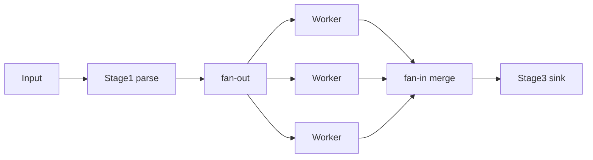

# Fan-out/Fan-in 与 Pipeline 模式

## 30 秒版（开场）

> **Pipeline** 用 stage + channel 串联处理；**fan-out** 多 worker 读同一 stage 输出，**fan-in** 合并多路结果（merge channel / errgroup）。生产关键词：**stage 背压、ctx 取消贯穿、errgroup 首错即停**。

## 3 分钟版（一面深度）

1. **是什么**：数据流经多个处理阶段，每阶段可由 goroutine 并行。
2. **为什么**：分解复杂流式任务（ETL、聚合 RPC）；清晰背压边界。
3. **怎么做**：每 stage `func(in <-chan T) <-chan U`；fan-out 启动 N 个相同 worker 消费 `in`；fan-in `select` 或单 goroutine merge。

## 10 分钟版（原理 + 图示）



**模式要点**

- **关闭传播**：只有发送方 close；下游 `range` 结束。
- **fan-out 限制**：无界 fan-out = goroutine 爆炸；用 worker 池大小固定。
- **fan-in**：合并需处理 **nil 通道** 或 ctx 取消；避免 merge goroutine 泄漏。
- **错误**：pipeline 中 error 常单独 `err chan` 或 `errgroup.WithContext`。

**与 map-reduce**：map≈fan-out，reduce≈fan-in 聚合。

## 生产场景

- **日志清洗**：read → parse → enrich(RPC) → write ES。
- **多服务聚合**：errgroup 并行调订单/库存/用户，fan-in 拼 DTO。
- **故障**：某 stage RPC 无超时时，pipeline 全局堆积。

## 排查与 tools

- trace 看各 stage 阻塞时间
- 每 stage 暴露 `channel_len`（调试用）
- 压测单 stage 定位瓶颈

## 架构取舍

| 方案 | 适用 |
|------|------|
| 纯 channel pipeline | 中等复杂度流处理 |
| errgroup | 无流式中间态的并行 RPC |
| Kafka/Flink | 大规模、持久化、重放 |
| 单 goroutine 顺序 | 低 QPS、简单逻辑 |

## 追问链

1. **fan-out 同一 in channel？** → 多 reader 竞争，每条消息仅一 worker 处理。
2. **如何保证顺序？** → 默认不保证；需序号重排 stage。
3. **stage 慢怎么办？** → 有界缓冲、增 worker、扩慢 stage。
4. **pipeline 如何取消？** → ctx 传入各 stage，select Done。
5. **与 worker pool 区别？** → pipeline 多阶段；pool 通常单阶段消费。

## 反模式与事故

- 中间 channel 无缓冲且无并行 consumer → 串行化。
- merge 未处理 ctx，上游退出 merge 永久阻塞。
- 每元素 fan-out 一 goroutine。

## 代码示例

```go
func fanIn(ctx context.Context, chans ...<-chan Result) <-chan Result {
    out := make(chan Result)
    var wg sync.WaitGroup
    multiplex := func(c <-chan Result) {
        defer wg.Done()
        for r := range c {
            select {
            case out <- r:
            case <-ctx.Done():
                return
            }
        }
    }
    wg.Add(len(chans))
    for _, c := range chans {
        go multiplex(c)
    }
    go func() { wg.Wait(); close(out) }()
    return out
}
```

多服务并行见 [`gin-example/example_28/main.go`](../../../gin-example/example_28/main.go)。

## 延伸阅读

- [Go blog: Pipelines](https://go.dev/blog/pipelines)
- [errgroup](https://pkg.go.dev/golang.org/x/sync/errgroup)
