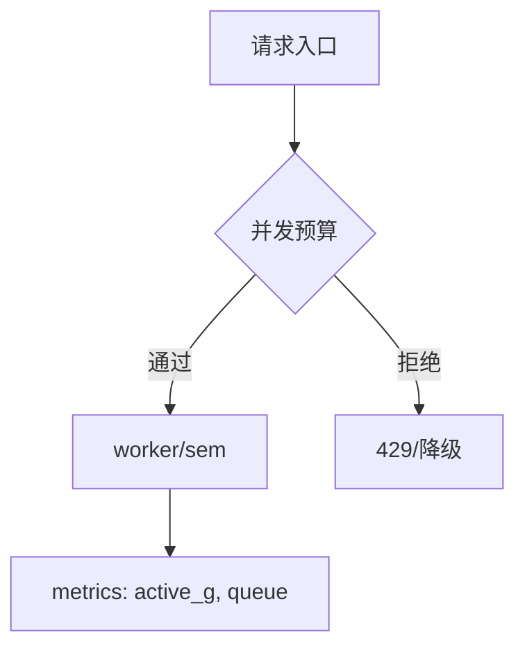

# Goroutine 泛滥治理与并发预算

## 30 秒版（开场）

> **Goroutine 轻量不等于无限**：需 **并发预算**（semaphore、worker 池、连接池对齐）、**可观测**（`go_goroutines`）、**编码规范**（禁止裸 go 无界）。生产关键词：**每请求 goroutine 上限、async 边界审计**。

## 3 分钟版（一面深度）

1. **是什么**：架构层对异步任务数量、生命周期、取消的统一约束。
2. **为什么**：泄漏、调度开销、下游过载、排查困难。
3. **怎么做**：lint 规则、包装 `SafeGo(ctx, fn)`、全局 sem、review checklist、压测验收 goroutine 曲线。

## 10 分钟版（原理 + 图示）



**治理层次**

| 层次 | 手段 |
|------|------|
| 代码 | errgroup、有界队列、ctx |
| 框架 | HTTP maxConns、gRPC 流控 |
| 运维 | HPA、实例数、告警 |
| 组织 | 「谁创建谁取消」规范 |

**审计点**：每 HTTP 请求启动多少 G；后台 ticker；第三方 SDK 内部 G。

**指标**

- `go_goroutines` 基线与 QPS 比值
- `process_threads` 异常升高
- p99 与 G 数相关性

## 生产场景

- **微服务「go 一把梭」**：每请求 20 个 RPC 各 `go`，峰值 200k G。
- **治理后**：sem(50) + 串行非关键路径，G 稳定在 5k。
- **On-call**：G 涨而 CPU 低 → 阻塞；G 与 CPU 齐涨 → 计算或泄漏。

## 排查与工具

- 定期 `pprof/goroutine` 快照 diff
- `runtime/metrics` 或 prometheus `go_sched_*`
- 静态分析：禁止 `go` in loop without limit（自定义 linter）

## 架构取舍

| 策略 | 适用 |
|------|------|
| 全链路 ctx | 所有服务 |
| 集中 async 层 | 大团队统一 |
| 消息队列卸峰 | 突发流量 |
| 禁止 goroutine | 不可能，需管理 |

## 追问链

1. **多少 G 算多？** → 看内存与趋势，非绝对值；10万+ 要警惕。
2. **sem 与 buffered chan？** → sem 计数、chan 可传任务语义。
3. **如何强制规范？** → wrapper + code review + CI grep。
4. **与 rate limit 区别？** → rate 限 QPS，sem 限并发 in-flight。
5. **子进程/线程池？** → 隔离阻塞库的最后手段。

## 反模式与事故

- 「Go 协程便宜」成为不设计背压的理由。
- 监控只有 CPU，G 泄漏三个月未发现。
- 在库内部偷偷 `go`，调用方无法 cancel。

## 代码示例

```go
var limit = semaphore.NewWeighted(100)

func SafeGo(ctx context.Context, fn func(context.Context) error) error {
    if err := limit.Acquire(ctx, 1); err != nil {
        return err
    }
    go func() {
        defer limit.Release(1)
        _ = fn(ctx)
    }()
    return nil
}
```

并发任务见 [`basis/goroutine/main.go`](../../../basis/goroutine/main.go)。

## 延伸阅读

- [semaphore](https://pkg.go.dev/golang.org/x/sync/semaphore)
- [Profiling Go Programs](https://go.dev/blog/pprof)
