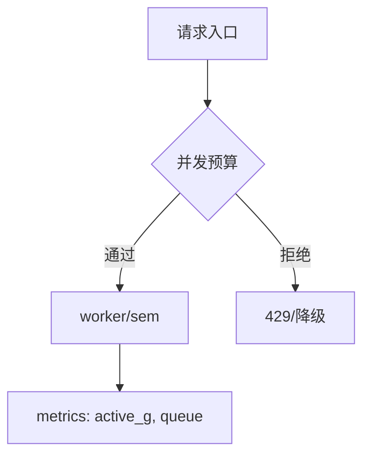

# Goroutine 泛滥治理与并发预算

<a id="oral-card"></a>

## 口述卡（高频必背）

[返回 P0 知识图谱](../_meta/p0-knowledge-graph.md)

!!! abstract "30 秒回答"

    **Goroutine 轻量不等于无限**：需 **并发预算**（semaphore、worker 池、连接池对齐）、**可观测**（`go_goroutines`）、**编码规范**（禁止裸 go 无界）。生产关键词：**每请求 goroutine 上限、async 边界审计**。

**3 分钟展开**

1. **是什么**：架构层对异步任务数量、生命周期、取消的统一约束。
2. **为什么**：泄漏、调度开销、下游过载、排查困难。
3. **怎么做**：优先 errgroup/worker pool 等结构化生命周期；按下游或任务类型设置独立 semaphore/队列；review 所有 fire-and-forget 边界；压测验证 goroutine、等待队列与下游容量。

| 记忆槽 | 内容 |
|--------|------|
| 三个不变量 | 运行中、排队中和下游占用都必须有界；每个 goroutine 都要有 owner 与退出条件；过载策略必须显式 |
| 手画图 | `request → admission → bounded queue → workers → dependency`，每一段标容量和 reject/cancel |
| 项目落点 | 用实际 RPC fan-out、链监听或批任务说明并发预算如何与连接池、provider 配额对齐；只引用本人实际参与部分和可解释指标 |
| 一个取舍 | 排队提高短突发成功率但增加尾延迟；快速拒绝保护系统但把重试责任推给上游 |

**错误表达**

- ❌ “goroutine 很轻，可以每个请求无限开；不够就让 HPA 扩容。”
- ✅ “goroutine 仍消耗栈、调度和下游资源；先做 admission 与有界并发，再谈横向扩容。”

**自测追问**：worker 数有界但 job channel 无界，系统仍可能怎样失败？并发预算按 CPU 还是下游配额设置？

## 10 分钟版（原理 + 图示）


```mermaid
flowchart TB
  Req[请求入口] --> Budget{并发预算}
  Budget -->|通过| Work[worker/sem]
  Budget -->|拒绝| Reject[429/降级]
  Work --> Observe[metrics: active_g, queue]
```

**治理层次**

| 层次 | 手段 |
|------|------|
| 代码 | errgroup、有界队列、ctx |
| 框架 | 网关/Listener 连接限制、HTTP/2/gRPC 流控、下游连接池 |
| 运维 | HPA、实例数、告警 |
| 组织 | 「谁创建谁取消」规范 |

**审计点**：每 HTTP 请求启动多少 G；后台 ticker；第三方 SDK 内部 G。

**指标**

- `go_goroutines` 基线与 QPS 比值
- `process_threads` 异常升高
- p99 与 G 数相关性

## 生产场景

- **微服务「go 一把梭」**：每请求 20 个 RPC 各 `go`，峰值 200k G。
- **治理后**：按压测得到的 semaphore + 有界队列，goroutine 数随负载有界且拒绝/排队指标可见。
- **On-call**：G 涨而 CPU 低 → 阻塞；G 与 CPU 齐涨 → 计算或泄漏。

## 排查与工具

- 定期 `pprof/goroutine` 快照 diff
- `runtime/metrics` 或 prometheus `go_sched_*`
- 静态分析：禁止 `go` in loop without limit（自定义 linter）

## 架构取舍

| 策略 | 适用 |
|------|------|
| 全链路 ctx | 所有服务 |
| 集中 async 层 | 大团队统一 |
| 消息队列卸峰 | 突发流量 |
| 禁止 goroutine | 不可能，需管理 |

## 追问链

1. **多少 G 算多？** → 没有统一阈值；看栈内存、阻塞原因、调度延迟、增长趋势和 SLO。数量大本身只是排查信号。
2. **sem 与 buffered chan？** → sem 计数、chan 可传任务语义。
3. **如何强制规范？** → wrapper + code review + CI grep。
4. **与 rate limit 区别？** → rate 限 QPS，sem 限并发 in-flight。
5. **子进程/线程池？** → 隔离阻塞库的最后手段。

## 反模式与事故

- 「Go 协程便宜」成为不设计背压的理由。
- 监控只有 CPU，G 泄漏三个月未发现。
- 在库内部偷偷 `go`，调用方无法 cancel。

## 代码示例

```go
var limit = semaphore.NewWeighted(100)

func SafeGo(ctx context.Context, fn func(context.Context) error) error {
    if err := limit.Acquire(ctx, 1); err != nil {
        return err
    }
    go func() {
        defer limit.Release(1)
        if err := fn(ctx); err != nil {
            reportAsyncError(err)
        }
    }()
    return nil
}
```

这个 wrapper 只适合明确允许 fire-and-forget 的边界；它不能让调用方等待完成，也不能替代 errgroup。全局一把 semaphore 还可能让无关任务互相阻塞，生产应按资源池拆分并定义 panic/error 策略。

并发任务见 [`basis/goroutine/main.go`](https://github.com/twodog-tt/Golang-development-manual/blob/master/basis/goroutine/main.go)。

## 延伸阅读

- [semaphore](https://pkg.go.dev/golang.org/x/sync/semaphore)
- [Profiling Go Programs](https://go.dev/blog/pprof)
