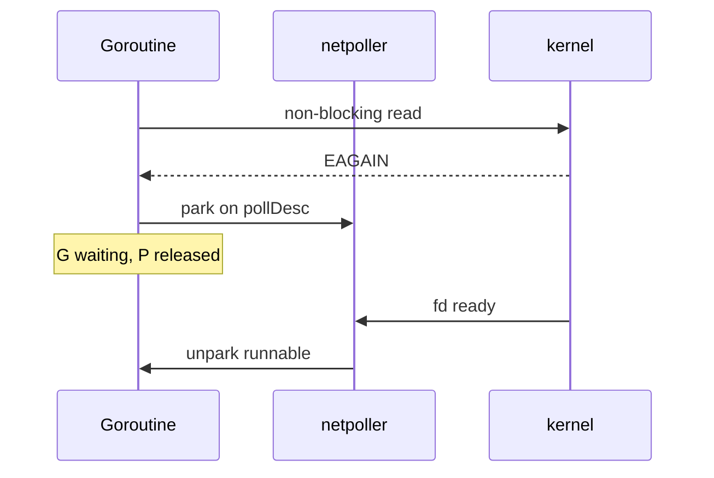

# Netpoller 与阻塞 Syscall 行为

## 30 秒版（开场）

> **Netpoller** 用 epoll/kqueue/IOCP 把 **网络 IO** 与调度器集成：socket 未就绪时 G 挂起不占 P 忙等，就绪后变 runnable。**纯阻塞 syscall**（文件 IO、部分 DNS）仍会占 M。生产关键词：**goroutine 多但线程不多靠 netpoller；阻塞 IO 要线程池或异步**。

## 3 分钟版（一面深度）

1. **是什么**：runtime 与 `internal/poll` 协作的网络轮询器，默认 edge-triggered。
2. **为什么**：数万连接若每连接阻塞一线程，M 爆炸；非阻塞 + 多路复用复用少量线程。
3. **怎么做**：`net` 包底层 `pollDesc`；Read/Write 遇 `EAGAIN` 则 `gopark` 注册 poll；就绪 `netpoll` 唤醒 G。

## 10 分钟版（原理 + 图示）



**走 netpoller 的**：TCP/UDP `net.Conn`、accept、常见 listen。

**不走 netpoller 的（阻塞 M）**

- 普通文件 `os.File` Read/Write（部分平台用 thread pool 模拟，实现因 OS 而异）
- 无 `SetNonblock` 的自定义 fd
- 部分 cgo / 同步 DNS（可用 `net.Resolver` 纯 Go 或异步）

**syscall 与 P**：阻塞 syscall → `entersyscall` → P handoff；netpoller 路径短阻塞，很快返回。

## 生产场景

- **C10K 网关**：百万 G，线程数 ~GOMAXPROCS+少量，靠 netpoller。
- **同步读大文件**：每请求 `go` + `ioutil.ReadFile`，M 涨、吞吐差 → 改 `io.Copy` 或限流。
- **故障**：fd 泄漏 → netpoller 注册数涨，最终 `too many open files`。

## 排查与工具

- `go tool trace` → Network blocking
- `lsof -p` fd 数量
- `pprof` threadcreate

## 架构取舍

| IO 类型 | 建议 |
|---------|------|
| 网络 | 默认 net 即可 |
| 磁盘密集 | 独立 worker 池、mmap、sendfile |
| DNS | 缓存、异步 resolver |
| cgo 阻塞库 | 隔离进程 |

## 追问链

1. **netpoller 与 select？** → 不同层；net 在 poll 层，select 是 chan。
2. **边缘触发丢事件？** → runtime 处理 level/edge 细节，应用无感。
3. **Deadline 如何实现？** → poll 注册 timer，超时唤醒。
4. **Listen backlog 满？** → 与 netpoller 无关，accept 仍调度。
5. **文件 netpoller 未来？** → io_uring 等逐步改进（关注 Go release）。

## 反模式与事故

- 把磁盘当网络，每请求 goroutine 同步读 GB 文件。
- 自定义 Conn 未正确 nonblock 集成 poll。
- ulimit n 过低，高并发下 accept 失败。

## 代码示例

```go
// 网络：自动 netpoller
conn, _ := net.Dial("tcp", addr)
_, _ = conn.Read(buf) // 阻塞语义，底层可 park

// 磁盘：考虑限流
sem := make(chan struct{}, 8)
sem <- struct{}{}
go func() {
    defer func() { <-sem }()
    processFile(path)
}()
```

## 延伸阅读

- [runtime/netpoll.go](https://go.dev/src/runtime/netpoll.go)
- [Issue: block on file IO](https://github.com/golang/go/issues/19093)
- [掘金：Go netpoller](https://juejin.cn/post/6844904079988232205)
