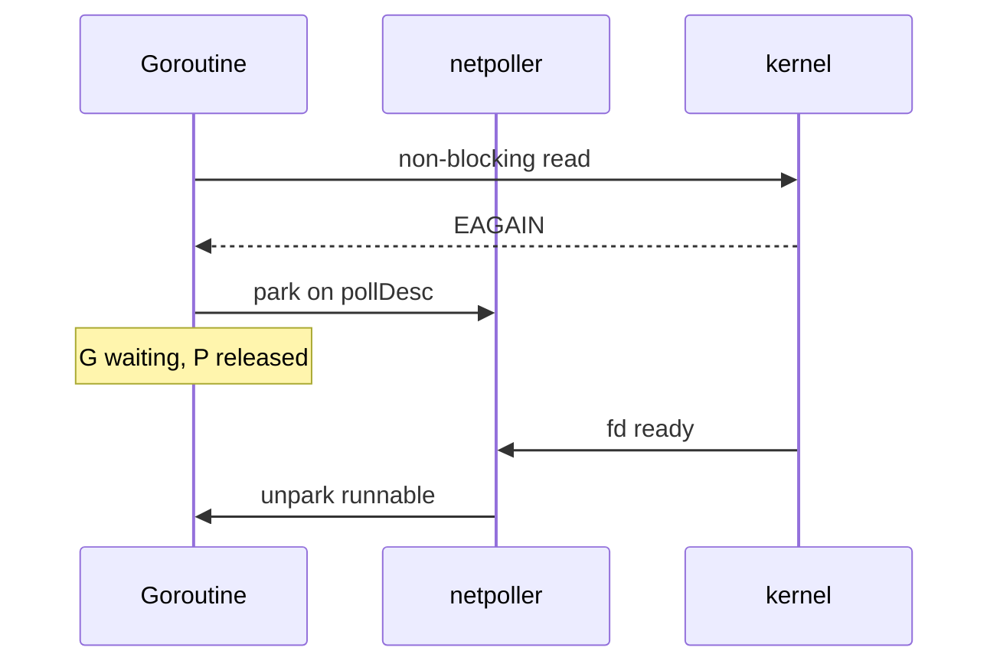

# Netpoller 与阻塞 Syscall 行为

<a id="oral-card"></a>

## 要点卡

[返回 P0 知识图谱](../_meta/p0-knowledge-graph.md)

!!! abstract "30 秒回答"

    **Netpoller** 用 epoll/kqueue/IOCP 等平台后端把可轮询 **网络 IO** 与调度器集成：
    socket 未就绪时 G 挂起并释放 P，就绪后变 runnable。**纯阻塞 syscall** 可能让执行它的
    M 阻塞；runtime 通常会把 P 交给别的 M，但线程资源并没有被 netpoll 消除。生产关键词：
    **网络等待 G 不等于一连接一线程；磁盘、cgo 和 resolver 路径要单独限并发**。

**3 分钟展开**

1. **是什么**：runtime 与 `internal/poll` 协作的网络轮询器。Linux 当前实现使用 epoll
   的 edge-triggered 模式，其他平台后端和细节不同；这不是 `net.Conn` API 契约。
2. **为什么**：数万连接若每连接阻塞一线程，M 爆炸；非阻塞 + 多路复用复用少量线程。
3. **怎么做**：`net` 包底层 `pollDesc`；Read/Write 遇 `EAGAIN` 则 `gopark` 注册 poll；就绪 `netpoll` 唤醒 G。

| 记忆槽 | 内容 |
|--------|------|
| 三个不变量 | readiness 不等于读写完成；网络等待 G 可 park 并释放 P；阻塞 syscall/cgo 仍可能占住 M |
| 手画图 | `G → nonblocking fd → EAGAIN → pollDesc/park → kernel ready → runnable`，旁画 blocking syscall |
| 项目落点 | 用实际 WebSocket、RPC 或链节点连接说明网络等待和磁盘/cgo 工作如何分池限流；只引用本人实际参与部分和可解释指标 |
| 一个取舍 | netpoll 适合可轮询网络 FD；文件/cgo 放有界池可控线程，但增加排队和实现复杂度 |

**错误表达**

- ❌ “Go 的所有 I/O 都走 epoll，所以一个连接既不占线程也不会阻塞系统。”
- ✅ “net 包把可轮询网络 I/O 接入平台 poller；后端和阻塞路径随 OS、fd 与 resolver/cgo 配置变化。”

**自测追问**：网络 Read 阻塞时 G、M、P 分别怎样变化？为什么普通文件 I/O 不能直接套用 socket 结论？

## 10 分钟版（原理 + 图示）


```mermaid
sequenceDiagram
  participant G as Goroutine
  participant NP as netpoller
  participant K as kernel
  G->>K: non-blocking read
  K-->>G: EAGAIN
  G->>NP: park on pollDesc
  Note over G: G waiting, P released
  K->>NP: fd ready
  NP->>G: unpark runnable
```

**走 netpoller 的**：TCP/UDP `net.Conn`、accept、常见 listen。

**不走 netpoller 的（阻塞 M）**

- 普通文件 `os.File` Read/Write（部分平台用 thread pool 模拟，实现因 OS 而异）
- 无 `SetNonblock` 的自定义 fd
- cgo 阻塞调用；DNS 是否走纯 Go resolver 或 cgo resolver 取决于平台、构建和配置，不能
  只看到 `net.Resolver` 就断言不会占线程

**syscall 与 P**：阻塞 syscall → `entersyscall` → P handoff；netpoller 路径短阻塞，很快返回。

## 生产场景

- **C10K 网关**：大量等待网络的 goroutine 不需要一一对应 OS 线程；实际线程数还受
  syscall、cgo、GC、profiling 和 runtime 后台线程影响，不能背成固定
  `GOMAXPROCS + N`。
- **同步读大文件**：每请求 `go` + `os.ReadFile` 仍会占用执行阻塞文件 IO 的 M；优先限制磁盘并发。文件直传 socket 时可评估 `io.Copy`/sendfile 降低用户态拷贝，但它不把普通磁盘 IO 自动变成 netpoller 异步 IO。
- **故障**：fd 泄漏 → netpoller 注册数涨，最终 `too many open files`。

## 排查与工具

- `go tool trace` → Network blocking
- `lsof -p` fd 数量
- `pprof` threadcreate

## 架构取舍

| IO 类型 | 建议 |
|---------|------|
| 网络 | 默认 net 即可 |
| 磁盘密集 | 独立 worker 池、mmap、sendfile |
| DNS | 缓存、异步 resolver |
| cgo 阻塞库 | 隔离进程 |

## 深挖问答

1. **netpoller 与 select？** → 不同层；net 在 poll 层，select 是 chan。
2. **边缘触发会不会丢事件？** → Linux runtime 必须把非阻塞 FD 消耗到 `EAGAIN` 并正确
   维护 poll 状态；`net.Conn` 用户得到阻塞式 API，但自定义 FD/`SyscallConn` 代码不能
   假设 runtime 会替错误的读写循环兜底。
3. **Deadline 如何实现？** → poll 注册 timer，超时唤醒。
4. **Listen backlog 满？** → 与 netpoller 无关，accept 仍调度。
5. **文件 netpoller 未来？** → io_uring 等逐步改进（关注 Go release）。

## 反模式与事故

- 把磁盘当网络，每请求 goroutine 同步读 GB 文件。
- 自定义 Conn 未正确 nonblock 集成 poll。
- ulimit n 过低，高并发下 accept 失败。

## 代码示例

```go
// 网络：自动 netpoller
conn, _ := net.Dial("tcp", addr)
_, _ = conn.Read(buf) // 阻塞语义，底层可 park

// 磁盘：考虑限流
sem := make(chan struct{}, 8)
sem <- struct{}{}
go func() {
    defer func() { <-sem }()
    processFile(path)
}()
```

## 延伸阅读

- [runtime/netpoll.go](https://go.dev/src/runtime/netpoll.go)
- [Issue: block on file IO](https://github.com/golang/go/issues/19093)
- [Draveness：网络轮询器 netpoll](https://draveness.me/golang/docs/part3-runtime/ch06-concurrency/golang-gmp/)
