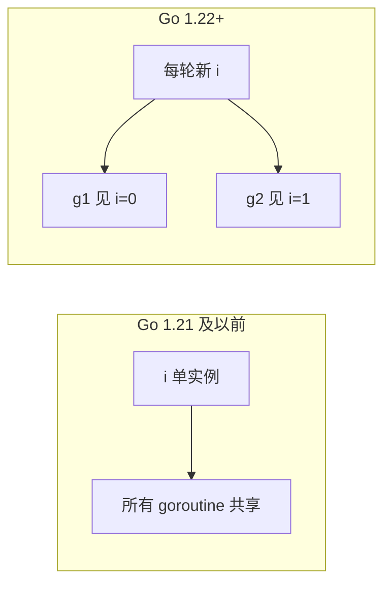

# Go 1.22 循环变量与泛型对并发的影响

## 30 秒版（开场）

> **Go 1.22+** 每轮循环 **创建新的循环变量副本**，修复经典 `go func(){ use i }()` bug；**泛型**让并发容器/池类型安全，但不改变 GMP 语义。生产关键词：**升级后闭包行为变化、GODEBUG=loopvar 兼容、泛型 sync 封装**。

## 3 分钟版（一面深度）

1. **是什么**：`for i := range n` 的 `i` 每迭代独立；泛型函数/类型可参数化 channel、Pool、map。
2. **为什么**：旧语义共享循环变量，异步闭包易捕错；泛型减少 `interface{}` 断言竞态面。
3. **怎么做**：1.22+ 可少写 `i:=i`；跨版本库注意 `GODEBUG=loopvar=1` 回退；用 `chan T`、`Pool` 泛型包装提升可读性。

## 10 分钟版（原理 + 图示）

**循环变量（1.22 变更）**



| 版本 | `for i := 0; i < 3; i++ { go func(){ print(i) }() }` 可能输出 |
|------|----------------------------------------------------------------|
| ≤1.21 | 常全 3（竞态） |
| ≥1.22 | 0 1 2（无序但各不同） |

**注意**：`range` slice 的元素变量、三层循环仍建议 benchmark；与 race detector 仍要配合。

**泛型与并发**

- **类型安全 channel**：`chan T` 泛型封装 `Send(ctx, T)`。
- **并发 map**：`Map[K,V]` 避免 `sync.Map` 的 any 断言。
- **worker pool**：`Pool[T]` 任务类型明确。
- **限制**：泛型不消除共享状态竞态，仍需 mutex/chan。

**1.22 其他**：`for range` 整数 `for i := range n`；与并发结合更常见。

## 生产场景

- **升级 1.22**：旧代码依赖「闭包捕末值」的隐藏逻辑偶发行为变化（少见）。
- **CI 固定 1.22**：删除冗余 `v := v`，减少噪音。
- **泛型库**：团队内部 `xsync.MapOf[K,V]` 统一缓存层。

## 排查与 tools

- 升级测试：`-race` 全量
- `GODEBUG=loopvar=1` 模拟旧语义做对比
- 代码搜索 `go func` + `range` 审计

## 架构取舍

| 选择 | 说明 |
|------|------|
| 最低版本 1.22 | 简化闭包、range int |
| 泛型并发工具 | 中大型团队共享库 |
| 仍写 `i:=i` | 无害，兼容老读者 |
| 第三方泛型池 | 评估维护成本 |

## 追问链

1. **1.22 还要 i:=i 吗？** → 非必须，但显式参数仍推荐 `go func(i int){}(i)`。
2. **泛型会影响性能吗？** → 单态化后通常与手写相当。
3. **interface{} 池改泛型？** → 减断言 panic，非减锁。
4. **loopvar 与内存模型？** → 新变量仍有 hb 规则，不自动防其他竞态。
5. **for range go 1.22 int？** → `for i := range 10` 合法，注意与并发配合测试。

## 反模式与事故

- 以为 1.22 修复了所有闭包 bug，共享 slice 元素仍可能竞态。
- 泛型 map 内部忘记 mutex。
- 混编 1.21 插件与 1.22 主程序，循环语义不一致（罕见）。

## 代码示例

```go
// Go 1.22+：每轮独立 i
for i := range 10 {
    go func() {
        fmt.Println(i) // 安全：各自捕获当轮 i
    }()
}

// 泛型 worker 任务类型
type Job[T any] struct {
    Ctx context.Context
    Val T
}
jobs := make(chan Job[Order], 128)
```

见 [`basis/goroutine/main.go`](../../../basis/goroutine/main.go) 中闭包与 WaitGroup 模式。

## 延伸阅读

- [Go 1.22 Release Notes](https://go.dev/doc/go1.22)
- [Loopvar preview](https://go.dev/blog/loopvar-preview)
- [Go 1.18 Generics](https://go.dev/blog/go1.18)
