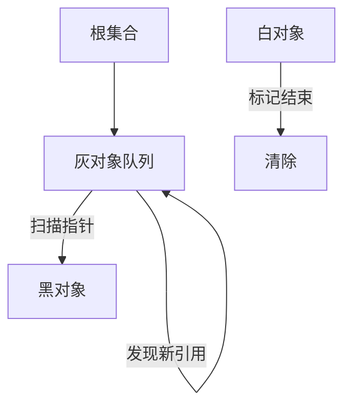

# 三色标记与混合写屏障

## 30 秒版（开场）

> Go GC 是**并发三色标记-清除**：白=未访问，灰=已访问待扫描，黑=已扫描完毕；**混合写屏障**（Yuasa + Dijkstra）保证并发标记期间不丢活对象，从而消除二次 STW rescan。生产关键词：**mark assist、写屏障开销、GC 与 mutator 并发**。

## 3 分钟版（一面深度）

1. **是什么**：三色标记是可达性分析的抽象。从根（栈、全局、寄存器）出发，将对象染色并沿指针传播，最终白色对象可回收。
2. **为什么**：全 STW 标记延迟高；纯并发标记若 mutator 修改指针，可能把「黑对象→白对象」的引用链打断，误回收活对象。
3. **怎么做**：Go 1.8 起混合写屏障——**堆**上指针写入时 shade 新/旧引用；**goroutine 栈在 mark 开始时 STW 扫描并视为黑色**，并发标记期间栈上指针写入不走堆写屏障。

## 10 分钟版（原理 + 图示）

**不变性目标**：标记结束时，不存在从黑色对象指向白色对象且中间无灰路径的引用。



**混合写屏障伪逻辑**

| 操作 | 屏障行为 |
|------|----------|
| 堆上 `*slot = ptr` | shade(ptr)；覆盖时 shade(旧值)（Yuasa + Dijkstra 混合） |
| 栈上指针写入 | 并发标记期间**不**触发堆写屏障；栈在 mark 起点已扫描 |

**与清除**：标记完成后并发 sweep；分配时触发 assist，帮助标记以控制堆增长。

**1.5 vs 1.8+**：1.5 并发标记但需 STW rescan 栈；1.8 混合写屏障去掉 rescan。**STW** 主要用于 **mark 开始（启用写屏障、扫根）** 与 **mark 终止**；**sweep 与 mutator 并发**。

## 生产场景

- **高分配服务**：JSON 反序列化、日志拼接导致 mark assist 占比高，CPU 被 GC 辅助标记吃掉。
- **指针密集结构**：图、树频繁改边，写屏障触发多，mutator 开销上升。
- **可观测**：`GODEBUG=gctrace=1`、`/debug/pprof/goroutine` 配合 `runtime/metrics` 的 `gc/pause:seconds`。

## 排查与工具

| 工具 | 用途 |
|------|------|
| `GODEBUG=gctrace=1` | 每轮 GC 的 STW、CPU 辅助、堆大小 |
| `go tool trace` | STW 窗口、mark assist 与 goroutine 重叠 |
| `pprof` CPU | `runtime.gc*`、`runtime.wb*` 热点 |

路径：GC CPU 占比异常 → gctrace 看 assist fraction → trace 对齐延迟毛刺 → 降分配或调 GOGC。

## 架构取舍

| 方案 | 适用 | 不适用 |
|------|------|--------|
| 依赖默认并发 GC | 通用服务端 | 硬实时、无 GC 容忍 |
| 降分配 + sync.Pool | 短命大对象 | 长生命周期缓存误用 Pool |
| `GOGC=off` + 手动 `runtime.GC()` | 批处理窗口 | 在线 API 默认 |

## 追问链

1. **为什么不用标记-整理？** → 整理需移动对象，与 Go 指针语义、unsafe 兼容性冲突；标记-清除实现简单，通过 span 复用缓解碎片。
2. **写屏障谁执行？** → 编译器在指针写入点插入，mutator 运行时执行。
3. **栈上对象特殊在哪？** → 栈扫描需 STW 或批量处理；混合屏障对栈有优化路径。
4. **弱三色 vs 强三色？** → Go 通过混合屏障实现强不变性，无需 rescan。
5. **finalizer 与标记关系？** → 有 finalizer 的对象会多一轮处理，延迟回收。

## 反模式与事故

- 认为「GC 完全并发 = 无 STW」——sweep termination、栈扫描仍有短 STW。
- 高频 `unsafe.Pointer` 改指针绕过类型系统，增加排查难度且可能破坏屏障假设的使用方式。
- 在延迟敏感路径上大量分配，把 mark assist 放大成全链路 P99 杀手。

## 代码示例

```go
// 减少指针写入频率：批量构建再一次性挂链，降低写屏障次数
type Node struct {
    next *Node
    data [16]byte
}

func buildList(n int) *Node {
    head := &Node{}
    cur := head
    for i := 0; i < n; i++ {
        cur.next = &Node{data: [16]byte{byte(i)}}
        cur = cur.next
    }
    return head.next
}
```

## 延伸阅读

- [Go GC Guide（官方）](https://go.dev/doc/gc-guide)
- [Eliminating Stack Re-Scan（proposal）](https://github.com/golang/proposal/blob/master/design/17503-eliminate-rescan.md)
- [ISM 2019: Go GC 演讲](https://go.dev/blog/ismmkeynote)
- [三色标记与写屏障（Draveness）](https://draveness.me/golang/docs/part3-runtime/ch07-memory/golang-garbage-collector/)
