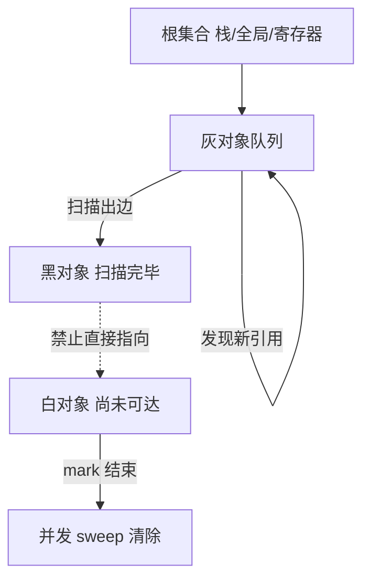
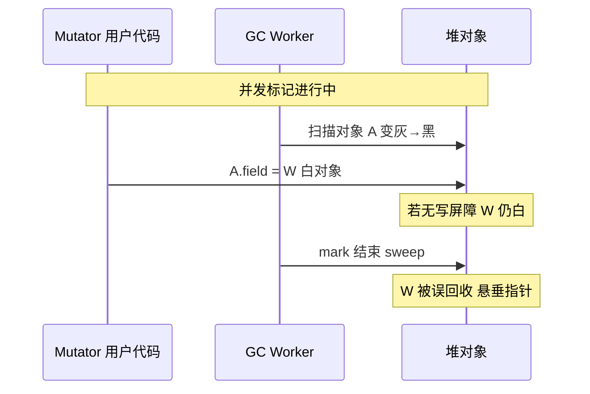
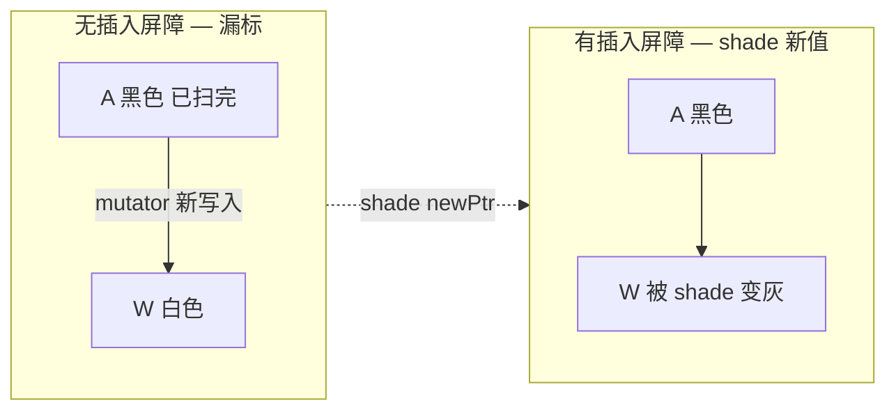
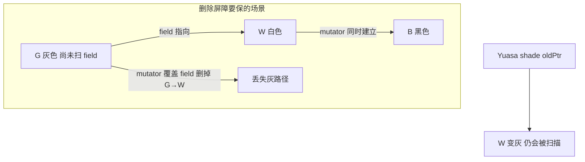
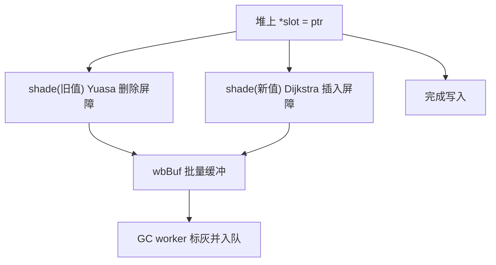
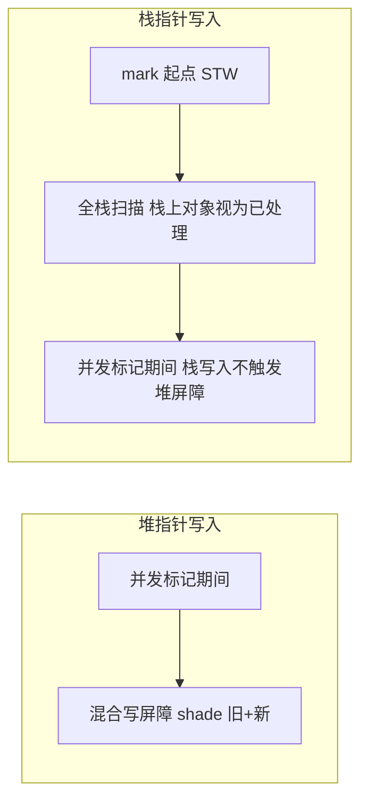
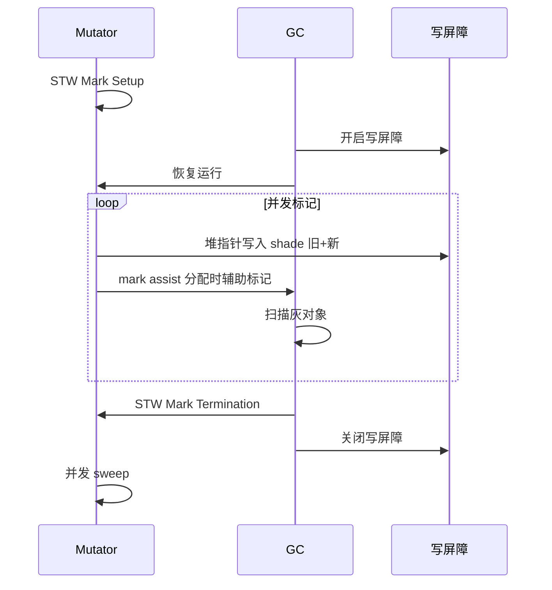

# 三色标记与混合写屏障

## 30 秒版（开场）

> Go GC 是**并发三色标记-清除**：白=未访问，灰=已扫描入口待展开，黑=已扫描完毕。**并发标记时 mutator 会改指针**，单靠三色不够，需要写屏障：
> - **插入写屏障（Dijkstra）**：写入新指针时 **shade(新值)**，防「黑→白」漏标；
> - **删除写屏障（Yuasa）**：覆盖旧指针时 **shade(旧值)**，防「删引用丢活对象」；
> - **混合写屏障（Go 1.8+）**：堆上 `*slot = ptr` 时 **shade(新) + shade(旧)**，配合 mark 起点 **STW 扫栈**，去掉 1.5 的 stack rescan STW。
> 生产关键词：**mark assist、写屏障开销、wbBuf、GC 与 mutator 并发**。

## 3 分钟版（一面深度）

1. **是什么**：三色标记是可达性分析的染色抽象——从根出发传播，最终**白色=可回收**。写屏障是编译器在**堆指针写入点**插入的 runtime 钩子，在并发标记期间把可能「漏标」的对象标灰（`shade`）。
2. **为什么**：全 STW 标记 pause 高；纯并发标记时 mutator 改边，可能破坏「不存在黑→白直接引用」的不变式，**误回收仍存活对象**。
3. **怎么做**：Go 1.8 起对**堆**用混合写屏障；**goroutine 栈在 mark 开始时 STW 扫描并视为黑色**，并发标记期间**栈上指针写入不触发堆写屏障**（见 [proposal 17503](https://github.com/golang/proposal/blob/master/design/17503-eliminate-rescan.md)）。详见 [S-MEM-02](./S-MEM-02-stw-evolution.md) 的 STW 阶段。

## 10 分钟版（原理 + 图示）

### 三色标记与清除（总览）


```mermaid
flowchart TB
  Roots[根集合 栈/全局/寄存器] --> Gray[灰对象队列]
  Gray -->|扫描出边| Black[黑对象 扫描完毕]
  Gray -->|发现新引用| Gray
  White[白对象 尚未可达] -->|mark 结束| Sweep[并发 sweep 清除]
  Black -.->|禁止直接指向| White
```

| 颜色 | 含义 | 标记阶段行为 |
|------|------|--------------|
| **白** | 尚未被 GC 访问 | mark 结束仍白 → 可回收 |
| **灰** | 已发现，出边未扫完 | 在 work queue 中等待扫描 |
| **黑** | 已发现且出边已扫完 | 不应再指向白（需写屏障维护） |

**强三色不变式（面试必背）**：标记结束时，**不存在**「黑色对象直接指向白色对象、且中间没有灰色路径」的引用链。

### 并发标记为何需要写屏障


```mermaid
sequenceDiagram
  participant M as Mutator 用户代码
  participant GC as GC Worker
  participant Heap as 堆对象

  Note over M,Heap: 并发标记进行中
  GC->>Heap: 扫描对象 A 变灰→黑
  M->>Heap: A.field = W 白对象
  Note over Heap: 若无写屏障 W 仍白
  GC->>Heap: mark 结束 sweep
  Note over Heap: W 被误回收 悬垂指针
```

| 问题 | 根因 | 需要的屏障 |
|------|------|------------|
| **黑→白漏标** | 黑对象已扫完，mutator 新写入指向白对象 | **插入写屏障** |
| **删引用丢对象** | 灰对象尚未扫完，mutator 覆盖 slot 删掉唯一灰→白路径 | **删除写屏障** |
| **栈上指针变动** | 栈在并发期改指针，难用堆屏障覆盖 | **mark 起点 STW 扫栈** |

---

### 插入写屏障（Insertion / Dijkstra Write Barrier）

**触发时机**：向堆对象字段 **写入新指针** `*slot = newPtr` 时。

**规则**：在 store 完成前 **`shade(newPtr)`**——若新指向对象是白色，将其标灰并入队扫描。

**解决的问题**：**黑色对象 → 新指向白色对象**（黑→白）。


```mermaid
flowchart LR
  subgraph Before[无插入屏障 — 漏标]
    A1[A 黑色 已扫完]
    W1[W 白色]
    A1 -->|mutator 新写入| W1
  end
  subgraph After[有插入屏障 — shade 新值]
    A2[A 黑色]
    W2[W 被 shade 变灰]
    A2 --> W2
  end
  Before -.->|shade newPtr| After
```

| 项目 | 说明 |
|------|------|
| 别名 | Dijkstra barrier、插入屏障、增量更新 barrier |
| 伪代码 | `shade(new); *slot = new` |
| 单独使用的局限 | 无法覆盖「覆盖写删掉旧引用导致白对象失联」场景 |

**典型漏标场景（面试白板）**

1. GC 已将对象 **A 标黑**（A 的所有字段已扫描）。
2. mutator 执行 `A.next = W`（W 是白对象）。
3. 无插入屏障 → W 永远不被扫描 → sweep 误回收 W。
4. 有插入屏障 → `shade(W)` → W 变灰 → 最终被标黑存活。

---

### 删除写屏障（Deletion / Yuasa Write Barrier）

**触发时机**：向堆对象字段 **覆盖写入** `*slot = newPtr` 时，**旧值** `oldPtr = *slot` 即将丢失。

**规则**：在覆盖前 **`shade(oldPtr)`**——保护因「删边」而可能失联的白色对象。

**解决的问题**：mutator **删除/覆盖** 灰色对象尚未扫描完的出边，导致白色子图与灰链脱钩。


```mermaid
flowchart TB
  subgraph Scenario[删除屏障要保的场景]
    G[G 灰色 尚未扫 field]
    W[W 白色]
    B[B 黑色]
    G -->|field 指向| W
    W -->|mutator 同时建立| B
    G -->|mutator 覆盖 field 删掉 G→W| X[丢失灰路径]
  end
  Fix[Yuasa shade oldPtr] --> W2[W 变灰 仍会被扫描]
```

| 项目 | 说明 |
|------|------|
| 别名 | Yuasa barrier、删除屏障、快照-at-the-beginning 风格 |
| 伪代码 | `old = *slot; shade(old); *slot = new; shade(new)`（混合时） |
| 单独使用的局限 | 不处理「黑对象新插入指向白对象」 |

**典型漏标场景**

1. 灰色对象 **G** 的某字段指向白色 **W**，GC 尚未扫描该字段。
2. mutator 执行 `G.field = nil` 或改为指向其他对象，**G→W 边被删**。
3. 若 W 仅通过这条灰边与已扫描子图相连，无删除屏障 → W 可能永不被标到。
4. 有删除屏障 → 覆盖前 `shade(W)` → W 入队 → 存活。

---

### 混合写屏障（Hybrid — Go 1.8+ 实际采用）

Go 在**堆指针写入**时同时应用 **Dijkstra + Yuasa**：

```
// 堆上指针赋值（并发标记期间，写屏障开启）
writePointer(slot, ptr):
    shade(*slot)   // Yuasa：删除/覆盖屏障，保护旧引用
    shade(ptr)     // Dijkstra：插入屏障，保护新引用
    *slot = ptr
```


```mermaid
flowchart TD
  Store["堆上 *slot = ptr"]
  Store --> Yuasa["shade(旧值) Yuasa 删除屏障"]
  Store --> Dijkstra["shade(新值) Dijkstra 插入屏障"]
  Yuasa --> WB[wbBuf 批量缓冲]
  Dijkstra --> WB
  WB --> Worker[GC worker 标灰并入队]
  Store --> Done[完成写入]
```

| 对比项 | 仅插入（Dijkstra） | 仅删除（Yuasa） | **混合（Go）** |
|--------|-------------------|-----------------|----------------|
| 黑→白新写入 | ✅ | ❌ | ✅ |
| 覆盖删旧引用 | ❌ | ✅ | ✅ |
| 需 stack rescan STW | 通常还需要 | 通常还需要 | **不需要**（配合 STW 初扫栈） |
| mutator 开销 | 较低 | 较低 | **略高**（两次 shade） |
| Go 版本 | 未单独采用 | 未单独采用 | **1.8+** |

**为何 Go 选混合 + STW 扫栈，而不是只选一种屏障？**

| 方案 | 结果 |
|------|------|
| 无屏障 | 并发标记不安全，必误回收 |
| 仅 Dijkstra | 覆盖写删边场景仍可能漏标 |
| 仅 Yuasa | 黑对象新插白引用仍可能漏标 |
| 混合 + mark 起点 STW 扫栈 | 堆上安全；栈当黑处理；**去掉 1.5 的 stack rescan STW** |

### 栈 vs 堆：写屏障策略差异（Go 特有）


```mermaid
flowchart LR
  subgraph Heap[堆指针写入]
    H1[并发标记期间]
    H1 --> H2[混合写屏障 shade 旧+新]
  end
  subgraph Stack[栈指针写入]
    S1[mark 起点 STW]
    S1 --> S2[全栈扫描 栈上对象视为已处理]
    S2 --> S3[并发标记期间 栈写入不触发堆屏障]
  end
```

| 位置 | 并发标记期间 | 原因 |
|------|--------------|------|
| **堆** `*slot = ptr` | ✅ 混合写屏障 | 堆对象可能被多个 goroutine 共享，变动频繁 |
| **栈** 局部变量/参数 | ❌ 不触发堆写屏障 | mark 开始时 STW 已扫描；栈是 goroutine 私有 |
| **栈上指针首次逃逸到堆** | ✅ 写入堆字段时触发 | 逃逸赋值本质是堆写 |

这与 [S-CONC-02](../01-runtime-concurrency/S-CONC-02-gmp-roles.md) 中 P 的 `wbBuf`（写屏障缓冲）配合：每个 P 批量收集 shade 请求，降低屏障同步开销。

### GC 周期中写屏障何时开启


```mermaid
sequenceDiagram
  participant M as Mutator
  participant GC as GC
  participant WB as 写屏障

  M->>M: STW Mark Setup
  GC->>WB: 开启写屏障
  GC->>M: 恢复运行
  loop 并发标记
    M->>WB: 堆指针写入 shade 旧+新
    M->>GC: mark assist 分配时辅助标记
    GC->>GC: 扫描灰对象
  end
  GC->>M: STW Mark Termination
  GC->>WB: 关闭写屏障
  M->>M: 并发 sweep
```

| 阶段 | 写屏障 | STW |
|------|--------|-----|
| Mark Setup | **开启** | ✅ 极短 |
| Concurrent Mark | **开启**（堆写入） | ❌ |
| Mark Termination | **关闭** | ✅ 短 |
| Concurrent Sweep | 关闭 | ❌（主体） |

**与清除（sweep）**：标记完成后**并发 sweep** 白色对象；sweep 本身**不依赖写屏障**。详见 [S-MEM-02](./S-MEM-02-stw-evolution.md)。

### shade / wbBuf 与 mark assist

| 机制 | 作用 |
|------|------|
| **`shade(obj)`** | 若 obj 为白，标灰并加入标记 work queue |
| **`wbBuf`（Per-P）** | 写屏障先把对象指针放入缓冲，批量 flush，减少锁竞争 |
| **mark assist** | mutator 分配过快时，必须帮 GC 做标记工作，控制堆增长 |

写屏障 + assist 共同构成「mutator 与 GC 并发」的开销来源；`pprof` 中可见 `runtime.wbBufFlush`、`runtime.gcAssistAlloc` 等。

### 1.5 vs 1.8+ 演进（写屏障视角）

| 版本 | 标记 | 写屏障 | 栈处理 | 额外 STW |
|------|------|--------|--------|----------|
| **≤1.4** | STW 标记 | 无 | STW 扫 | 长 pause |
| **1.5** | 并发三色 | 无/不完整 | 并发期需 **stack rescan** | rescan STW |
| **1.8+** | 并发三色 | **堆混合写屏障** | mark 起点 STW 扫栈 | 仅 setup/term |
| **1.12+** | 同上 | 同上 | 同上 | 优化 term STW 长度 |

### 弱三色 vs 强三色

| 模型 | 不变式 | Go 选择 |
|------|--------|---------|
| **弱三色** | 允许黑→白，但要求白对象「曾从灰可达」等弱条件 | 未采用 |
| **强三色** | 不允许黑→白 | **混合写屏障 + STW 扫栈** 维护 |

---

## 生产场景

| 场景 | 现象 | 与写屏障关系 | 策略 |
|------|------|--------------|------|
| 指针密集图/链表改边 | GC CPU 高、`runtime.wb*` 热点 | 每次堆写触发 shade×2 | 批量构建、少改指针、结构换 slice |
| JSON 反序列化风暴 | mark assist + 写屏障叠加 | 大量新指针写入堆 | 降分配、对象池、流式解析 |
| 延迟敏感 API | P99 毛刺 | STW term + assist，非写屏障单次开销主导 | trace 对齐；调 GOGC/GOMEMLIMIT |
| 误以为无 STW | 监控只有 sweep | 忽略 mark setup/term | `GODEBUG=gctrace=1` |

## 排查与工具

| 工具 | 用途 |
|------|------|
| `GODEBUG=gctrace=1` | 每轮 STW、assist 占比、堆大小 |
| `go tool trace` | STW 窗口、mark assist 与请求重叠 |
| `pprof` CPU | `runtime.gc*`、`runtime.wbBufFlush*` 热点 |
| `runtime/metrics` | `gc/pause:seconds` 分位 |

路径：GC CPU 高 → pprof 看 wb vs assist → 若 wb 高则查指针写入频率 → 减堆写或改数据结构。

## 架构取舍

| 方案 | 适用 | 不适用 |
|------|------|--------|
| 默认并发 GC + 混合屏障 | 通用服务端 | 硬实时、零 GC |
| 降指针写入 / 批量挂链 | 图、链表、ORM 组装 | 过度优化简单 CRUD |
| 降分配 + `sync.Pool` | 短命对象 | 长生命周期误用 Pool |
| `GOGC=off` + 手动 GC | 批处理窗口 | 在线 API |

## 追问链

1. **三色各代表什么？** → 白未访问、灰待扫描、黑已扫完；结束仍白则清除。
2. **插入写屏障解决什么？** → 黑对象新写入指向白对象时 `shade(新)`，防漏标。
3. **删除写屏障解决什么？** → 覆盖堆指针前 `shade(旧)`，防删边导致白对象失联。
4. **Go 为何用混合而非单种？** → 单独 Dijkstra 或 Yuasa 都不足以覆盖两种漏标；混合 + STW 扫栈去 rescan。
5. **栈上指针写入要屏障吗？** → 并发标记期间**不**触发堆屏障；mark 起点 STW 已扫栈。
6. **写屏障谁插入？** → **编译器**在堆指针 store 点插入对 `runtime` 的调用。
7. **写屏障何时开启？** → 并发 mark 从 setup 到 termination 之间。
8. **shade 做什么？** → 白→灰并入队，保证后续被扫描。
9. **清除（sweep）要 STW 吗？** → 主体并发；见 [S-MEM-02](./S-MEM-02-stw-evolution.md)。
10. **写屏障和 mark assist 区别？** → 屏障保正确性；assist 是分配过快时 mutator 帮标记控堆增长。

## 反模式与事故

| 反模式 | 后果 | 正确认知 |
|--------|------|----------|
| 「GC 完全并发 = 零 STW」 | 低估 P99 | setup/term 仍有 STW |
| 高频改指针图结构 | wb CPU 飙升 | 批量更新、immutable 快照 |
| 滥用 `unsafe.Pointer` 改堆指针 | 可能绕过屏障语义 | 极谨慎，需 `runtime.KeepAlive` 等 |
| 认为 sweep 也要写屏障 | 概念混淆 | 屏障只在 **mark 并发期** |

## 代码示例

### 减少堆指针写入次数（降低写屏障触发）

```go
// 每条 next 赋值都可能触发混合写屏障（并发 mark 期间）
type Node struct {
    next *Node
    data [16]byte
}

// 较差：循环内多次堆写
func buildListSlow(n int) *Node {
    head := &Node{}
    cur := head
    for i := 0; i < n; i++ {
        cur.next = &Node{data: [16]byte{byte(i)}} // 每次 shade 旧+新
        cur = cur.next
    }
    return head.next
}

// 较好：预分配 slice，最后一次性挂链（写屏障次数仍取决于最终链接方式）
func buildSlice(n int) []*Node {
    nodes := make([]*Node, n)
    for i := range nodes {
        nodes[i] = &Node{data: [16]byte{byte(i)}}
    }
    for i := 0; i < n-1; i++ {
        nodes[i].next = nodes[i+1]
    }
    return nodes
}
```

### 观察 GC 与写屏障相关开销（调试）

```go
// 启动前：GODEBUG=gctrace=1
// 或压测时：go test -cpuprofile=cpu.prof
// go tool pprof -top cpu.prof  查看 runtime.wbBufFlush 等
func churnPointers(n int) {
    var root *Node
    for i := 0; i < n; i++ {
        root = &Node{next: root} // 频繁堆写，mark 期间屏障开销明显
    }
    _ = root
}
```

## 延伸阅读

- [S-MEM-02 STW 与 GC 演进](./S-MEM-02-stw-evolution.md) — mark setup/term、sweep termination
- [S-MEM-03 GOGC 调优](./S-MEM-03-gogc-tuning.md) — assist 与堆增长
- [S-MEM-13 GC 抖动](./S-MEM-13-gc-jitter.md) — P99 毛刺治理
- [S-CONC-02 G/M/P 与 wbBuf](../01-runtime-concurrency/S-CONC-02-gmp-roles.md) — P 上的写屏障缓冲
- [Go GC Guide（官方）](https://go.dev/doc/gc-guide)
- [Eliminating Stack Re-Scan（proposal 17503）](https://github.com/golang/proposal/blob/master/design/17503-eliminate-rescan.md)
- [ISM 2019: Go GC 演讲](https://go.dev/blog/ismmkeynote)
- [Dijkstra 等：On-the-fly GC（ISMM 98）](https://researcher.watson.ibm.com/researcher/files/us-pgroves/ISMM98.pdf)
- [三色标记与写屏障（Draveness）](https://draveness.me/golang/docs/part3-runtime/ch07-memory/golang-garbage-collector/)
