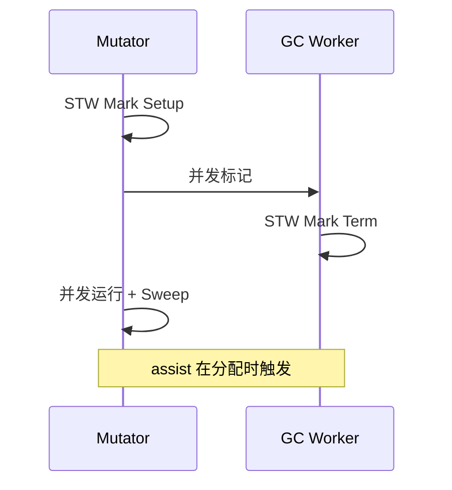

# STW 阶段与 Go 1.5+ GC 演进

## 30 秒版（开场）

> **STW（Stop The World）** 是 GC 需要暂停所有 goroutine 以做全局一致操作的阶段；Go 自 1.5 起以**并发标记**为主，STW 从毫秒级降到亚毫秒级，但**从未归零**。生产关键词：**sweep termination、栈扫描、P99 毛刺**。

## 3 分钟版（一面深度）

1. **是什么**：STW 期间 mutator 不运行，scheduler 与 GC 可安全扫描栈、切换 GC 阶段。
2. **为什么**：完全无 STW 的并发 GC 极难；Go 选择「短 STW + 长并发」平衡吞吐与延迟。
3. **怎么做**：1.5 三色并发标记；1.8 混合写屏障去 rescan；1.12 优化 mark termination；1.14+ 调度抢占协同；持续缩短 sweep termination 与 assist 压力。

## 10 分钟版（原理 + 图示）

**典型 GC 周期 STW 点（简化）**

| 阶段 | STW? | 说明 |
|------|------|------|
| Mark Setup | 是（极短） | 开启写屏障、准备 worker |
| Concurrent Mark | 否 | mutator + GC worker 并行 |
| Mark Termination | 是（短） | 完成标记，关闭写屏障 |
| Concurrent Sweep | 否 | 后台清扫 span |
| Sweep Termination | 可能 | 分配需干净 span 时短暂 STW |



**版本演进时间线**

- **≤1.4**：标记-清除，STW 长，吞吐差。
- **1.5**：并发三色标记，STW 主要剩 setup/term。
- **1.8**：混合写屏障，去掉 stack rescan STW。
- **1.12**：mark assist 调度优化，降低 term STW。
- **1.19+**：软内存限制 `GOMEMLIMIT` 与 GC 协同，减少 OOM 前剧烈 GC。

## 生产场景

- **低延迟 API**：P99 偶发 1–3ms 毛刺，trace 显示 `STW` 与 `network` 无关 → GC pause。
- **发布升级**：Go 小版本升级后 GC pause 分布变化，需回归压测对比 `pause_ns` 分位。
- **可观测**：Prometheus `go_gc_duration_seconds`、OpenTelemetry runtime metrics。

## 排查与工具

| 工具 | 用途 |
|------|------|
| `go tool trace` | 精确 STW 区间与长度 |
| `GODEBUG=gctrace=1` | 每轮 pause 时间 |
| `runtime/metrics` | `gc/pause:seconds` 分位数 |

路径：P99 毛刺 → trace 过滤 STW → 对齐 gctrace 周期 → 查分配率/GOGC/GOMEMLIMIT。

## 架构取舍

| 方案 | 适用 | 不适用 |
|------|------|--------|
| 接受亚毫秒 STW | 大多数 HTTP/gRPC | 微秒级硬实时 |
| 升级 Go 版本获 GC 改进 | 长期维护服务 | 无回归测试的一次升级 |
| 换语言/进程隔离 GC 敏感路径 | 极端延迟 | 小团队过早优化 |

## 追问链

1. **STW 时 goroutine 状态？** → 停在 safe-point，M 参与 STW 标记。
2. **并发标记时 mutator 能分配吗？** → 能，触发 assist 并受写屏障保护。
3. **1.5 前后对比一句话？** → 从「大部分时间 STW 标记」到「大部分时间并发」。
4. **sweep 为何能并发？** → 通过 span 状态位与分配路径协调，必要时 brief STW。
5. **如何读 gctrace 第一列？** → STW 时间 + 并发阶段 wall time。

## 反模式与事故

- 用「Go 无 STW」回答面试——会被追问 sweep term 打脸。
- 仅看 `GOGC=100` 默认值，不随容器 memory limit 设 `GOMEMLIMIT`。
- 压测只看 QPS 不看 GC pause 分位，上线后 P99 暴雷。

## 代码示例

```go
// 读取 GC pause 分位（Go 1.16+ runtime/metrics）
import "runtime/metrics"

func gcPauseQuantile(q float64) float64 {
    samples := make([]metrics.Sample, 1)
    samples[0].Name = "/gc/pause:seconds"
    metrics.Read(samples)
    ps := samples[0].Value.Float64Histogram()
    if ps == nil {
        return 0
    }
    return ps.Percentile(q)
}
```

## 延伸阅读

- [Go 1.5 Release Notes - GC](https://go.dev/doc/go1.5)
- [Go 1.8 Release Notes - Hybrid Barrier](https://go.dev/doc/go1.8)
- [Go GC Guide](https://go.dev/doc/gc-guide)
- [GopherCon 2018: GC 演进](https://www.youtube.com/watch?v=0izBiElKNl4)
