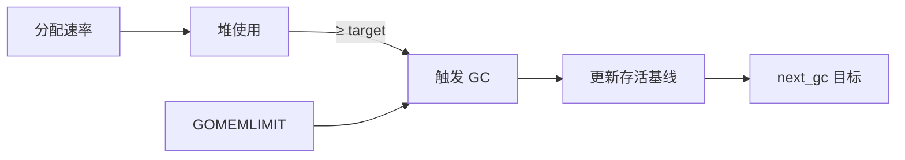

# GC 触发条件与 GOGC 调优

## 30 秒版（开场）

> GC 由**堆增长触发**：下次 GC 目标堆 ≈ 上次 GC 后存活 × (1 + GOGC/100)；默认 **GOGC=100** 即存活翻倍再 GC。**GOMEMLIMIT**（1.19+）设软上限，与 GOGC 协同避免 OOM。生产关键词：**吞吐 vs 堆占用、assist、容器 memory limit**。

## 3 分钟版（一面深度）

1. **是什么**：`GOGC` 控制 GC 频率与 CPU 开销的权衡；`debug.SetGCPercent` 运行时等价调参。
2. **为什么**：过频 GC 浪费 CPU；过稀 GC 堆膨胀、mark assist 暴增、OOM 风险。
3. **怎么做**：容器内用 `GOMEMLIMIT` 约为 limit 的 90%；CPU 充足可略降 GOGC 换更低延迟；批处理可 `GOGC=200~400` 换吞吐。

## 10 分钟版（原理 + 图示）

**触发公式（直觉）**

```
next_gc = live_after_last_gc × (1 + GOGC/100)
```

当 `heap_live ≥ next_gc` 时启动新周期（另有 force GC、`runtime.GC()`、内存压力等路径）。

| 参数 | 默认 | 效果 |
|------|------|------|
| GOGC=100 | 是 | 堆相对存活增 100% 触发 |
| GOGC=50 | — | 更勤 GC，CPU↑ 堆↓ |
| GOGC=200 | — | 更懒 GC，堆↑ pause 可能↑ |
| GOGC=off | — | 仅手动/内存限制触发 |
| GOMEMLIMIT | 无 | 软限制，逼近时提高 GC 积极性 |



**mark assist**：分配过快时 mutator 帮标记，等价于「用业务 CPU 换 GC 进度」。

**Ballast 技巧（谨慎）**：大 `[]byte` 占位抬升 live baseline，减少 GC 次数——仅理解原理，生产优先官方 `GOMEMLIMIT`。

## 生产场景

- **K8s Pod OOMKilled**：堆+栈+元数据触 limit，未设 GOMEMLIMIT，GC 来不及回收。
- **广告竞价/网关**：GOGC 默认 + 高 QPS 小对象，GC CPU 15%+ → 调 GOGC 或降分配。
- **可观测**：`go_memstats_heap_inuse_bytes`、`go_gc_cpu_fraction`（需自行采集或 expvar）。

## 排查与工具

| 工具 | 用途 |
|------|------|
| `GODEBUG=gctrace=1` | 每轮 heap goal、CPU fraction |
| `runtime.ReadMemStats` | HeapAlloc、NextGC、NumGC |
| `debug.SetMemoryLimit` | 代码内设置软限制 |

路径：OOM/高 GC CPU → memstats 看 NextGC 与 HeapAlloc → 调 GOMEMLIMIT/GOGC → 压测验证吞吐与 P99。

## 架构取舍

| 方案 | 适用 | 不适用 |
|------|------|--------|
| 默认 GOGC + GOMEMLIMIT | 容器化标准做法 | 无 memory limit 的裸机可只调 GOGC |
| 提高 GOGC | CPU 紧、堆充足 | 延迟敏感且堆已大 |
| 降低 GOGC | 要低延迟、可牺牲 CPU | 已 GC  bound |
| sync.Pool / 降分配 | 根因优化 | 不替代 limit 配置 |

## 追问链

1. **GOGC=100 具体含义？** → 上次 GC 后存活 100MB，则堆到约 200MB 触发（含浮动与实现细节）。
2. **GOMEMLIMIT 与 cgroup limit？** → 应对齐 Pod limit，留 headroom 给栈与非堆。
3. **SetGCPercent(-1)？** → 关闭自动 GC，仅手动。
4. **为何调 GOGC 后 P99 可能变差？** → 堆大 → 标记工作量增 → term STW/assist 变长。
5. **如何 A/B 调参？** → 固定负载，看吞吐、P99、`GC CPU%`、RSS 四象限。

## 反模式与事故

- 盲目 `GOGC=1000` 省 CPU，结果 OOM 或 assist 在峰值打满 CPU。
- 容器 limit 512Mi 却 GOMEMLIMIT=512Mi，无栈/元数据余量。
- 只调 GOGC 不查分配热点，治标不治本。

## 代码示例

```go
import (
    "log"
    "runtime/debug"
)

func initGCTuning() {
    // 容器 memory limit 512Mi 时示例
    debug.SetMemoryLimit(450 * 1024 * 1024) // 软限制 ~450Mi
    debug.SetGCPercent(100)                   // 或压测后调整
    log.Printf("GOGC=%d", debug.SetGCPercent(-1)) // 读当前值需 SetGCPercent 技巧
}
```

## 延伸阅读

- [Go GC Guide - GOGC and GOMEMLIMIT](https://go.dev/doc/gc-guide)
- [Go 1.19 Release Notes - Soft memory limit](https://go.dev/doc/go1.19)
- [Uber: Automating GOMAXPROCS / GOMEMLIMIT](https://eng.uber.com/)
