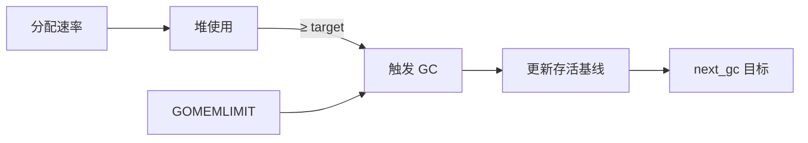

# GC 触发条件与 GOGC 调优

<a id="oral-card"></a>

## 要点卡

[返回 P0 知识图谱](../_meta/p0-knowledge-graph.md)

!!! abstract "30 秒回答"

    GC 主要由**堆增长目标**触发。忽略根扫描成本时可粗记为“上次存活堆 × (1 + GOGC/100)”；更准确的模型还把 goroutine 栈和全局指针等 GC roots 计入。**GOMEMLIMIT**（1.19+）是 runtime 管理内存的软限制，不是 RSS 硬上限。

**3 分钟展开**

1. **是什么**：`GOGC` 控制 GC 频率与 CPU 开销的权衡；`debug.SetGCPercent` 运行时等价调参。
2. **为什么**：过频 GC 浪费 CPU；过稀 GC 堆膨胀、mark assist 暴增、OOM 风险。
3. **怎么做**：先给容器 limit 留出 runtime 之外的内存余量，再设 `GOMEMLIMIT`；以默认 GOGC 为基线压测。降低 GOGC 通常降内存、增 GC CPU，**不保证降低 P99**；提高 GOGC 通常相反，也必须受内存上限约束。

| 记忆槽 | 内容 |
|--------|------|
| 三个不变量 | GOGC 是 CPU/内存权衡参数；GOMEMLIMIT 是 runtime 软限制而非 RSS/cgroup 硬线；调参必须基于 profile 与压测 |
| 手画图 | `allocation → heap goal → mark/assist → live heap → next goal`，旁接 `GOGC` 与 `GOMEMLIMIT` |
| 项目落点 | 用实际索引器、行情或 API 的分配热点说明升级/调参前后如何比较 GC CPU、RSS、assist 和 P99；只引用本人实际参与部分和可解释指标 |
| 一个取舍 | 降低 GOGC 通常省内存但吃 CPU；提高 GOGC 反向，二者都不能替代减少无效分配 |

**错误表达**

- ❌ “GOMEMLIMIT 设成容器 limit 就不会 OOM；Go 1.26 GC 更快，所以可以直接调高 GOGC。”
- ✅ “内存限制是软边界且不覆盖全部进程内存；收集器升级后仍要针对真实 workload 重建基线。”

**自测追问**：为什么 live heap 突增时仅靠固定 GOGC 容易 OOM？GOMEMLIMIT 过低为什么可能导致 thrashing？

## 10 分钟版（原理 + 图示）

**触发公式（直觉，省略 pacer 与内存限制细节）**

```
target ≈ live_heap + (live_heap + GC_roots) × GOGC/100
```

`GC_roots` 包括 goroutine 栈和全局指针等扫描成本。实际触发由 pacer 动态调整，还会受到强制 GC、`runtime.GC()` 与 `GOMEMLIMIT` 约束。

| 参数 | 默认 | 效果 |
|------|------|------|
| GOGC=100 | 是 | 堆相对存活增 100% 触发 |
| GOGC=50 | — | 更勤 GC，CPU↑ 堆↓ |
| GOGC=200 | — | 更懒 GC，堆↑ pause 可能↑ |
| GOGC=off | — | 关闭 GOGC 堆增长触发；有限 GOMEMLIMIT 仍会触发 GC |
| GOMEMLIMIT | 默认近似无限 | 限制 runtime 管理的总内存，逼近时提高 GC 积极性 |


```mermaid
flowchart LR
  Alloc[分配速率] --> Heap[堆使用]
  Heap -->|≥ target| GC[触发 GC]
  GC --> Live[更新存活基线]
  Live --> Target[next_gc 目标]
  MemLimit[GOMEMLIMIT] --> GC
```

**mark assist**：分配过快时 mutator 帮标记，等价于「用业务 CPU 换 GC 进度」。

**GOMEMLIMIT 的边界**：它约束的是 Go runtime 统计的 `Sys - HeapReleased`，不是进程 RSS，也不包含 cgo/C 分配、部分 `mmap`、内核缓冲等全部进程内存。

**Go 1.26 边界**：Green Tea 默认优化标记/扫描的局部性和 CPU 扩展性，但没有改变 `GOGC` 与 `GOMEMLIMIT` 的基本调优模型。升级后应重新建立 GC CPU、RSS、assist 与 P99 基线；不能因为收集器平均更省 CPU，就直接提高 GOGC 或压低内存余量。

**Ballast 技巧（历史做法）**：过去有人用大 `[]byte` 抬升 live baseline；有了 `GOMEMLIMIT` 后通常不应再用，ballast 会真实占用地址空间并扭曲内存基线。

## 生产场景

- **K8s Pod OOMKilled**：堆+栈+元数据触 limit，未设 GOMEMLIMIT，GC 来不及回收。
- **广告竞价/网关**：GOGC 默认 + 高 QPS 小对象，GC CPU 15%+ → 调 GOGC 或降分配。
- **可观测**：优先用 `runtime/metrics` 观察 live heap、heap goal、GC total/assist CPU，
  再与进程 RSS 和业务 P99 对齐；具体 exporter 指标名随采集库版本变化，不要背一个不存在的固定名称。

## 排查与工具

| 工具 | 用途 |
|------|------|
| `GODEBUG=gctrace=1` | 每轮 heap goal、CPU fraction |
| `runtime.ReadMemStats` | HeapAlloc、NextGC、NumGC |
| `debug.SetMemoryLimit` | 代码内设置软限制 |

路径：OOM/高 GC CPU → memstats 看 NextGC 与 HeapAlloc → 调 GOMEMLIMIT/GOGC → 压测验证吞吐与 P99。

## 架构取舍

| 方案 | 适用 | 不适用 |
|------|------|--------|
| 以默认 GOGC 为基线并设置合适 GOMEMLIMIT | 有明确进程/容器内存预算的服务 | 不能替代堆外余量和分配治理 |
| 提高 GOGC | CPU 紧、堆充足 | 延迟敏感且堆已大 |
| 降低 GOGC | 需要压低堆峰值、CPU 有余量 | 已 GC bound；把它当成必然降低延迟 |
| sync.Pool / 降分配 | 根因优化 | 不替代 limit 配置 |

## 深挖问答

1. **GOGC=100 具体含义？** → 若忽略 roots 和 pacer 浮动，上次 GC 后存活 100MB，可粗略理解为接近 200MB 目标；实际值并非固定翻倍点。
2. **GOMEMLIMIT 与 cgroup limit？** → 应低于 Pod limit，给 cgo、mmap、内核页与监控误差留 headroom；它不是 RSS 硬上限。
3. **SetGCPercent(-1)？** → 关闭 GOGC 触发；若 GOMEMLIMIT 有限，内存限制仍可驱动 GC。
4. **为何调 GOGC 后 P99 可能变差？** → 堆大 → 标记工作量增 → term STW/assist 变长。
5. **如何 A/B 调参？** → 固定负载，看吞吐、P99、`GC CPU%`、RSS 四象限。

## 反模式与事故

- 盲目 `GOGC=1000` 省 CPU，结果 OOM 或 assist 在峰值打满 CPU。
- 容器 limit 512Mi 却 GOMEMLIMIT=512Mi，没有给 cgo、mmap、内核缓冲和波动留余量。
- 只调 GOGC 不查分配热点，治标不治本。

## 代码示例

```go
import (
    "log"
    "runtime/debug"
)

func initGCTuning() {
    // 容器 memory limit 512Mi 时示例
    debug.SetMemoryLimit(450 * 1024 * 1024) // 软限制 ~450Mi
    prev := debug.SetGCPercent(100)           // 返回上一个 GOGC 值
    log.Printf("GOGC was %d, now 100", prev)
    // 注意：SetGCPercent(-1) 关闭的是 GOGC 触发；
    // 若设置了有限 GOMEMLIMIT，GC 仍可能被内存限制触发。
}
```

## 延伸阅读

- [Go GC Guide - GOGC and GOMEMLIMIT](https://go.dev/doc/gc-guide)
- [Go 1.19 Release Notes - Soft memory limit](https://go.dev/doc/go1.19)
- [Go 1.26 Release Notes - Green Tea GC](https://go.dev/doc/go1.26)
- [runtime/debug.SetMemoryLimit](https://pkg.go.dev/runtime/debug#SetMemoryLimit)
