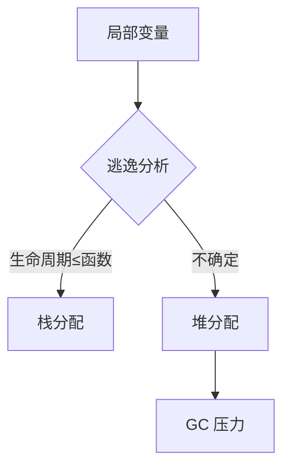

# 逃逸分析与 -gcflags=-m

## 30 秒版（开场）

> **逃逸分析**决定变量分配在栈还是堆：若编译器无法证明生命周期不超出函数，则**逃逸到堆**，增加 GC 压力。用 **`go build -gcflags=-m`** 看决策。生产关键词：**少逃逸、interface/fmt/闭包/closing over loop**。

## 3 分钟版（一面深度）

1. **是什么**：编译期静态分析，追踪变量引用是否被返回、存入全局、跨 goroutine、传给 interface 等。
2. **为什么**：栈分配随函数返回 O(1) 释放；堆分配走 GC，高 QPS 下是性能杀手。
3. **怎么做**：改 API 传值/指针、避免 `interface{}` 装箱、预分配 slice、闭包不捕获大变量；`-m -m` 看详细原因。

## 10 分钟版（原理 + 图示）

**常见逃逸原因**

| 模式 | 原因 |
|------|------|
| `return &local` | 返回局部指针 |
| `go func(){ use(x) }()` | 跨 goroutine |
| `fmt.Println(x)` | 变参/interface 装箱 |
| `cache[k] = &v` | 存入 map/全局 |
| `[]byte(str)` 等 | 部分转换强制堆分配 |
| 大 slice `append` 扩容 | 底层数组逃逸 |



**`-gcflags=-m` 输出解读**

```
./main.go:10:6: moved to heap: x
./main.go:12:17: x escapes to heap
```

第二级 `-m -m` 会打印「because ...」引用链。

**误区**：「小对象在栈上」——取决于逃逸，不取决于 size；大对象也可能栈分配（若不逃逸）。

## 生产场景

- **热路径 JSON/日志**：`fmt.Sprintf`、`interface` 参数导致大量小对象堆分配。
- **Handler 里 `go func`**：捕获 request 大 struct，整包逃逸。
- **可观测**：`pprof -alloc_objects`、`-m` 对比优化前后 inuse/allocs。

## 排查与工具

| 工具 | 用途 |
|------|------|
| `go build -gcflags='-m -m'` | 编译期逃逸报告 |
| `pprof allocs` | 运行时分配热点 |
| `benchstat` | 优化前后 ns/op、B/op |

路径：allocs 高 → 定位函数 → `-m` 看逃逸 → 改签名/预分配/去 interface。

## 架构取舍

| 方案 | 适用 | 不适用 |
|------|------|--------|
| 值传递小 struct | ≤几十字节、无修改 | 大 struct 拷贝更贵 |
| sync.Pool 复用 | 短命重复对象 | 对象生命周期不确定 |
| 代码生成避免 interface | 序列化热点 | 普通 CRUD |
| 栈分配优先 | 默认可读代码 | 过早 micro-opt 牺牲可读性 |

## 追问链

1. **栈分配线程安全吗？** → 每 G 独立栈，无需锁。
2. **闭包为何逃逸？** → 闭包对象在堆，捕获变量若被闭包引用则一起逃逸。
3. **`-m` 能看运行时吗？** → 不能，仅编译期决策。
4. **inlining 与逃逸？** → 内联可能消除逃逸，也可能暴露新逃逸路径。
5. **Go 1.22 loop var 与逃逸？** → 每迭代独立变量，减少经典 loop 逃逸 bug。

## 反模式与事故

- 热路径 `interface{}` 或 `any` 擦除类型，隐式装箱。
- `for` 里 `go func(){ use(v) }()`（1.21 前）经典 bug，同时造成错误与逃逸。
- 不看 `B/op` 只优化 CPU，GC 仍拖垮 P99。

## 代码示例

```go
// 优化前：返回指针 → 逃逸
func bad() *int {
    x := 42
    return &x
}

// 优化后：值返回
func good() int {
    x := 42
    return x
}

// 预分配避免 append 逃逸链
func build(n int) []int {
    s := make([]int, 0, n) // cap 足够则少扩容
    for i := 0; i < n; i++ {
        s = append(s, i)
    }
    return s // slice header 可能栈，底层数组在堆
}
```

调试：`go build -gcflags='-m -m' ./... 2>&1 | grep escapes`

## 延伸阅读

- [Go FAQ: stack or heap](https://go.dev/doc/faq#stack_or_heap)
- [Command-line compile flags](https://pkg.go.dev/cmd/compile)
- [Dave Cheney: Stack vs Heap](https://dave.cheney.net/2017/08/06/go-on-the-stack-or-the-heap)
