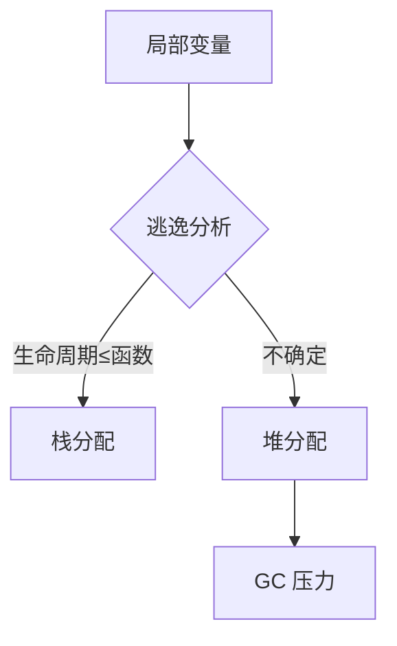

# 逃逸分析与 -gcflags=-m

<a id="oral-card"></a>

## 要点卡

[返回 P0 知识图谱](../_meta/p0-knowledge-graph.md)

!!! abstract "30 秒回答"

    **逃逸分析**决定对象能否放在栈上或被完全消除：若编译器无法证明引用不会超出安全生命周期，就可能**逃逸到堆**，增加 GC 压力。用 **`go build -gcflags=-m`** 看当前编译器的决策，不要把某种语法和“必然上堆”画等号。

**3 分钟展开**

1. **是什么**：编译期静态分析，追踪变量引用是否被返回、存入长生命周期对象、跨 goroutine，或流向编译器无法证明安全的位置。
2. **为什么**：栈分配随函数返回 O(1) 释放；堆分配走 GC，高 QPS 下是性能杀手。
3. **怎么做**：先用 profile 确认热分配，再用 `-m -m` 看当前编译器的引用链；按结果评估
   API 传值/指针、interface/可变参数、slice 预分配和闭包捕获。不能把“用了
   `interface{}`”直接等同于“必然逃逸”。

| 记忆槽 | 内容 |
|--------|------|
| 三个不变量 | 逃逸是编译器对当前上下文的决定；取地址不等于必然上堆；优化前先证明分配是瓶颈 |
| 手画图 | `value/reference flow → compiler proof → stack/elide | heap → GC`，标出 return、closure、interface |
| 项目落点 | 用实际事件解析或热路径说明如何从 allocs profile 定位，再用 `-gcflags=-m -m` 验证改动；只引用本人实际参与部分和可解释指标 |
| 一个取舍 | 值传递可能复制大对象；指针减少复制但可能延长生命周期和增加别名，必须 benchmark |

**错误表达**

- ❌ “返回局部变量指针会悬空；用了指针或 interface 就一定逃逸到堆。”
- ✅ “Go 会保证被引用对象存活；是否逃逸取决于编译器能否证明生命周期及具体优化上下文。”

**自测追问**：为什么 `return &local` 在 Go 中是安全的？内联为何可能改变逃逸报告？

## 10 分钟版（原理 + 图示）

**常见逃逸原因**

| 模式 | 原因 |
|------|------|
| `return &local` | 常使对象流向调用方；内联后仍可能被进一步优化 |
| `go func(){ use(x) }()` | 被异步 goroutine 捕获的变量通常需延长生命周期 |
| `fmt.Println(x)` | 变参/interface 装箱可能导致逃逸，具体看编译结果 |
| `cache[k] = &v` | 若 map/cache 本身长生命周期，引用对象可能逃逸 |
| `[]byte(str)` 等 | 可能分配，也可能被编译器针对非逃逸用法优化 |
| slice `append` 扩容 | 新底层数组是否在堆上取决于大小、逃逸与优化上下文 |


```mermaid
flowchart TD
  Var[局部变量] --> EA{逃逸分析}
  EA -->|生命周期≤函数| Stack[栈分配]
  EA -->|不确定| Heap[堆分配]
  Heap --> GC[GC 压力]
```

**`-gcflags=-m` 输出解读**

```
./main.go:10:6: moved to heap: x
./main.go:12:17: x escapes to heap
```

第二级 `-m -m` 会打印「because ...」引用链。

**误区**：「小对象一定在栈、大对象一定在堆」。生命周期是主要因素，但编译器也有栈对象大小等实现限制；即使逻辑上不逃逸，过大的局部对象也可能被放到堆上。

## 生产场景

- **热路径 JSON/日志**：`fmt.Sprintf`、`interface` 参数导致大量小对象堆分配。
- **Handler 里 `go func`**：捕获 request 或其字段，可能让相关对象延长生命周期并逃逸。
- **可观测**：`pprof -alloc_objects`、`-m` 对比优化前后 inuse/allocs。

## 排查与工具

| 工具 | 用途 |
|------|------|
| `go build -gcflags='-m -m'` | 编译期逃逸报告 |
| `pprof allocs` | 运行时分配热点 |
| `benchstat` | 优化前后 ns/op、B/op |

路径：allocs 高 → 定位函数 → `-m` 看逃逸 → 改签名/预分配/去 interface。

## 架构取舍

| 方案 | 适用 | 不适用 |
|------|------|--------|
| 值传递小 struct | ≤几十字节、无修改 | 大 struct 拷贝更贵 |
| sync.Pool 复用 | 短命重复对象 | 对象生命周期不确定 |
| 代码生成避免 interface | 序列化热点 | 普通 CRUD |
| 栈分配优先 | 默认可读代码 | 过早 micro-opt 牺牲可读性 |

## 深挖问答

1. **栈分配线程安全吗？** → 每 G 独立栈，无需锁。
2. **闭包为何逃逸？** → 若闭包本身逃逸或异步执行，被捕获变量通常要延长生命周期；不逃逸闭包也可能被内联或栈上处理。
3. **`-m` 能看运行时吗？** → 不能，仅编译期决策。
4. **inlining 与逃逸？** → 内联可能消除逃逸，也可能暴露新逃逸路径。
5. **Go 1.22 loop var 与逃逸？** → 每迭代独立变量，减少经典 loop 逃逸 bug。

## 反模式与事故

- 不看 `-m` 和 benchmark，就把所有 `interface{}`/`any` 都判为堆逃逸并大规模改 API。
- `for` 里 `go func(){ use(v) }()`（1.21 前）经典 bug，同时造成错误与逃逸。
- 不看 `B/op` 只优化 CPU，GC 仍拖垮 P99。

## 代码示例

```go
// 返回局部变量地址通常会让对象逃逸；
// 但内联到调用方后，编译器仍可能进一步消除分配。
func bad() *int {
    x := 42
    return &x
}

// 优化后：值返回
func good() int {
    x := 42
    return x
}

// 预分配避免 append 逃逸链
func build(n int) []int {
    s := make([]int, 0, n) // cap 足够则少扩容
    for i := 0; i < n; i++ {
        s = append(s, i)
    }
    return s // 返回后底层数组通常需存活；最终位置以 -m 输出为准
}
```

调试：`go build -gcflags='-m -m' ./... 2>&1 | rg 'escape|moved to heap'`

## 延伸阅读

- [Go FAQ: stack or heap](https://go.dev/doc/faq#stack_or_heap)
- [Command-line compile flags](https://pkg.go.dev/cmd/compile)
