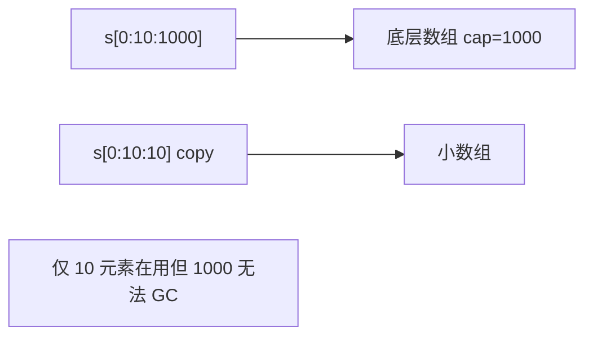

# slice 底层、扩容与内存泄漏场景

## 30 秒版（开场）

> **slice 是三元组**（pointer, len, cap）描述底层数组的视图；**扩容**通常 `<256` 翻倍、之后约 1.25 倍。泄漏高发于 **subslice 持有大数组引用**、**未 drain 的 channel+slice**、**全局缓存截断不当**。生产关键词：**cap>>len、copy 裁剪、sync.Pool 长度**。

## 3 分钟版（一面深度）

1. **是什么**：slice 不拥有数据，指向 runtime 管理的数组；`append` 可能 realloc 新数组。
2. **为什么**：共享底层数组高效但易误用；扩容策略平衡 amortized O(1) 与内存浪费。
3. **怎么做**：大文件只取头：`s = append([]T(nil), s[:n]...)` 或 `copy` 到新 slice；用完 `s=nil`；传 slice 时注意是否暴露整个 cap。

## 10 分钟版（原理 + 图示）

**header 布局（64 位）**

```
ptr *array  | len int | cap int
```

**扩容规则（Go 1.18+ 近似）**

| 条件 | 新 cap |
|------|--------|
| oldCap < 256 | double |
| else | min( oldCap + oldCap/4, 所需 ) |



**典型泄漏场景**

1. **subslice**：`small := big[0:10]`，`big` 的数组仍被引用。
2. **重切片未缩 cap**：`s = s[:0]` 但 cap 巨大，Pool 归还大 buffer。
3. **timer/goroutine 捕获 slice**。
4. **parse 大 buffer**：HTTP body 读入 []byte，解析结果只留头部字段。

## 生产场景

- **日志/指标采集**：每请求 `append` 到共享 slice，cap 涨到 GB 级 RSS 不降。
- **对象池**：`Get()` 的大 slice 只 `[:0]` 重置 len，旧元素若是指针类型仍可达。
- **可观测**：heap profile 中 `[]uint8`/`[]*T` inuse 与业务 QPS 不成比例。

## 排查与工具

| 工具 | 用途 |
|------|------|
| `pprof heap` | 看 slice 底层类型占用 |
| `go build -gcflags=-m` | append 链是否多余分配 |
| 代码审查 | `[:n:n]` 三索引切片 |

路径：RSS 高 → heap 看大 []byte → 搜 subslice/Pool → copy 或三索引切片修复。

## 架构取舍

| 方案 | 适用 | 不适用 |
|------|------|--------|
| 三索引 `s[low:high:max]` | 明确限制 cap | 每次都要 API 语义清晰 |
| 单独 `make` + `copy` | 长期持有小子集 | 一次性大拷贝成本 |
| `bytes.Buffer` / ring buffer | 流式 IO | 随机访问 |
| sync.Pool | 复用 []byte | 存指针 slice 未清零 |

## 追问链

1. **append 是否修改原 slice？** → len/cap 够则原地，否则新数组，原 slice 不变。
2. **`s[:0]` 与 `s=nil`？** → 前者 cap 仍在，底层数组仍可达。
3. **传 slice 到 goroutine？** → 共享底层数组，需并发写保护或 copy。
4. **delete slice 元素释放内存？** → 对指针元素置 nil，否则 GC 仍引用对象。
5. **strings 与 []byte 转换？** → 1.20+ `unsafe` 优化与 `strings.Clone` 场景。

## 反模式与事故

- 解析 GB 级文件用单一 `[]byte` subslice 存百万小对象，数组永不释放。
- Pool 里 `buf = buf[:0]` 不 `clear` 指针槽，泄漏整个对象图。
- 以为 `len=0` 就等于释放内存。

## 代码示例

```go
func clipFirstKB(data []byte) []byte {
    if len(data) <= 1024 {
        out := make([]byte, len(data))
        copy(out, data)
        return out
    }
    out := make([]byte, 1024)
    copy(out, data[:1024])
    return out
}

func clearPtrSlice(s []*Item) {
    for i := range s {
        s[i] = nil
    }
    s = s[:0]
}
```

## 延伸阅读

- [Go Wiki: SliceTricks](https://go.dev/wiki/SliceTricks)
- [Go Slices: usage and internals](https://go.dev/blog/slices-intro)
- [Slice 扩容源码（runtime）](https://github.com/golang/go/blob/master/src/runtime/slice.go)
