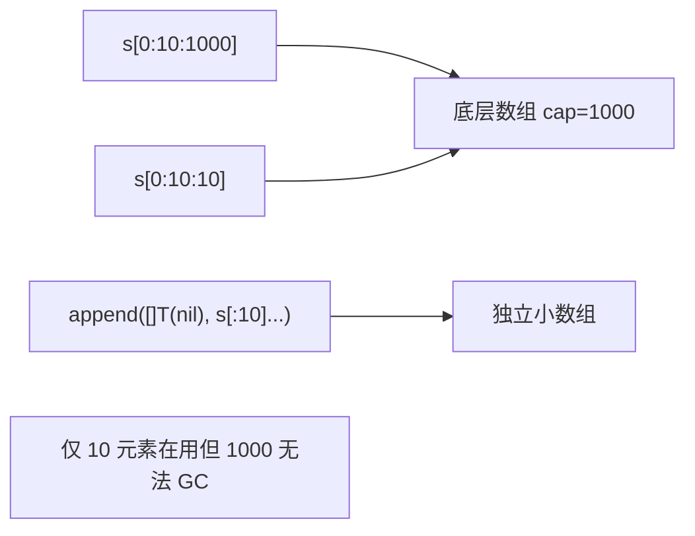

# slice 底层、扩容与内存泄漏场景

<a id="oral-card"></a>

## 口述卡（高频必背）

[返回 P0 知识图谱](../_meta/p0-knowledge-graph.md)

!!! abstract "30 秒回答"

    **slice 是三元组**（pointer, len, cap）描述底层数组的视图；扩容在当前 runtime 中小容量倾向翻倍，大容量从约 2 倍平滑过渡到约 1.25 倍，最终容量还受分配器规格影响。泄漏高发于 **subslice 持有大数组引用**和 **Pool 留住超大 buffer/指针槽**。

**3 分钟展开**

1. **是什么**：slice 不拥有数据，指向 runtime 管理的数组；`append` 可能 realloc 新数组。
2. **为什么**：共享底层数组高效但易误用；扩容策略平衡 amortized O(1) 与内存浪费。
3. **怎么做**：大文件只取头：`s = append([]T(nil), s[:n]...)` 或 `copy` 到新 slice；需要释放
   大数组时确保所有旧引用都消失，单独 `s=nil` 只会移除当前这一份引用；传 slice 时注意是否
   暴露整个 cap。

| 记忆槽 | 内容 |
|--------|------|
| 三个不变量 | slice 是底层数组视图；append 可能换数组；只要任一引用仍指向大数组，GC 就不能回收它 |
| 手画图 | `slice(ptr,len,cap) → big array`，画 subslice 与 copy 后的小数组两条路径 |
| 项目落点 | 用实际区块/日志/HTTP body 解析说明小字段长期引用大 buffer 的内存滞留问题；只引用本人实际参与部分和可解释指标 |
| 一个取舍 | 复制消除大数组滞留但增加一次分配和拷贝；共享视图省 CPU 但必须控制生命周期 |

**错误表达**

- ❌ “`s[:n:n]` 或 `s=nil` 一定能释放原大数组；slice 扩容倍率是语言规范。”
- ✅ “三索引只限制 cap；释放要求所有旧引用消失，扩容策略属于版本相关实现。”

**自测追问**：为什么 `small := big[:10:10]` 仍可能保留整个 big？append 后如何判断是否还共享数组？

## 10 分钟版（原理 + 图示）

**header 布局（64 位）**

```
ptr *array  | len int | cap int
```

**扩容规则（当前 runtime 的近似，不属于语言规范）**

| 条件 | 新 cap |
|------|--------|
| 所需容量 `> 2×oldCap` | 直接以所需容量为候选 |
| `oldCap < 256` | 候选容量约为 `2×oldCap` |
| 更大 slice | 使用平滑公式逐步从约 2× 过渡到约 1.25×，直到满足所需容量 |
| 最终结果 | 还会按元素大小和 allocator size class 向上取整 |


```mermaid
flowchart LR
  S1["s[0:10:1000]"] --> Arr[底层数组 cap=1000]
  S2["s[0:10:10]"] --> Arr
  Copy["append([]T(nil), s[:10]...)"] --> Arr2[独立小数组]
  Note1[仅 10 元素在用但 1000 无法 GC]
```

三索引切片 `s[:n:n]` **只限制 cap，阻止后续 append 原地覆盖共享数组**；它仍指向原来的大数组，不能解决长期持有导致的内存滞留。要释放大数组，必须复制出所需数据并丢弃所有旧引用。

**典型泄漏场景**

1. **subslice**：`small := big[0:10]`，`big` 的数组仍被引用。
2. **重切片未缩 cap**：`s = s[:0]` 但 cap 巨大，Pool 归还大 buffer。
3. **timer/goroutine 捕获 slice**。
4. **parse 大 buffer**：HTTP body 读入 []byte，解析结果只留头部字段。

## 生产场景

- **日志/指标采集**：每请求 `append` 到共享 slice，cap 涨到 GB 级 RSS 不降。
- **对象池**：`Get()` 的大 slice 只 `[:0]` 重置 len，旧元素若是指针类型仍可达。
- **可观测**：heap profile 中 `[]uint8`/`[]*T` inuse 与业务 QPS 不成比例。

## 排查与工具

| 工具 | 用途 |
|------|------|
| `pprof heap` | 看 slice 底层类型占用 |
| `go build -gcflags=-m` | append 链是否多余分配 |
| 代码审查 | subslice 是否长期持有大数组；Pool 是否丢弃超大 cap |

路径：RSS 高 → heap 看大 `[]byte` → 搜 subslice/Pool → 长期持有小片段时复制；超大 Pool buffer 直接丢弃。

## 架构取舍

| 方案 | 适用 | 不适用 |
|------|------|--------|
| 三索引 `s[low:high:max]` | 限制 append 可用容量，隔离修改语义 | 不能释放原底层数组 |
| 单独 `make` + `copy` | 长期持有小子集 | 一次性大拷贝成本 |
| `bytes.Buffer` / ring buffer | 流式 IO | 随机访问 |
| sync.Pool | 复用 []byte | 存指针 slice 未清零 |

## 追问链

1. **append 是否修改原 slice？** → len/cap 够则原地，否则新数组，原 slice 不变。
2. **`s[:0]` 与 `s=nil`？** → 前者 cap 仍在，底层数组仍可达。
3. **传 slice 到 goroutine？** → 共享底层数组，需并发写保护或 copy。
4. **移除 slice 元素后对象会释放吗？** → 若底层数组的未使用槽仍保存指针，需置 nil 或 `clear`，否则对象仍可达。
5. **string 与 []byte 转换一定分配吗？** → 语义上会产生可独立使用的值；编译器可对特定只读、非逃逸场景做优化，不能依赖它作为 API 保证。

## 反模式与事故

- 解析 GB 级文件用单一 `[]byte` subslice 存百万小对象，数组永不释放。
- Pool 里 `buf = buf[:0]` 不 `clear` 指针槽，泄漏整个对象图。
- 以为 `len=0` 就等于释放内存。

## 代码示例

```go
func clipFirstKB(data []byte) []byte {
    if len(data) <= 1024 {
        out := make([]byte, len(data))
        copy(out, data)
        return out
    }
    out := make([]byte, 1024)
    copy(out, data[:1024])
    return out
}

func clearPtrSlice(s []*Item) {
    clear(s) // Go 1.21+；调用方若要缩 len，仍需自己执行 s = s[:0]
}
```

## 延伸阅读

- [Go Wiki: SliceTricks](https://go.dev/wiki/SliceTricks)
- [Go Slices: usage and internals](https://go.dev/blog/slices-intro)
- [Slice 扩容源码（runtime）](https://github.com/golang/go/blob/master/src/runtime/slice.go)
