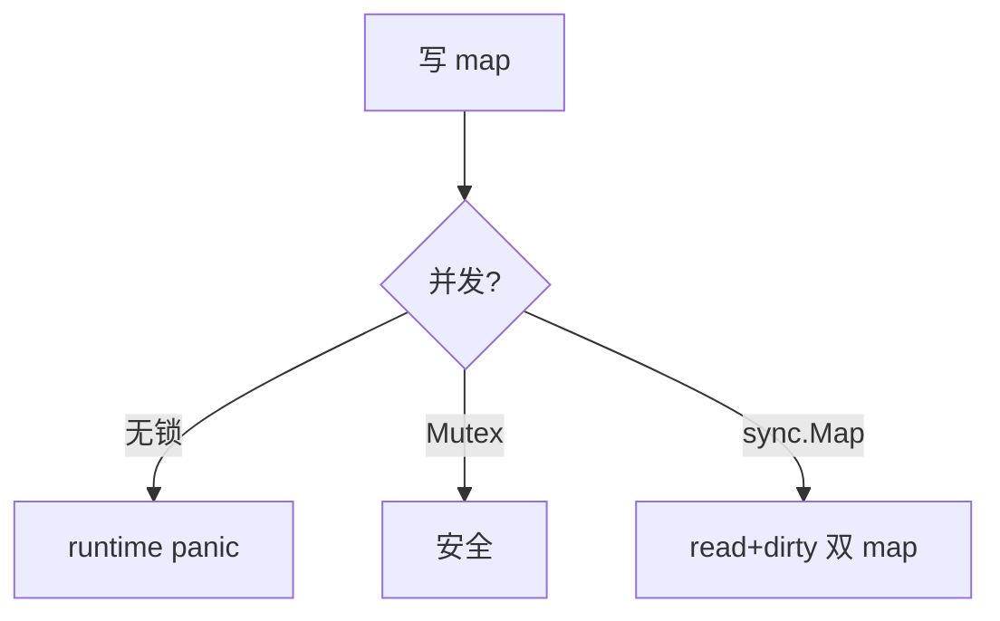

# map 并发安全、扩容与 sync.Map 选型

## 30 秒版（开场）

> **内置 map 非并发安全**，并发读写 panic；读多写少可用 **`sync.Map`** 或 **`RWMutex+map`**。底层 **hmap + bucket**，负载因子超阈值 **增量扩容**，迭代顺序随机。生产关键词：**fatal error: concurrent map、扩容 STW 短暂、Swiss Table（1.24+）**。

## 3 分钟版（一面深度）

1. **是什么**：map 是哈希表，key 经 hasher 落 bucket，冲突用 overflow 链或内联槽位。
2. **为什么**：Go 选择 map 专用 runtime 实现，非通用容器；并发需外层同步。
3. **怎么做**：写多读少 `map+RWMutex`；读极多写极少 `sync.Map`；分片 map 降锁；预分配 `make(map[K]V, hint)` 减扩容。

## 10 分钟版（原理 + 图示）

**hmap 要点**

| 字段 | 含义 |
|------|------|
| count | 元素数 |
| B | buckets = 2^B |
| buckets | 数组，每 bucket 8 个 key/elem 槽 |
| oldbuckets | 增量扩容时旧表 |
| hashGrow | 扩容标志 |

**扩容**：负载 > 6.5（约）触发 **double buckets**；等量扩容整理 overflow。扩容期间 **渐进迁移**，访问触发 evacuate。



**sync.Map 结构**

- `read`：`atomic.Value` 存只读 map，无锁读。
- `dirty`：写时晋升，miss 过多则全量替换 read。
- 适合：**键稳定、读>>写、键集合相对固定**。

## 生产场景

- **配置缓存**：启动后只读，偶尔热更新 → `atomic.Value` 存不可变 map 快照优于 sync.Map。
- **会话表**：高并发读写 → 分片 `shardMap[256]` + 每片 Mutex。
- **可观测**：panic stack `concurrent map read and map write`；CPU profile 见 `mapassign`/`mapaccess`。

## 排查与工具

| 工具 | 用途 |
|------|------|
| `-race` | 捕获 map 竞态 |
| pprof CPU | 扩容/哈希热点 |
| 日志 stack | 定位哪条 goroutine 并发写 |

路径：panic → race/代码搜 map 共享 → 加锁或分片 → 压测验证。

## 架构取舍

| 方案 | 适用 | 不适用 |
|------|------|--------|
| map + RWMutex | 通用、写不少 | 读极端多且锁竞争 |
| sync.Map | 读多写少、key 稳定 | 频繁 Delete/新 key |
| 分片 map | 高 QPS 计数/缓存 | key 少、实现复杂 |
| 不可变快照 | 配置/字典 | 频繁增量更新 |

## 追问链

1. **map 能取地址吗？** → `&m[k]` 非法，因扩容可能搬迁。
2. **key 必须 comparable？** → 是，slice/map/func 不可作 key。
3. **迭代顺序？** → 随机，勿依赖。
4. **nil map 读写？** → 读零值，写 panic。
5. **1.24 Swiss Table？** → 新哈希表实现，关注性能与语义不变。

## 反模式与事故

- 多个 goroutine 读，一个写「应该没事」→ 直接 panic。
- sync.Map 当通用 map，写多导致 dirty 抖动性能差。
- 超大 map 不 hint，启动阶段多次扩容卡顿。

## 代码示例

```go
type ShardedMap struct {
    shards [256]struct {
        mu sync.RWMutex
        m  map[string]int
    }
}

func (s *ShardedMap) shard(key string) *struct {
    mu sync.RWMutex
    m  map[string]int
} {
    h := fnv32(key)
    return &s.shards[h%256]
}

func (s *ShardedMap) Get(key string) (int, bool) {
    sh := s.shard(key)
    sh.mu.RLock()
    v, ok := sh.m[key]
    sh.mu.RUnlock()
    return v, ok
}
```

## 延伸阅读

- [sync.Map 文档](https://pkg.go.dev/sync#Map)
- [Go 1.24 Swiss Tables](https://go.dev/blog/swisstable)
- [map 实现剖析（Draveness）](https://draveness.me/golang/docs/part2-foundation/ch03-datastructure/golang-hashmap/)
