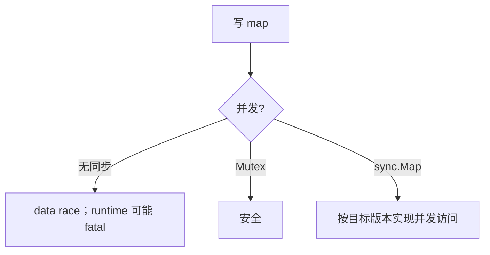

# map 并发安全、扩容与 sync.Map 选型

<a id="oral-card"></a>

## 要点卡

[返回 P0 知识图谱](../_meta/p0-knowledge-graph.md)

!!! abstract "30 秒回答"

    **内置 map 不保证并发安全**：无同步并发读写属于 data race，runtime 常会以
    `fatal error: concurrent map...` 终止，但不能把“必然 panic”当同步机制。Go ≤1.23
    的内置 map 使用经典 `hmap/bucket`，Go 1.24 起改为 **Swiss Table 风格实现**；
    `sync.Map` 又是另一种并发容器，并在 Go 1.26 从 read/dirty 双表切换为并发 hash-trie。
    这些实现变化都不改变各自 API 契约。

**3 分钟展开**

1. **是什么**：map 是 runtime 实现的哈希表；具体布局随 Go 版本变化，必须区分“语言语义”和“当前实现”。
2. **为什么**：内置 map 选择 runtime 专用实现，非通用并发容器；并发读写需外层同步。
3. **怎么做**：通用场景先用 `map+Mutex/RWMutex` 并基准测试；`sync.Map` 主要适合“键写一次读很多”或不同 goroutine 操作互不相交的键集合；配置读取可用不可变 map + `atomic.Value/Pointer`。

| 记忆槽 | 内容 |
|--------|------|
| 三个不变量 | 内置 map 并发读写需要同步；runtime fatal 不是同步保证；布局与扩容实现随 Go 版本变化 |
| 手画图 | `map access → ownership/lock? → builtin map`，旁分 `sync.Map` 与 `atomic immutable snapshot` |
| 项目落点 | 用实际路由、资产元数据或配置表说明读多写少快照与普通 `map+Mutex` 的选择；只引用本人实际参与部分和可解释指标 |
| 一个取舍 | `map+Mutex` 易维护复合不变量；`sync.Map` 针对特定访问模式，必须按目标版本 benchmark |

**错误表达**

- ❌ “并发 map 写一定 panic，所以捕获 panic 就安全；sync.Map 在所有场景都更快。”
- ✅ “无同步访问是 data race，fatal 只是可能表现；容器选择由访问模式、类型安全和不变量决定。”

**自测追问**：`sync.Map.Range` 是否是一致快照？为什么一个写一次读很多的 key 集合更符合它的设计目标？

## 10 分钟版（原理 + 图示）

**Go ≤1.23：经典 hmap（历史实现）**

| 字段 | 含义 |
|------|------|
| count | 元素数 |
| B | buckets = 2^B |
| buckets | 数组，每 bucket 8 个 key/elem 槽 |
| oldbuckets | 增量扩容时旧表 |
| nevacuate | 下一批待迁移 bucket 的进度 |

**扩容**：负载 > 6.5（约）触发 **double buckets**；等量扩容整理 overflow。扩容期间 **渐进迁移**，访问触发 evacuate。

**Go 1.24+：Swiss Table 风格实现**

- 使用 control bytes 与成组 slot 加速哈希片段匹配和空槽查找。
- 大 map 可由目录管理多个 table，增长时拆分 table；不再应使用 `hmap.B/oldbuckets/8 槽 bucket` 解释当前实现。
- `make(map[K]V, hint)` 仍只是容量提示；扩容/拆分是单个 map 操作推进的内部工作，**不是全局 STW**。
- 先说语义，再按目标 Go 版本补充实现，避免把旧源码结构背成永久规范。


```mermaid
flowchart TB
  Write[写 map] --> Lock{并发?}
  Lock -->|无同步| Race[data race；runtime 可能 fatal]
  Lock -->|Mutex| Safe[安全]
  Lock -->|sync.Map| CAS[按目标版本实现并发访问]
```

**`sync.Map` 的版本边界（实现细节，不是 API 契约）**

- Go 1.25 及更早的常见实现使用原子发布的 `read` 快照与加锁维护的 `dirty` map，
  miss 达阈值后发生晋升。
- Go 1.26 的标准库实现改为 `internal/sync.HashTrieMap` 并发 hash-trie；继续用
  “read/dirty 晋升”解释 1.26 已经是过时答案。
- 官方重点场景：**键写一次、读取很多次**，或多个 goroutine 操作**互不相交的键集合**。
- 稳定契约还包括：观察到某次写效果的读与该写建立 `synchronizes-before`；`Range`
  不承诺一致快照。选型应依据契约和 benchmark，不能依赖内部字段。

## 生产场景

- **配置缓存**：启动后只读，偶尔热更新 → `atomic.Value` 存不可变 map 快照优于 sync.Map。
- **会话表**：若 profile 证明单锁竞争，可按稳定 hash 分片并给每片独立 Mutex；分片数不是
  固定 256，必须按 key 分布、内存和目标版本 benchmark。
- **可观测**：panic stack `concurrent map read and map write`；CPU profile 见 `mapassign`/`mapaccess`。

## 排查与工具

| 工具 | 用途 |
|------|------|
| `-race` | 捕获 map 竞态 |
| pprof CPU | 扩容/哈希热点 |
| 日志 stack | 定位哪条 goroutine 并发写 |

路径：panic → race/代码搜 map 共享 → 加锁或分片 → 压测验证。

## 架构取舍

| 方案 | 适用 | 不适用 |
|------|------|--------|
| map + Mutex/RWMutex | 通用、需要类型不变量或复合操作 | 极端锁竞争且无法分片 |
| sync.Map | 写一次读很多；不同 goroutine 操作不相交 key | 需要跨 key 原子不变量；写热点集中 |
| 分片 map | 高 QPS 计数/缓存 | key 少、实现复杂 |
| 不可变快照 | 配置/字典 | 频繁增量更新 |

## 深挖问答

1. **map 能取地址吗？** → `&m[k]` 非法，因扩容可能搬迁。
2. **key 必须 comparable？** → 是，slice/map/func 不可作 key。
3. **迭代顺序？** → 语言规范未指定，同一个 map 的不同次迭代也可能不同，勿依赖。
4. **nil map 读写？** → 读零值，写 panic。
5. **1.24 Swiss Table？** → control bytes + 分组探测，并用目录/table 拆分支持增长；旧 `hmap bucket` 细节不再适用于当前版本，语义保持不变。
6. **Go 1.26 的 sync.Map 还是 read/dirty 吗？** → 否，1.26 已切换为并发
   hash-trie；read/dirty 是旧实现细节，先讲 API 场景、内存模型保证与一致快照边界。

## 反模式与事故

- 多个 goroutine 读，一个写「应该没事」→ data race，可能 fatal，也可能产生不可预测结果。
- 把旧版 `sync.Map` 的 dirty 晋升机制当成永久契约，或没做 benchmark 就断言某种读写比
  一定更快。
- 超大 map 不 hint，启动阶段多次扩容卡顿。

## 代码示例

```go
type ShardedMap struct {
    // 仅演示结构；生产分片数应由 workload benchmark 决定。
    shards [256]struct {
        mu sync.RWMutex
        m  map[string]int
    }
}

func (s *ShardedMap) shard(key string) *struct {
    mu sync.RWMutex
    m  map[string]int
} {
    h := fnv32(key)
    return &s.shards[h%256]
}

func (s *ShardedMap) Get(key string) (int, bool) {
    sh := s.shard(key)
    sh.mu.RLock()
    v, ok := sh.m[key]
    sh.mu.RUnlock()
    return v, ok
}
```

## 延伸阅读

- [sync.Map 文档](https://pkg.go.dev/sync#Map)
- [Go 1.24 Swiss Tables](https://go.dev/blog/swisstable)
- [Go 1.26 `sync.Map` source](https://github.com/golang/go/blob/go1.26.0/src/sync/map.go)
- [map 实现剖析（Draveness）](https://draveness.me/golang/docs/part2-foundation/ch03-datastructure/golang-hashmap/)
