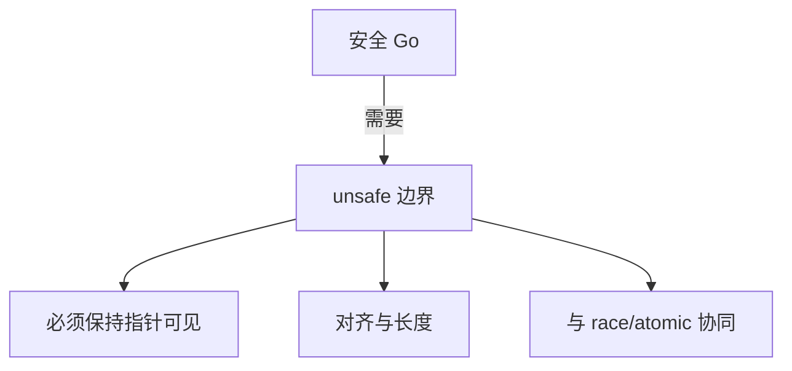

# 内存对齐与 unsafe 边界

## 30 秒版（开场）

> Go 按类型 **alignment** 布局 struct，错误 padding 会浪费内存或导致 **atomic 64 位未对齐 panic**（32 位架构）。**unsafe** 可绕过类型系统做指针算术，但需自己保证 **GC 可见性、对齐、uintptr 不长期持有**。生产关键词：**unsafe.Pointer 规则、字段重排、零拷贝边界**。

## 3 分钟版（一面深度）

1. **是什么**：alignment 是 CPU 高效访问与 atomic 指令的要求；`unsafe` 提供 Sizeof/Alignof/Offsetof 与 Pointer 转换。
2. **为什么**：序列化、互操作、性能优化需要；误用导致 subtle bug、GC 丢引用、数据 race。
3. **怎么做**：用 `atomic` 包类型；struct 大→小排列减 padding；遵守 `unsafe.Pointer` 六条转换规则；优先 `encoding/binary` 而非手写。

## 10 分钟版（原理 + 图示）

**对齐示例（amd64）**

```go
type Bad struct {
    a bool   // 1 + 7 pad
    b int64  // 8
} // size 16

type Good struct {
    b int64
    a bool
} // size 16 但可与其他字段组合更优
```

**unsafe.Pointer 核心规则（摘要）**

1. `*T` → `unsafe.Pointer` → `*U` 需合法对齐。
2. 不可将 `uintptr` 存变量后再转回 Pointer（GC 可能移动对象）。
3. `reflect.SliceHeader/StringHeader` 已 deprecated，用 `unsafe.Slice`/`StringData`。



**常见合法场景**

- cgo 边界、syscall、mmap
- `atomic` 未导出字段需 `Align64`
- 与 `[]byte` 零拷贝视图（注意只读 string 字节不可写）

## 生产场景

- **高频计数器**：struct 内 `int64` 未 64 对齐，ARM32 上 `atomic.Add` panic。
- **自定义协议解析**：`unsafe` 强转 []byte 到 struct，字段未对齐或大小端错误。
- **可观测**：罕见 panic `unaligned 64-bit atomic`；race detector 报 unsafe 区 data race。

## 排查与工具

| 工具 | 用途 |
|------|------|
| `unsafe.Alignof` / `Offsetof` | 验证布局 |
| `go vet` | 部分 unsafe 误用 |
| `-race` | unsafe 区并发 |

路径：atomic panic → 查 struct 字段顺序 → 加 padding 或独立 array → 架构相关测试。

## 架构取舍

| 方案 | 适用 | 不适用 |
|------|------|--------|
| encoding/binary | 协议稳定 | 极致零拷贝 |
| unsafe 零拷贝 | 热路径大流量 | 团队无 review 能力 |
| cgo | 必须用 C 库 | 可纯 Go 实现 |
| 代码生成 marshaler | 复杂 struct | 小消息 |

## 追问链

1. **uintptr 与 Pointer 区别？** → uintptr 是整数，不参与 GC 扫描。
2. **string 转 []byte 零拷贝？** → 需 unsafe，且 string 字节不可变，写会 crash。
3. **空 struct 对齐？** → size 0 或 1，取决于版本与 context。
4. **为何 atomic 要 Align64？** → 32 位系统上 int64 可能 4 字节对齐。
5. **Go 1.20+ SliceData？** → 官方 API 替代 SliceHeader hack。

## 反模式与事故

- 把 `uintptr` 存 map 再转指针，对象已被 GC 回收。
- 跨 goroutine 无 sync 改 unsafe 映射内存。
- 从网络包直接 `(*Header)(unsafe.Pointer(&buf[0]))` 忽略对齐与 endian。

## 代码示例

```go
import (
    "sync/atomic"
    "unsafe"
)

type Counter struct {
    _ [56]byte              // padding 使 n 64 字节对齐（cache line 优化另论）
    n atomic.Int64
}

// Go 1.20+：从 []byte 读 uint32（binary 更安全）
func readU32(b []byte) uint32 {
    if len(b) < 4 {
        panic("short")
    }
    return *(*uint32)(unsafe.Pointer(&b[0])) // 需保证对齐；binary.LittleEndian 更 portable
}
```

## 延伸阅读

- [unsafe 包文档](https://pkg.go.dev/unsafe)
- [Go spec: Size and alignment](https://go.dev/ref/spec#Size_and_alignment_guarantees)
- [Go 1.20 unsafe.Slice / StringData](https://go.dev/doc/go1.20)
