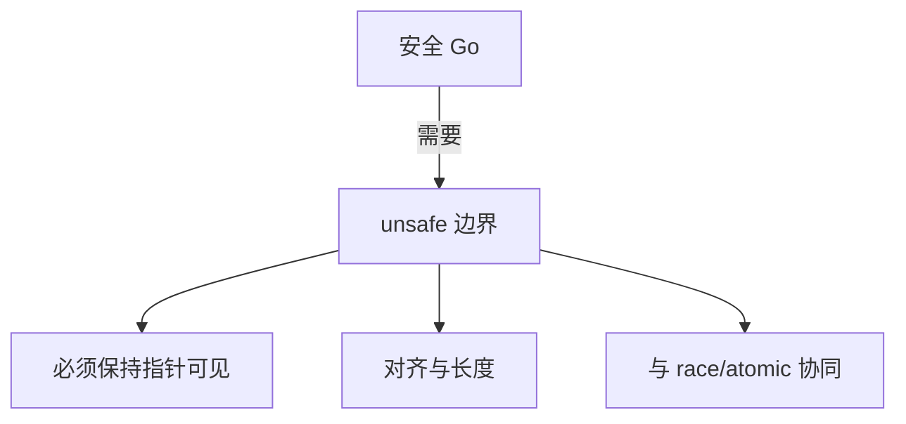

# 内存对齐与 unsafe 边界

## 30 秒版（开场）

> Go 按类型 **alignment** 布局 struct，字段顺序会影响 padding；在 32 位架构上直接对未对齐的裸 `int64/uint64` 使用 64 位 atomic 还可能失败。优先使用会自动保证对齐的 `atomic.Int64/Uint64`。`unsafe` 可绕过类型系统，但必须遵守指针存活、对象边界与对齐规则。

## 3 分钟版（一面深度）

1. **是什么**：alignment 是 CPU 高效访问与 atomic 指令的要求；`unsafe` 提供 Sizeof/Alignof/Offsetof 与 Pointer 转换。
2. **为什么**：序列化、互操作、性能优化需要；误用导致 subtle bug、GC 丢引用、数据 race。
3. **怎么做**：用 `atomic` 包类型；struct 大→小排列减 padding；遵守 `unsafe.Pointer` 六条转换规则；优先 `encoding/binary` 而非手写。

## 10 分钟版（原理 + 图示）

**对齐示例（amd64）**

```go
type Bad struct {
    a bool   // 1 + 7 pad
    b int64  // 8
    c bool   // 1 + 7 tail padding
} // size 24

type Good struct {
    b int64
    a bool
    c bool
} // size 16
```

**unsafe.Pointer 核心规则（摘要）**

1. `*T` → `unsafe.Pointer` → `*U` 需要布局兼容、大小足够并满足对齐。
2. `uintptr` 是整数，不保持对象存活。一般不能保存后再转回指针；允许的指针算术要求转换在同一个表达式内，结果仍指向原对象内部。
3. `reflect.SliceHeader/StringHeader` 已 deprecated，用 `unsafe.Slice`/`StringData`。

当前 Go 堆 GC 通常不移动对象，但这**不是**长期保存 `uintptr` 的理由：对象可能被回收，goroutine 栈也可能增长并搬迁。跨 syscall/cgo 或 finalizer 边界还要按官方模式使用 `runtime.KeepAlive`，但它不能把非法 Pointer 转换变合法。


```mermaid
flowchart TD
  Safe[安全 Go] -->|需要| Unsafe[unsafe 边界]
  Unsafe --> GC[必须保持指针可见]
  Unsafe --> Align[对齐与长度]
  Unsafe --> Race[与 race/atomic 协同]
```

**常见合法场景**

- cgo 边界、syscall、mmap
- `atomic.Int64/Uint64` 等 typed atomic（自动保证 64 位对齐）
- 与 `[]byte` 零拷贝视图（注意只读 string 字节不可写）

## 生产场景

- **高频计数器**：struct 内 `int64` 未 64 对齐，ARM32 上 `atomic.Add` panic。
- **自定义协议解析**：`unsafe` 强转 []byte 到 struct，字段未对齐或大小端错误。
- **可观测**：罕见 panic `unaligned 64-bit atomic`；race detector 报 unsafe 区 data race。

## 排查与工具

| 工具 | 用途 |
|------|------|
| `unsafe.Alignof` / `Offsetof` | 验证布局 |
| `go vet` | 部分 unsafe 误用 |
| `-race` | unsafe 区并发 |

路径：atomic panic → 查 struct 字段顺序 → 加 padding 或独立 array → 架构相关测试。

## 架构取舍

| 方案 | 适用 | 不适用 |
|------|------|--------|
| encoding/binary | 协议稳定 | 极致零拷贝 |
| unsafe 零拷贝 | 热路径大流量 | 团队无 review 能力 |
| cgo | 必须用 C 库 | 可纯 Go 实现 |
| 代码生成 marshaler | 复杂 struct | 小消息 |

## 深挖问答

1. **uintptr 与 Pointer 区别？** → uintptr 是整数，不参与 GC 扫描。
2. **string 转 []byte 零拷贝？** → 可用 unsafe 构造只读视图，但绝不能通过它修改 string；后果可能是崩溃或内存破坏，且需保证原 string 存活。
3. **空 struct 对齐？** → `unsafe.Sizeof(struct{}{}) == 0`、对齐通常为 1；不同零尺寸变量地址允许相同，尾部零尺寸字段还可能影响外层 struct 的最终大小。
4. **为何优先 typed atomic？** → 32 位系统上裸 `int64` 不一定自然 8 字节对齐，而 `atomic.Int64/Uint64` 会自动对齐。
5. **Go 1.20+ SliceData？** → 官方 API 替代 SliceHeader hack。

## 反模式与事故

- 把 `uintptr` 存 map 再转指针，对象已被 GC 回收。
- 跨 goroutine 无 sync 改 unsafe 映射内存。
- 从网络包直接 `(*Header)(unsafe.Pointer(&buf[0]))` 忽略对齐与 endian。

## 代码示例

```go
import (
    "encoding/binary"
    "sync/atomic"
)

type Counter struct {
    n atomic.Int64 // 自动保证 64 位原子操作所需对齐
}

// 网络/文件字节流还涉及长度、对齐与大小端；优先显式解码。
func readU32(b []byte) uint32 {
    if len(b) < 4 {
        panic("short")
    }
    return binary.LittleEndian.Uint32(b)
}
```

## 延伸阅读

- [unsafe 包文档](https://pkg.go.dev/unsafe)
- [Go spec: Size and alignment](https://go.dev/ref/spec#Size_and_alignment_guarantees)
- [Go 1.20 unsafe.Slice / StringData](https://go.dev/doc/go1.20)
