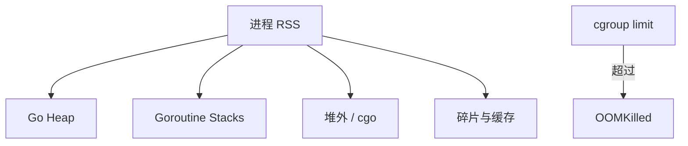

# 大对象、堆外与 OOM 排查

## 30 秒版（开场）

> **OOM** 常是 RSS（堆+栈+runtime+堆外）超 cgroup limit，而非单纯「GC 没回收」。**大对象**（≥32KB 等阈值）走 dedicated span，加剧堆碎片与 GC 标记成本。**堆外**：mmap、cgo、DirectByteBuffer 类库不计入 HeapAlloc。生产关键词：**GOMEMLIMIT、RSS vs HeapInuse、pprof+smem**。

## 3 分钟版（一面深度）

1. **是什么**：Go 进程内存 = 堆 + goroutine 栈 + runtime 元数据 + 堆外分配。
2. **为什么**：仅看 `HeapAlloc` 会漏栈暴涨、CGO、未 Trim 的 OS 内存；大对象影响 sweep/mark。
3. **怎么做**：设 `GOMEMLIMIT`、查 goroutine 栈、heap profile 大 slice、容器看 working set；限制单请求 body、流式处理。

## 10 分钟版（原理 + 图示）

**内存组成**

| 类别 | 说明 |
|------|------|
| Heap | 小对象 span + 大对象 direct |
| Stack | goroutine 栈可增长至 1GB（默认上限） |
| Off-heap | cgo C.malloc、部分驱动 |
| OS 缓存 | 归还 span 未必立刻还 OS（Scavenger） |



**大对象**：超过 maxSmallSize 的对象单独分配，释放进 idle 列表；频繁分配/释放大 buffer 导致堆峰值高。

**Scavenger**：`debug.FreeOSMemory()` 强制归还，平时按策略 lazy return。

## 生产场景

- **图片/报表服务**：单次加载 100MB 文件到 `[]byte`，并发 50 → OOM。
- **goroutine 泄漏**：百万 G，栈总和数 GB，heap profile 正常。
- **可观测**：K8s `OOMKilled`、Prometheus `process_resident_memory_bytes` vs `go_memstats_heap_inuse_bytes`。

## 排查与工具

| 工具 | 用途 |
|------|------|
| `pprof heap` | 堆内大对象类型 |
| `pprof goroutine` | 栈与 G 数量 |
| `/proc/PID/smaps` | RSS 细项 |
| `GODEBUG=gctrace=1` | GC 是否跟不上分配 |

路径：OOMKilled → 事件前后 RSS 曲线 → heap/goroutine profile → 限流/流式/GOMEMLIMIT/修泄漏。

## 架构取舍

| 方案 | 适用 | 不适用 |
|------|------|--------|
| 流式 IO + 大小限制 | 上传/下载 | 必须全量内存计算 |
| 对象存储 offload | 大文件 | 低延迟本地处理 |
| 进程级隔离 | 重任务 worker | 单体省 ops |
| GOMEMLIMIT | 容器标准 | 替代不了逻辑泄漏修复 |

## 追问链

1. **HeapAlloc 与 RSS 为何差很多？** → span 缓存、栈、堆外、libc。
2. **大对象阈值大概？** → 32KB 量级（实现相关，口述「有大对象专门路径」即可）。
3. **FreeOSMemory 生产能用吗？** → 仅诊断或特殊批处理，常调用损性能。
4. **cgo 内存谁回收？** → 自己 C.free，Go GC 不管。
5. **如何设 Pod memory？** → request≈常态 RSS，limit 留峰值，GOMEMLIMIT≈90% limit。

## 反模式与事故

- 仅监控 heap_inuse，栈泄漏直到 OOM 才发现。
- 无限缓存「反正会 GC」——活对象永不释放。
- 压测数据量小于生产，未触发大对象路径。

## 代码示例

```go
import (
    "io"
    "net/http"
)

const maxBody = 8 << 20 // 8Mi

func handler(w http.ResponseWriter, r *http.Request) {
    lr := io.LimitReader(r.Body, maxBody+1)
    buf := make([]byte, 32*1024) // 流式缓冲，非整包读入
    var n int64
    for {
        nr, err := lr.Read(buf)
        n += int64(nr)
        if n > maxBody {
            http.Error(w, "body too large", http.StatusRequestEntityTooLarge)
            return
        }
        if err == io.EOF {
            break
        }
        if err != nil {
            http.Error(w, err.Error(), 500)
            return
        }
        // process buf[:nr]
    }
}
```

## 延伸阅读

- [Go GC Guide - Memory limit](https://go.dev/doc/gc-guide)
- [Debugging memory in Go services](https://www.youtube.com/watch?v=6qAfkJGWsns)
- [Kubernetes OOM best practices](https://kubernetes.io/docs/tasks/configure-pod-container/assign-memory-resource/)
