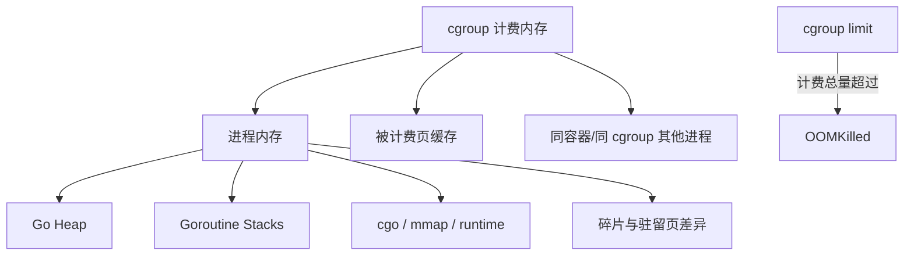

# 大对象、堆外与 OOM 排查

<a id="oral-card"></a>

## 要点卡

[返回 P0 知识图谱](../_meta/p0-knowledge-graph.md)

!!! abstract "30 秒回答"

    **OOM** 要从“进程或容器被计费内存达到限制”排查，而不能只归因于“GC 没回收”；
    容器 OOM 的口径也不等同于某一个进程的 RSS。Go 堆、goroutine 栈、runtime 元数据、
    cgo/`mmap`、页缓存与其他容器进程都可能贡献内存压力。
    当前 runtime 把超过约 32 KiB 小对象上限的分配走大对象路径；精确边界属于实现细节。
    大对象可能抬高峰值与碎片，其 GC 扫描成本还取决于对象是否含指针。`mmap`、cgo/C
    分配等不体现在 `HeapAlloc`，也未必受 `GOMEMLIMIT` 完整约束。

**3 分钟展开**

1. **是什么**：先区分 Go runtime 指标、进程 RSS 与 cgroup 计费口径，再分解堆、goroutine
   栈、runtime 元数据、cgo/`mmap` 和页缓存。
2. **为什么**：仅看 `HeapAlloc` 会漏栈暴涨、cgo 和堆外内存；仅看 RSS 又不能定位所有权；
   大对象对 GC 的影响还取决于存活时间、指针密度和分配速率。
3. **怎么做**：设 `GOMEMLIMIT`、查 goroutine 栈、heap profile 大 slice、容器看 working set；限制单请求 body、流式处理。

| 记忆槽 | 内容 |
|--------|------|
| 三个不变量 | 先区分 runtime、进程和 cgroup 口径；HeapAlloc 正常不能排除 OOM；GOMEMLIMIT 不覆盖全部内存来源 |
| 手画图 | `cgroup charge → Go heap + stacks + runtime + cgo/mmap + cache/other process → OOM` |
| 项目落点 | 用实际批量索引、文件解析或 RPC body 峰值说明如何从容器事件到 heap/goroutine/cgo 逐层定位；只引用本人实际参与部分和可解释指标 |
| 一个取舍 | 流式处理和请求限额降低峰值但增加状态管理；整块加载实现简单却放大并发内存 |

**错误表达**

- ❌ “heap profile 正常就不是内存问题；调用 `debug.FreeOSMemory` 可以根治 OOM。”
- ✅ “heap 只是一个组成；先对齐 cgroup/RSS/runtime 指标，再根据所有权和存活链定位根因。”

**自测追问**：容器 OOMKilled 时为什么进程 heap 可能看起来不高？如何区分 goroutine 栈和 cgo 内存？

## 10 分钟版（原理 + 图示）

**内存组成**

| 类别 | 说明 |
|------|------|
| Heap | 小对象 span + 大对象 direct |
| Stack | goroutine 栈按需增长；64 位平台默认单栈上限约 1GB，属于实现配置 |
| Off-heap | cgo C.malloc、部分驱动 |
| OS 缓存 | 归还 span 未必立刻还 OS（Scavenger） |


```mermaid
flowchart TB
  Charge["cgroup 计费内存"] --> Proc["进程内存"]
  Charge --> Cache["被计费页缓存"]
  Charge --> Sidecar["同容器/同 cgroup 其他进程"]
  Proc --> Heap["Go Heap"]
  Proc --> Stack["Goroutine Stacks"]
  Proc --> Off["cgo / mmap / runtime"]
  Proc --> Frag["碎片与驻留页差异"]
  Limit[cgroup limit] -->|计费总量超过| OOM[OOMKilled]
```

**大对象**：超过 maxSmallSize 的对象单独分配，释放进 idle 列表；频繁分配/释放大 buffer 导致堆峰值高。

**Scavenger**：平时按策略把空闲物理页归还 OS；`debug.FreeOSMemory()` 会先强制 GC，再尽量 scavenging，频繁调用会明显干扰吞吐与延迟。

## 生产场景

- **图片/报表服务**：单次加载 100MB 文件到 `[]byte`，并发 50 → OOM。
- **goroutine 泄漏**：百万 G，栈总和数 GB，heap profile 正常。
- **可观测**：K8s `OOMKilled`、Prometheus `process_resident_memory_bytes` vs `go_memstats_heap_inuse_bytes`。

## 排查与工具

| 工具 | 用途 |
|------|------|
| `pprof heap` | 堆内大对象类型 |
| `pprof goroutine` | 栈与 G 数量 |
| `/proc/PID/smaps` | RSS 细项 |
| `GODEBUG=gctrace=1` | GC 是否跟不上分配 |

路径：OOMKilled → 事件前后 RSS 曲线 → heap/goroutine profile → 限流/流式/GOMEMLIMIT/修泄漏。

## 架构取舍

| 方案 | 适用 | 不适用 |
|------|------|--------|
| 流式 IO + 大小限制 | 上传/下载 | 必须全量内存计算 |
| 对象存储 offload | 大文件 | 低延迟本地处理 |
| 进程级隔离 | 重任务 worker | 单体省 ops |
| GOMEMLIMIT | 容器标准 | 替代不了逻辑泄漏修复 |

## 深挖问答

1. **HeapAlloc 与 RSS 为何差很多？** → span 缓存、栈、堆外、libc。
2. **大对象阈值大概？** → 当前实现是超过 32 KiB 小对象上限的量级；这是 runtime
   实现常量，不是 Go 语言/API 保证，讲解“有大对象专门路径”更稳妥。
3. **FreeOSMemory 生产能用吗？** → 仅诊断或特殊批处理，常调用损性能。
4. **cgo 内存谁回收？** → 自己 C.free，Go GC 不管。
5. **如何设 Pod memory？** → 用实测常态与峰值制定 request/limit；GOMEMLIMIT 要低于 limit，并给 cgo、mmap、内核缓冲和波动留足余量，没有通用固定百分比。

## 反模式与事故

- 仅监控 heap_inuse，栈泄漏直到 OOM 才发现。
- 无限缓存「反正会 GC」——活对象永不释放。
- 压测数据量小于生产，未触发大对象路径。

## 代码示例

```go
import (
    "io"
    "net/http"
)

const maxBody = 8 << 20 // 8Mi

func handler(w http.ResponseWriter, r *http.Request) {
    lr := io.LimitReader(r.Body, maxBody+1)
    buf := make([]byte, 32*1024) // 流式缓冲，非整包读入
    var n int64
    for {
        nr, err := lr.Read(buf)
        n += int64(nr)
        if n > maxBody {
            http.Error(w, "body too large", http.StatusRequestEntityTooLarge)
            return
        }
        if err == io.EOF {
            break
        }
        if err != nil {
            http.Error(w, err.Error(), 500)
            return
        }
        // process buf[:nr]
    }
}
```

## 延伸阅读

- [Go GC Guide - Memory limit](https://go.dev/doc/gc-guide)
- [Debugging memory in Go services](https://www.youtube.com/watch?v=6qAfkJGWsns)
- [Kubernetes OOM best practices](https://kubernetes.io/docs/tasks/configure-pod-container/assign-memory-resource/)
