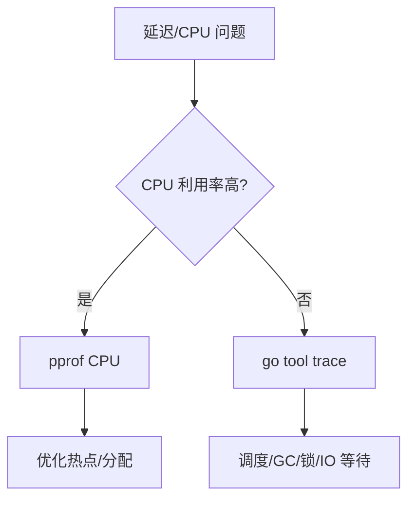

# CPU profile vs execution trace 选型

## 30 秒版（开场）

> **CPU profile** 回答「**哪段代码耗 CPU**」，采样统计、可长期开；**execution trace** 回答「**时间线上发生了什么**」——调度、GC STW、网络阻塞、锁等待。生产关键词：**profile 找热点、trace 找毛刺与等待**。

## 3 分钟版（一面深度）

1. **是什么**：pprof CPU 按周期采样 PC 栈；trace 记录 runtime 事件时间戳（G/P/M、syscall、GC）。
2. **为什么**：CPU 不高但 P99 高 → profile 无效，需 trace 看等待；CPU 100% → profile 直达热点。
3. **怎么做**：先 metrics 看症状 → CPU 高用 profile → 延迟/毛刺用 trace（短窗口 1–5s）→ 结合 heap/goroutine。

## 10 分钟版（原理 + 图示）

**对比矩阵**

| 维度 | CPU profile | Execution trace |
|------|-------------|-----------------|
| 开销 | 低（~5% 可调） | 较高，短 capture |
| 粒度 | 函数/指令采样 | 事件级时间线 |
| 擅长 | 热点、GC assist CPU | STW、调度延迟、block |
| 可视化 | flame graph | trace viewer 时间条 |



**trace 关键视图**

- **Goroutine analysis**：G 执行/Runnable/Waiting 比例。
- **Network/Syscall blocking**：IO 等待占比。
- **GC**：STW 长度与频率。
- **Proc utilization**：P 是否吃满。

**profile 关键视图**

- **flat/cum**：谁耗 CPU。
- 与 **mutex/block profile** 配合（需 `runtime.SetBlockProfileRate`）。

## 生产场景

- **P99 3ms、CPU 30%**：trace 见频繁 STW 1ms → 调 GOGC/降分配。
- **CPU 90%**：profile 见 `regexp` 或 `json` → 算法/缓存优化。
- **可观测**：On-call 5s trace + 30s CPU profile 标准 playbook。

## 排查与工具

| 工具 | 用途 |
|------|------|
| `go tool pprof -http` | CPU/mutex/block |
| `runtime/trace` + `go tool trace` | 时间线 |
| `curl /debug/pprof/profile?seconds=30` | 生产抓取 |

路径：SLO 破 → 区分 CPU bound vs wait bound → 选工具 → 修复 → 同负载复测 trace 的 P99 段。

## 架构取舍

| 方案 | 适用 | 不适用 |
|------|------|--------|
| 持续 CPU profile | 容量规划 | 替代 trace 查 STW |
| 短 trace | 毛刺、调度 | 长时间全量 trace 文件巨大 |
| block/mutex profile | 锁竞争 | 默认未开启 |
| 分布式 tracing（OTel） | 跨服务 | 替代不了 runtime trace |

## 追问链

1. **profile 采样 100Hz 含义？** → 每 10ms 一次，短函数可能被低估。
2. **trace 影响生产？** → 短 capture 可接受，需限流与权限。
3. **如何关联两者？** → 同一时段先 trace 定位 STW 时刻，再 CPU profile 看 mark assist。
4. **netpoller 在 trace 里？** → network block 视图可见。
5. **Go 1.22+ 变化？** → 持续改进 trace 开销与 viewer，关注 release note。

## 反模式与事故

- CPU profile 正常就宣称「无性能问题」，忽略 IO/调度等待。
- trace 抓 5 分钟，文件 GB 级无法打开。
- 未开 block profile 就猜锁问题。

## 代码示例

```go
import (
    "os"
    "runtime/trace"
)

func captureTrace(path string, fn func()) error {
    f, err := os.Create(path)
    if err != nil {
        return err
    }
    defer f.Close()
    if err := trace.Start(f); err != nil {
        return err
    }
    defer trace.Stop()
    fn()
    return nil
}
```

```bash
# CPU 30s
curl -o cpu.prof 'http://127.0.0.1:6060/debug/pprof/profile?seconds=30'
go tool pprof -http=:0 cpu.prof

# Trace 2s
curl -o trace.out 'http://127.0.0.1:6060/debug/pprof/trace?seconds=2'
go tool trace trace.out
```

## 延伸阅读

- [Diagnostics 官方指南](https://go.dev/doc/diagnostics)
- [Go Diagnostics：Execution Tracer](https://go.dev/doc/diagnostics#execution-tracer)
- [High Performance Go Workshop - Profiling](https://dave.cheney.net/high-performance-go-workshop/dotgo-paris.html)
