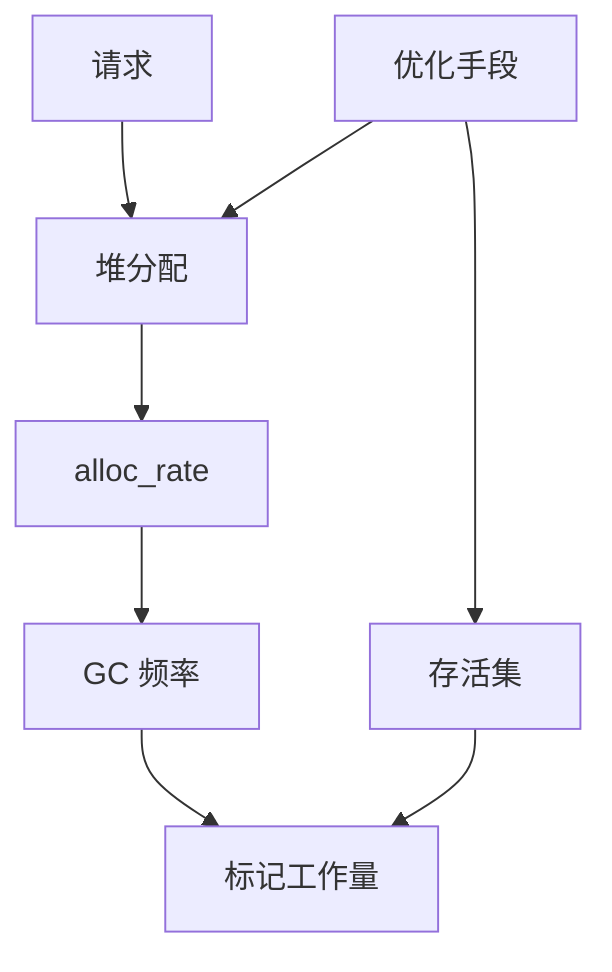

# 减少 GC 压力的系统级手段

## 30 秒版（开场）

> 降 GC 压力本质是 **降堆分配速率与存活对象**；系统级手段包括 **对象池、预分配、值语义、零拷贝、批处理、协议选型（Protobuf vs JSON）**。调 GOGC 是最后旋钮，不是第一选择。生产关键词：**alloc_rate、B/op、存活集大小**。

## 3 分钟版（一面深度）

1. **是什么**：减少 mutator 每请求堆分配字节数与长生命周期引用。
2. **为什么**：GC CPU ∝ 分配率 + 存活集；assist 与 mark 都受影响。
3. **怎么做**：profile allocs → 改数据结构 → Pool/arena 思路 → 架构层缓存与流式；再考虑 GOGC/GOMEMLIMIT。

## 10 分钟版（原理 + 图示）

**优化层次**

| 层级 | 手段 | 影响 |
|------|------|------|
| 架构 | 异步化、批量写、边缘缓存 | 降 QPS 级分配 |
| API | 具体类型、泛型、代码生成 | 减 boxing |
| 数据结构 | slice 预 cap、strings.Builder | 减扩容 |
| 运行时 | sync.Pool、复用 buffer | 减短命对象 |
| GC 参数 | GOGC、GOMEMLIMIT | 全局权衡 |



**sync.Pool 注意**

- 对象可能被 GC 清空，不能当可靠缓存。
- 归还前清理指针字段，避免泄漏。
- Pool 内对象大小应接近，避免 size class 抖动。

**其他**

- **strings.Builder**：预 `Grow(n)`。
- **json**：`json.Decoder` 流式；或 `sonic`/`protobuf` 降反射分配。
- **避免 `fmt` 热路径**：改用 `strconv`。

## 生产场景

- **API 网关**：每请求 `json.Marshal` map → 改 protobuf + 复用 buffer，GC CPU 从 18% 到 5%。
- **日志**：结构化日志异步 + 固定字段 slice 复用。
- **可观测**：压测 `B/op`、`GC/CPU`、`alloc_space` top 函数。

## 排查与工具

| 工具 | 用途 |
|------|------|
| `benchstat` + `testing.AllocsPerRun` | 微基准 B/op |
| `pprof allocs` | 宏观热点 |
| `-gcflags=-m` | 逃逸根因 |

路径：allocs top → 设计替代（池/值/生成代码）→ bench 与压测 → 看 GC trace 周期拉长。

## 架构取舍

| 方案 | 适用 | 不适用 |
|------|------|--------|
| sync.Pool | 短命、可丢失的 buffer | 连接池/有状态对象 |
| 值传递小对象 | 热路径 | 大 struct |
| Protobuf | 内部 RPC | 浏览器直连 JSON |
| 手动内存 arena（cgo/实验） | 极极致 | 标准业务 |

## 追问链

1. **降分配和降 GOGC 哪个优先？** → 先降分配，调参不减少总拷贝字节。
2. **Pool 为何会被 GC 清空？** → 每轮 GC 可能 drop pool 链，防内存囤积。
3. **Builder 复用？** → `Reset()` 后复用底层 []byte。
4. **泛型能减少 GC 吗？** → 减少 interface 装箱，视 monomorphization 结果。
5. **如何设 SLO 验证？** → 同 QPS 下 P99 + GC pause + 吞吐三角。

## 反模式与事故

- 全局 map 缓存所有请求体「复用」→ 泄漏 + 巨型存活集，GC 更慢。
- Pool 存 `*BigStruct` 不 zero，旧指针挂住图。
- 只调 GOGC=200，峰值 assist 打满 CPU。

## 代码示例

```go
var bufPool = sync.Pool{
    New: func() any {
        b := make([]byte, 0, 4096)
        return &b
    },
}

func marshalPooled(v any, enc func([]byte, any) ([]byte, error)) ([]byte, error) {
    bp := bufPool.Get().(*[]byte)
    b := (*bp)[:0]
    defer func() {
        *bp = b[:0]
        bufPool.Put(bp)
    }()
    return enc(b, v)
}
```

## 延伸阅读

- [Go GC Guide - Optimization](https://go.dev/doc/gc-guide)
- [sync.Pool 源码与 GC 交互](https://go.dev/src/sync/pool.go)
- [JSON v2 方向（Go 团队）](https://go.dev/blog/json)
