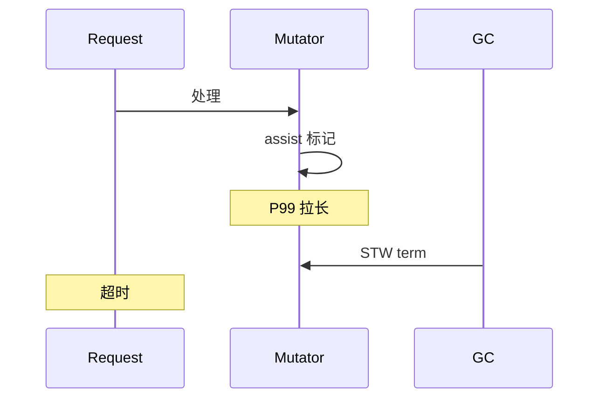

# 延迟敏感服务的 GC 抖动治理

## 30 秒版（开场）

> **GC 抖动** 指 P99/P999 延迟被 STW、mark assist、sweep 争抢打断；治理需 **降存活集、平滑分配、GOMEMLIMIT、版本升级**，而非简单堆内存「越大越好」。生产关键词：**pause 分位、assist 毛刺、与 CPU throttle 叠加**。

## 3 分钟版（一面深度）

1. **是什么**：并发 GC 仍会在分配尖峰触发 assist，或在 sweep term 产生短 STW，表现为尾延迟尖刺。
2. **为什么**：延迟敏感服务（交易、游戏、广告竞价）SLO 在毫秒级，亚毫秒 STW 叠加队列即超时。
3. **怎么做**：压测看 `gc/pause` P99；trace 对齐尖刺；控分配 burst；设 memory limit；必要时隔离或 `GOGC` 略降换更稳堆曲线。

## 10 分钟版（原理 + 图示）

**抖动来源**

| 来源 | 表现 |
|------|------|
| Mark termination STW | 短而尖 |
| Mark assist | 请求线程变慢，无 STW 但 P99↑ |
| Sweep 争用 | 分配路径与 sweep 竞争 |
| 堆突增 | 促销/批任务导致 GC 连环触发 |
| CPU limit | GC 与业务抢 cgroup 份额 |



**pacer（1.19+ 改进）**：根据 `GOMEMLIMIT` 与 GOGC 动态调节触发点，减少「堆暴涨后连环 GC」。

**治理 playbook**

1. 基线：固定 RPS 压测，记录 P50/P99/P999 与 `gc/pause:seconds`。
2. trace 5s 捕获尖刺时刻是否 STW/assist。
3. 降 burst 分配（批处理改队列平滑）。
4. 调 `GOMEMLIMIT` ≈ 0.9×limit，必要时 `GOGC=50~80` 换频率。
5. 升级 Go 小版本获 pacer/GC 修复。

## 生产场景

- **竞价 RTB**：100ms 超时，P999 偶发 8ms → trace 见 2ms STW + assist。
- **FinTech 撮合**：GC 与业务同核，cgroup 1 CPU，assist 与 throttle 双重恶化。
- **可观测**：histogram `go_gc_duration_seconds`、自定义「请求耗时 − 业务耗时」残差。

## 排查与工具

| 工具 | 用途 |
|------|------|
| `go tool trace` | 尖刺对齐 STW |
| `runtime/metrics` | pause 分位 |
| 压测 + 限流 | 复现 burst |

路径：P99 破 SLO → trace → 若 GC → allocs/存活/GOGC/GOMEMLIMIT → 平滑负载或隔离。

## 架构取舍

| 方案 | 适用 | 不适用 |
|------|------|--------|
| 分配隔离（批处理另进程） | 混合负载 | 运维复杂 |
| 略降 GOGC | 要稳延迟、CPU 有余 | CPU 已紧 |
| 超大堆换少 GC | 吞吐批处理 | 延迟敏感 |
| 非 Go 处理极热路径 | 极端 | 过早 |

## 追问链

1. **assist 如何体现在 trace？** → mutator 时间片执行 `gcAssistAlloc`。
2. **GOMEMLIMIT 如何减抖动？** → 提前触发 GC，避免撞 hard limit 连环 GC。
3. **能否禁用 GC？** → `GOGC=off` 仅特殊 job，在线不可用。
4. **和 netpoller 延迟区分？** → trace network vs GC 视图。
5. **SLO 多少 GC 可接受？** → 业务定；常要求 P99 pause < 1ms 且 assist 可忽略。

## 反模式与事故

- 促销倍流量无预热，分配 burst 触发连环 GC，全站 P99 爆。
- 只扩容 Pod 不控分配，堆线性涨，mark 时间随存活集增。
- 用 sleep 错开 GC——不可靠，应靠 pacer 与架构。

## 代码示例

```go
// 平滑 burst：有界队列 + 固定 worker，避免瞬时百万分配
func startSmoothedWorkers(n int, q <-chan Job) {
    var wg sync.WaitGroup
    for i := 0; i < n; i++ {
        wg.Add(1)
        go func() {
            defer wg.Done()
            buf := make([]byte, 0, 4096) // worker 级复用
            for j := range q {
                buf = buf[:0]
                process(j, &buf)
            }
        }()
    }
    wg.Wait()
}
```

## 延伸阅读

- [Go GC Guide - Latency](https://go.dev/doc/gc-guide)
- [GC Pacer Redesign（proposal）](https://github.com/golang/proposal/blob/master/design/44167-gc-pacer-redesign.md)
- [Go 1.19 GOMEMLIMIT](https://go.dev/doc/go1.19)
